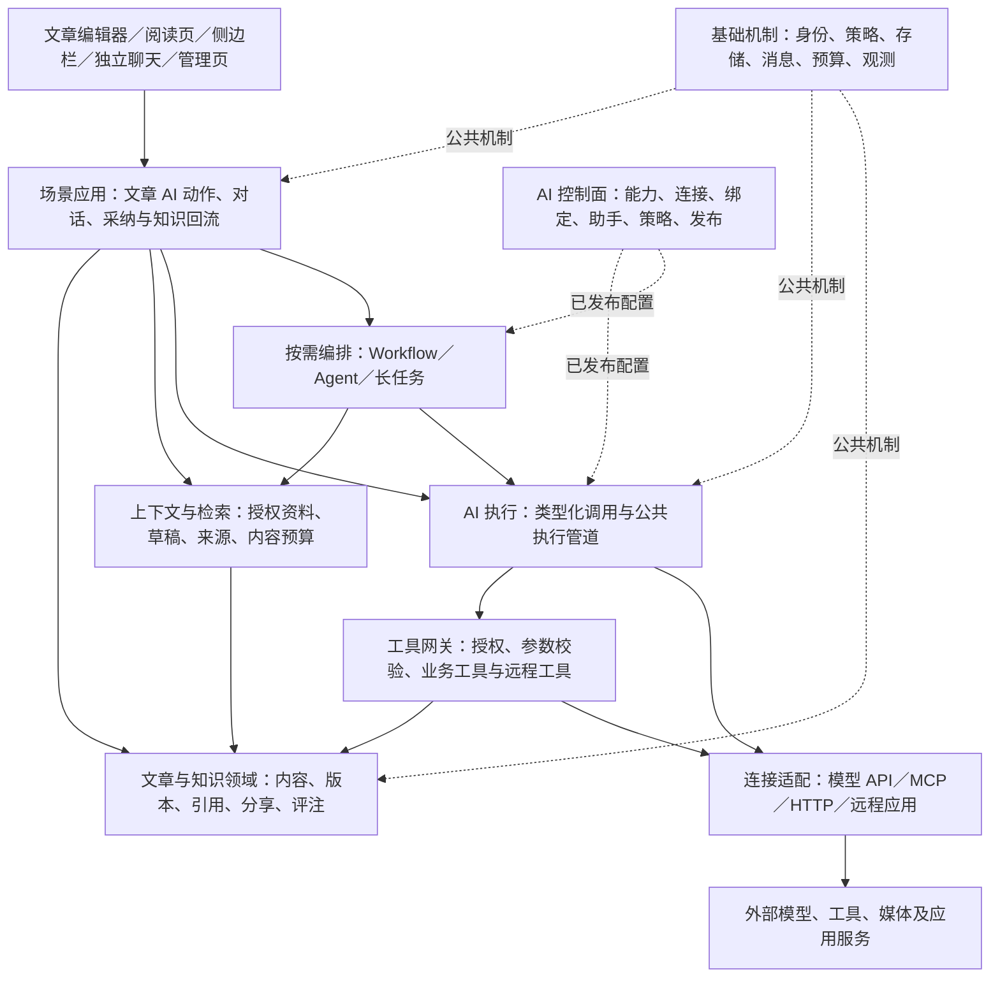
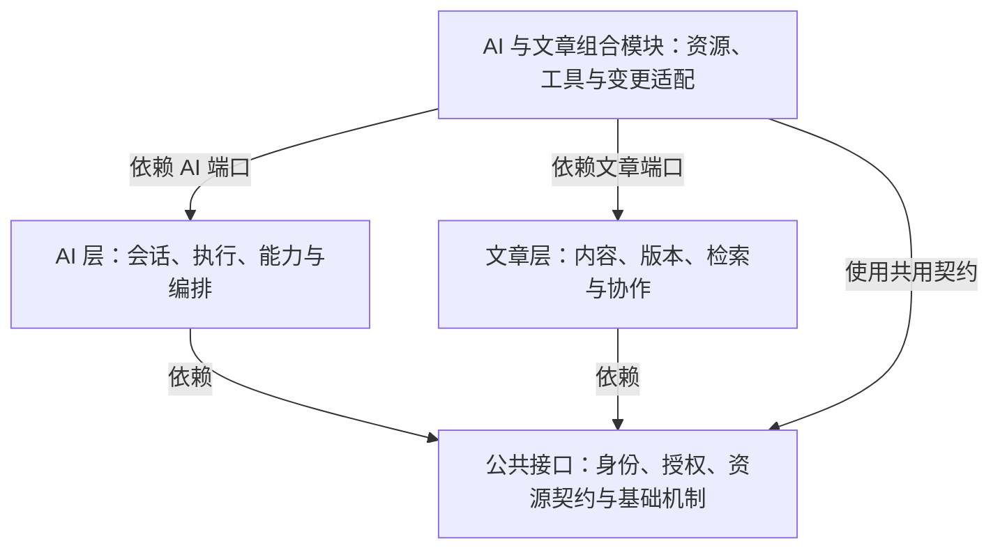
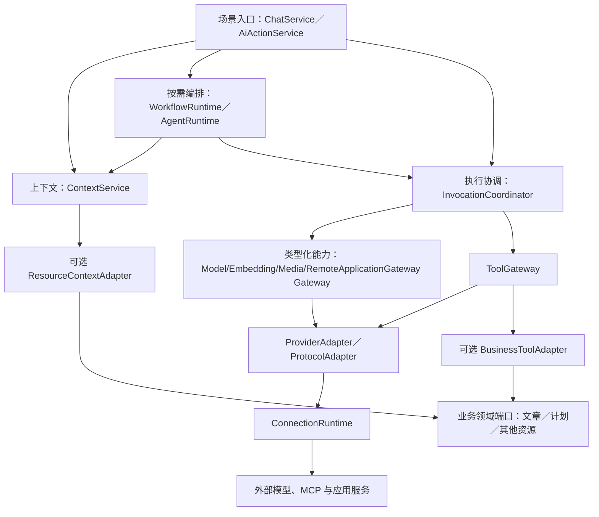
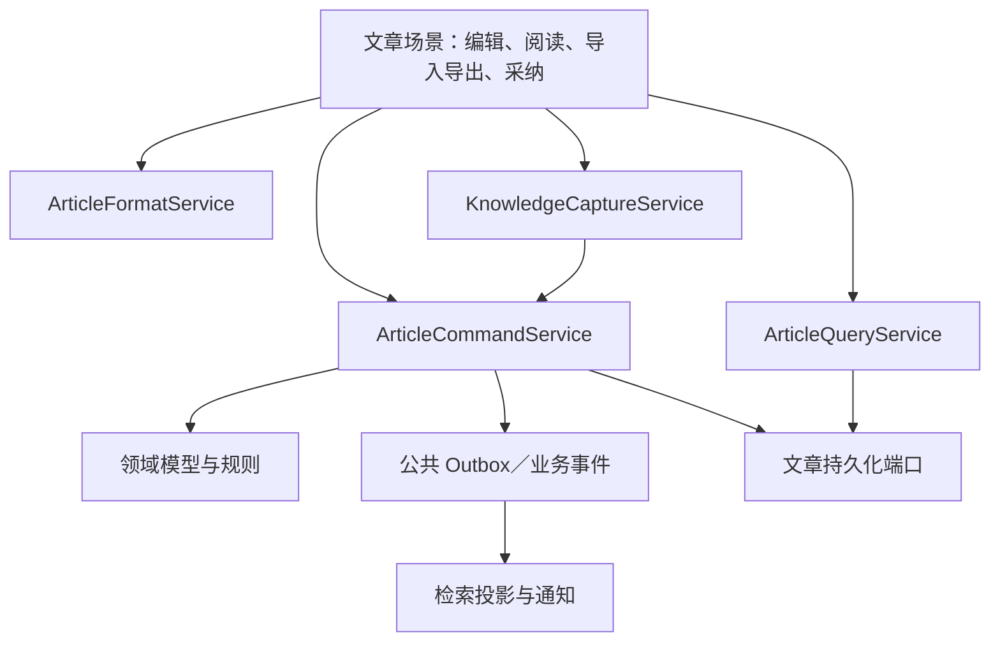

AI 平台与业务资源系统顶层架构草案

版本：v0.2  
日期：2026-10-02  
状态：讨论稿。用于确认需求、模块边界、核心对象及顶层契约，不限定现有代码结构，不包含具体实现。

## TODO

- [ ] 评审新版设计、顶层接口与分阶段验收，确认与目标及 P0／P1／P2 需求对应。
- [ ] 确认结构化文档、Markdown 兼容、草稿与版本、范围锚点及撤销语义。
- [ ] 确认 Tenant／Workspace、共享角色、AI 外发策略及权限撤销边界。
- [ ] 细化 Conversation、Turn、动作、Invocation／Attempt、Job、Run 与远端任务契约。
- [ ] 细化类型化能力、连接、绑定、助手、Skill、策略和发布的 Schema 与版本。
- [ ] 确认采纳、正式保存、来源记录、幂等、冲突和跨领域事务边界。
- [ ] 明确 P0 快速执行、Worker 领取、租约、事件重放与未知结果的实现方案。
- [ ] 验证数据库、Redis、消息／Outbox、对象存储、中文检索与向量的职责及选型。
- [ ] 确认首期供应商及框架／协议版本，验证统一工具网关与适配契约。
- [ ] 通过原型与压测确认编辑、上下文、流式、容量、成本与可用性目标。
- [ ] 细化凭据管理、审计保留、插件隔离、备份恢复、发布回滚与运维方案。
- [ ] 完成 P0 契约、安全、故障与场景验证后，再进入相应实现与上线评审。

## 资源/参考

以下资料分别用于理解架构模式、协议契约和工程约束。论文模式作为可评估的策略来源，不要求全部实现；协议与库的实际接入版本应在实现阶段明确记录。

1. [Anthropic：Building effective agents](https://www.anthropic.com/engineering/building-effective-agents)：Workflow、Agent
   及常见编排模式。
2. [Anthropic：Effective context engineering for AI agents](https://www.anthropic.com/engineering/effective-context-engineering-for-ai-agents)
   ：上下文、工具集、按需加载及长任务记忆。
3. [MCP：Understanding MCP servers](https://modelcontextprotocol.io/docs/learn/server-concepts)：Tools、Resources、Prompts
   及交互边界。
4. [Agent Skills 规范](https://agentskills.io/specification)：Skill 的指令、参考资料、脚本、资源和渐进加载。
5. [ReAct 论文](https://arxiv.org/abs/2210.03629)：推理与行动交替的研究模式。
6. [Plan-and-Solve Prompting 论文](https://arxiv.org/abs/2305.04091)：规划后求解的提示方法；与运行时 Plan-and-Execute
   分别讨论。
7. [Temporal：Durable AI](https://docs.temporal.io/ai)：可恢复任务、长时间等待和人工审批的实现参考。
8. [Redis Pub/Sub](https://redis.io/docs/latest/develop/pubsub/)
   与 [Redis Streams](https://redis.io/docs/latest/develop/data-types/streams/)：通知和流消费的投递语义。
9. [OWASP：Authorization](https://cheatsheetseries.owasp.org/cheatsheets/Authorization_Cheat_Sheet.html)：最小权限、默认拒绝和逐次授权。
10. [OWASP：LLM Prompt Injection Prevention](https://cheatsheetseries.owasp.org/cheatsheets/LLM_Prompt_Injection_Prevention_Cheat_Sheet.html)
    ：文档、工具输出等不可信内容的处理。
11. [RFC 9110：If-Match](https://www.rfc-editor.org/rfc/rfc9110.html#name-if-match)：条件更新与并发修改控制。
12. [Envoy：Connection pooling](https://www.envoyproxy.io/docs/envoy/latest/intro/arch_overview/upstream/connection_pooling.html)
    ：连接复用与并发限制的工程参考。

13. [Spring AI：Tool Calling](https://docs.spring.io/spring-ai/reference/api/tools.html)：模型请求与应用执行工具的边界。
14. [Spring Framework：WebFlux](https://docs.spring.io/spring-framework/reference/web/webflux/new-framework.html)：异步
    I/O、并发与背压。
15. [MCP：Transports](https://modelcontextprotocol.io/specification/latest/basic/transports) 与
    [Authorization](https://modelcontextprotocol.io/specification/latest/basic/authorization)：按协议版本适配传输与认证。
16. [Debezium：Outbox Event Router](https://debezium.io/documentation/reference/stable/transformations/outbox-event-router.html)
    ：事务与消息衔接参考。
17. [Temporal：Workflow Execution](https://docs.temporal.io/workflow-execution)：持久化运行历史与恢复模型。

## 目标

>
人类的知识行为，大致可看作“创造”与“模仿”的双螺旋：塔尔德视“发明”为社会现象的起源，“模仿”为个体联结与社会形成的基本机制；文化进化论则以模仿为文化复制之“遗传”。若借用演化论，创造是变异，模仿是遗传，二者相辅相成。健康的知识生态既需保护创造、宽容失败，也需建立学习与传播的机制。人类文明，正是在“创造—模仿—再创造”的循环中不断前行。

ARTE 是面向个人和团队、以文章为主要载体的 AI 内容创作与知识管理工作空间。ARTE 不是纯写作软件，而是“以写作为界面”的知识操作系统。

ARTE 将内容创作、知识使用与 AI
协作融入同一工作过程，通过丰富的内容表达形式，帮助用户将资料、想法和经验转化为可理解、可查找、可复用的内容。用户能够借助已有积累持续创作和完成工作，让知识在学习、积累、应用和再创造中不断产生价值。

ARTE 主要服务于个人创作与团队知识积累，其适用于：个人写作、企业内部知识库、计划/信息管理等。

1. **高效创作与组织内容**
   1. 提供流畅、易用的编辑体验，兼顾 Markdown 使用习惯与直观的格式呈现。支持文章、附件和内容片段的组织，让用户便捷地记录想法、积累经验并完成长篇写作。
2. **高效阅读、查找与复用知识**
   1. 支持内容检索、阅读定位、个人标注、评注和来源引用，帮助用户快速找到相关信息、理解已有内容，并将知识用于后续写作与工作。支持内容导出，明确格式兼容范围，保障内容的可迁移性。
3. **丰富且一致的内容表达**
   1. 支持文本、代码、数学公式、图片、音频、视频及可编辑图表等内容形式，提供清晰、一致的编辑和阅读体验。媒体内容的插入、生成、管理与展示作为基础能力，专业媒体编辑范围另行明确。
4. **融入工作过程的 AI 协作**
   1. 提供独立 AI 对话入口，以及结合当前文章或业务资源的侧边栏交互。支持检索问答、解释、总结、翻译、续写、补全、改写和媒体生成，并允许用户创建可复用的助手与操作流程。
   2. AI 可以针对整篇文章或指定内容片段进行解读、插入或替换。操作范围和结果清晰可见，内容修改遵循用户授权，并支持预览、版本保护和撤销。
5. **安全共享与自主控制**
   1. 支持按资源分配管理、编辑、评注和阅读权限，使个人与团队能够安全地共享和协作。用户能够了解 AI
      使用了哪些内容、执行了哪些操作，并控制访问范围、外部服务使用和内容修改。
6. **持续扩展到其他知识与工作场景**
   1. 在文章与 AI 核心能力的基础上，通过模块扩展支持项目计划、客户信息、内部知识库，以及论文、小说等专业写作场景。扩展模块复用内容、检索和
      AI 能力，同时保留各自的业务规则。

## 需求

本章依据目标规划用户任务与阶段范围，不以现有代码、功能或技术选型为前提，分为核心需求点与细节需求点。首期面向需要持续写作、整理资料和积累知识的个人创作者；P1
扩展到共同维护文章与知识资料的小团队，涉及作者、编辑者、评注者、阅读者及共享管理者。先验证个人知识积累与再创作，再深化团队协作和复杂任务。

**阶段划分**：P0 为原始可用功能集，所有 P0 共同组成 MVP；P1 在 P0 基础上深化知识利用、个性化与团队协作；P2
为进一步扩展的需求池，结合实际使用反馈逐项取舍。首期聚焦桌面
Web，不以覆盖全部格式、平台、终端和业务场景为目标。验收标准与性能、安全等非功能性要求后续在设计中阐述；本章保留用户需要感知和控制的资料使用、内容修改与共享边界。

**阶段取舍依据**：P0 验证用户能否将资料与想法写成文章、借助已有文章和 AI 完成修订、保存有价值的成果并在下一次创作中再次使用；P1
验证文章集合的检索问答及团队评审修订；P2 在高频任务明确后扩展自主执行、多模态与专属业务。独立聊天属于完整产品范围，在 P1
引入，使首期优先验证文章与知识复用的价值。

**用语约定**：文章是可独立保存、编辑和检索的内容单元；选区是一次操作中临时指定的内容范围；引用是复用内容时保留可查看的来源；知识资产是用户整理、采纳并保存、可再次使用的内容，P0
以普通文章承载。P1 的可复用片段是用户从文章中保存的摘录，不预设底层块结构；附件指与文章关联的文件，P0
仅覆盖图片插入与展示，其他附件管理和解析范围在 P1 明确。

**一、核心需求点**

1. **文章创作与表达**
   - **P0**：创建、编辑、保存和恢复文章，以 Markdown 为基础提供易用的编辑与阅读体验，支持常用文本格式和图片。【已实现】
   - **P1**：通过模板、数学公式、图表和更丰富的编辑操作，提高专业写作与内容表达效率。【已实现】
   - **P2**：扩展音视频、脑图及可编辑的复杂图表，支持更丰富的内容创作。【部分已实现，可编辑的复杂图表未实现】
2. **知识组织、检索与阅读**
   - **P0**：通过文章列表、最近访问和标题／正文关键词检索找回已有内容，手动选择文章或摘录用于新的写作和 AI 提问；支持
     Markdown 导入、导出。【已实现】
   - **P1**：深化分类、标签、阅读标记、来源关联与语义检索，支持基于指定文章集合的知识问答。【已实现】
3. **文章中的 AI 协作**
   - **P0**：围绕当前文章或选区提问、追问，可主动加入已有文章或摘录作为参考；直接发起总结、翻译、改写和续写，并衔接追问，通过解读、插入、替换三种方式使用结果。【已实现】
   - **P1**：提供独立聊天页面、可复用助手和模型选择，支持围绕文章集合进行检索问答，以及根据文章生成图片和基础图表。【部分已实现，根据文章生成图片或图表未实现】
   - **P2**：扩展多模态生成、自定义流程和受用户控制的自主任务执行。
4. **知识反哺与持续复用**
   - **P0**：用户核对并采纳 AI 回答、总结或生成内容后，可保存到当前文章、其他已有文章或新文章，查看其来源；保存结果可再次检索、编辑和用于
     AI 处理。
   - **P1**：保留结果与来源的关联，将已采纳成果整理为可复用的知识条目、写作素材或模板，支持后续校正和更新。
5. **分享与协作编辑**
   - **P1**：共享文章、邀请成员、按角色查看／评注／编辑，通过异步协作完成内容评审与修订。【已实现】
   - **P2**：支持多人实时编辑、在线状态、光标／选区提示及协同修改体验。
6. **用户控制与后续扩展**
   - **P0**：明确本次 AI 使用的资料、服务和结果用途，允许调整或拒绝资料发送；支持停止生成、预览、采纳、放弃和撤销，原文变化时提示用户重新处理。
   - **P1**：保存助手与上下文偏好，管理可用模型，查看任务结果和用量信息。
   - **P2**：按实际任务接入工具、Skill、外部应用等能力，将成熟的文章与 AI 协作体验扩展到计划、客户资料等后续模块。

**二、细节需求点**

### P0-01 个人文章创作与基础编辑

- **场景**：用户记录想法、整理资料或撰写文章，能够从草稿持续修改到可阅读、可复用的内容。
- 支持文章创建、重命名、编辑、保存、删除及误删恢复；展示保存状态，重新打开后能够继续编辑已保存内容。保存暂时失败时保留当前草稿，允许继续编辑、复制备份并重试，明确区分未保存内容与已保存版本。
- 默认支持 Markdown，提供基础所见即所得的编辑与阅读体验，涵盖标题、段落、列表、引用、表格、代码、链接、常用文字格式及图片插入与展示；提供常用快捷键和选区操作入口。
- 支持编辑撤销／重做，以及恢复此前保存的文章版本；支持基础 Markdown 文件导入、导出，让用户能够带入和带走自己的文本内容。
- **边界**：首期以单篇文章为编辑单位，服务个人写作，不承诺兼容所有 Markdown 扩展、第三方富文本格式或复杂媒体；完整版本比较、模板和专业表达能力在
  P1 深化。首期保护已打开文章的草稿，不要求完整离线工作空间或跨端离线同步。

### P0-02 文章找回、阅读与再次使用

- **场景**：用户将文章保存后，能够在下一次写作或提问时找到它、读懂它并继续使用。
- 提供文章列表、最近访问记录，以及覆盖标题和正文的关键词检索；从检索结果直接打开文章并查看匹配内容。
- 支持阅读位置记忆，在切换文章或重新打开时继续阅读；已有内容可复制或引用到新的文章，引用时保留可查看的来源文章。
- 检索到资料后，用户可手动选择文章或摘录作为当前写作、提问和 AI 动作的参考，查看并移除本次选入的资料；摘录带有来源，不要求先建立独立片段库。
- **边界**：首期检索用户自己的已保存文章，不包含附件内容解析、语义检索、知识图谱或全库自动问答。检索本身即可独立使用，无需开启
  AI。

### P0-03 当前文章的 AI 提问与追问

- **场景**：用户阅读或编辑当前文章时，通过侧边栏询问含义、梳理要点或讨论改进方向，并继续追问。
- 用户可选择以当前文章或选区为背景，并手动加入已有文章或摘录；明确看到本次带入的文章、内容范围及草稿／已保存状态，可查看和移除参考资料，不要求先另建聊天会话。
- 所选内容无法全部用于本次处理时，告知实际使用范围，允许缩小选区、调整参考资料或改为分段处理；不将部分内容处理呈现为已完整阅读全文。
- 发送前能够了解本次使用的 AI 服务及资料范围，并选择是否发送；不使用 AI 时仍可完成文章编辑与检索。
- 支持连续对话、历史查看、重新生成和停止生成；切换文章时明确显示会话关联的文章，避免无提示地混用不同文章的背景。
- 回答引用文章内容时提供可定位的来源片段，便于核对；没有内容依据时说明依据不足，不把模型补充内容呈现为文章原有事实。
- 提供可直接使用的默认助手和首期模型；用户无需先配置工具、记忆或流程才能提问。
- **边界**：首期以当前文章为工作中心，只使用用户主动选入的资料，不自动搜索全库、浏览外部资料或执行其他业务操作。跨文章参考采用手动选择，不包含语义检索和全库自动检索问答；对话历史不自动成为知识库内容。

### P0-04 文章 AI 动作与结果应用

- **场景**：用户在编辑器中选择内容或定位光标，发起总结、翻译、改写、续写，查看结果后完成文章修订。
- 提供少量可直接使用的预设动作，用户能够补充要求；动作可针对整篇文章、选区或光标位置，发起前明确处理范围与结果用途。
- **解读**：只展示解释或生成结果，不改变原文； **插入**：采纳后将结果放入指定位置； **替换**：采纳后以结果修改指定内容。
- 支持预览、必要的前后比较、继续调整、采纳、放弃及撤销；一次动作无需先创建独立聊天会话。
- 用户可从动作结果继续追问或转到文章侧边栏，保留该次指令、参考资料、生成结果及采纳状态，免于重复描述；只延续用户选择的这次操作，不无提示地带入其他动作历史。
- 支持查看该次操作的处理范围、参考来源、结果及是否已应用；失败或停止时明确说明状态，不自动应用未完成结果。重新生成与重新应用分别呈现，重试不重复插入同一结果。
- 生成期间目标内容发生变化时，提示用户核对新的内容并重新选择应用方式，避免将旧结果直接覆盖新修改。
- **边界**：首期由用户发起单次动作、核对后应用；不要求实时逐字 AI 补全、自定义多步骤流程或 AI 自主修改整库文章。

### P0-05 已采纳 AI 成果回流为知识资产

- **场景**：用户获得有价值的回答、摘要或生成内容，经核对与修改后保存下来，在后续写作和提问中再次使用。
- 可将结果保存到当前文章、用户选定的其他已有文章，或连同必要的问题背景保存为新文章；保存前可编辑结果、指定位置、拟定标题，避免将每次回答都默认创建为新文章。
- 已保存成果可查看其 AI 辅助生成说明、参考文章与摘录、采纳时间，以及采纳时的内容；来源记录说明生成依据，不将“已采纳”标记为事实已被验证。
- 保存后的内容遵循普通文章的使用方式：可继续编辑、搜索、引用、导出，打开后可再次用于文章提问或 AI 动作。
- 用户能够清楚区分“仅存在于对话中的结果”和“已保存的文章内容”；再次采纳时提示已有保存结果，便于选择更新或另存。
- **闭环**：查找已有资料 → 写作／提问／生成 → 核对与修订 → 保存到合适的文章 → 检索找回 → 作为参考再次创作或提问。
- **边界**：知识反哺以用户采纳为前提，不自动收录全部对话、自动发布内容或自动训练模型。采纳保存不意味着同意将内容用于训练或其他二次用途。P0
  以文章承载成果，不另建独立知识资产管理系统，也不强制用户建立标签或文件夹后才能保存。

### P1-01 丰富写作表达与可复用模板

- **场景**：用户撰写技术文档、研究笔记或结构化文章，能够使用专业格式和模板提高表达效率。
- 增加数学公式、Mermaid 等图表、悬浮编辑操作、快捷输入及可复用文章模板；支持文章版本查看、比较与恢复。
- 可根据文章或描述生成图片、基础图表，先查看或调整，再插入文章；适用的图表结果能够继续编辑。
- 支持模板、附件及扩展内容的管理与复用，明确导入、导出后能够保留的内容和格式。
- **边界**：本阶段优先满足常见写作和图片／基础图表需求，不以完整替代专业绘图工具、音视频编辑器为目标。

### P1-02 文章集合的知识检索与问答

- **场景**：用户为新文章查找旧资料，或围绕一个主题从多篇文章中提取、比较和归纳知识。
- 支持分类、标签、文章关联与来源引用，深化关键词检索并增加语义检索；支持将摘录保存为可管理、可复用的片段，并保留来源。支持私有阅读标记、重点标注和笔记，明确其与修改原文的区别。
- 用户选择文章集合或检索范围后发起问答，能够查看、调整使用的资料，并从回答定位到来源文章和相关片段。
- 回答中的资料归纳与 AI 推断应便于区分；来源不足时提示用户补充资料。结果可按知识反哺方式保存，并保留与来源的关联。
- 已采纳成果可整理成主题文章、摘录素材或模板；“知识条目”表示这些已保存内容的用途，不要求另建一套内容体系。来源更新时，用户能够识别和校正受影响的成果。
- **边界**：先服务用户可访问的文章集合，附件管理与内容解析分别明确支持范围，不默认将所有附件纳入问答；双向链接、关系图谱及互联网资料接入按实际需求取舍。

### P1-03 独立聊天、助手与模型管理

- **场景**：用户进行不依赖某篇文章的交流，或复用特定的写作、研究助手，并按任务选择模型和资料。
- 提供独立聊天页面，支持会话创建、命名、检索、继续交流与删除；可明确选择文章资料作为对话背景。
- 支持创建和复用助手，保存角色、提示和偏好；支持管理可用模型及其连接，选择适合本次任务的模型并确认可用状态。
- 用户能够查看和调整对话关联的资料与保留信息，按需保存、修改或删除记忆；记忆与作为事实依据的文章资料分别呈现。
- 支持查看调用状态、结果及用量／费用信息；从独立聊天得到的成果同样可采纳并保存为文章。
- **边界**：先提供日常可用的默认设置和必要的个性化，不要求普通用户理解模型协议、工具绑定或复杂编排；全面外部能力管理在 P2
  扩展。

### P1-04 文章分享与异步协作编辑

- **场景**：小团队将文章交给成员阅读、评注和修订，完成“共享 → 评审 → 修改 → 确认”的协作闭环。
- 支持共享文章、邀请成员和撤销共享；按资源分配完全控制、编辑、评注、只读权限，使成员清楚自己可执行的操作。
- 支持围绕具体内容的共享评论、回复和处理状态；个人阅读标记、共享评注和原文修改分别呈现。相关成员能够收到评注、回复和文章更新通知，并回到对应内容继续处理。
- 支持成员异步或轮流编辑，查看修改者、修改时间及历史版本；多人修改同一内容时提供冲突提示和处理入口。
- 共享管理者可决定共享内容是否允许 AI 处理，以及可使用的外部服务范围；阅读、导出、复制另存、AI 处理和修改原文分别遵循共享约定，成员能够查看可执行的操作。
- 允许使用 AI 的阅读者可查看结果，评注者可将建议作为评注提交，编辑者可采纳修改；使用 AI 不提升成员原有权限。生成结果进入共同文章前仍遵循协作与修改规则。
- **边界**：此阶段不承诺多人同时编辑时的实时同步体验；实时共同编辑、在线光标及同步选区归入 P2。

### P2-01 多人实时协作编辑

- **场景**：多名成员同时撰写、讨论和修订一篇文章，在共同编辑过程中及时理解彼此的操作。
- 提供在线成员、光标和选区提示，实时呈现协同修改；评论、评注和历史记录与编辑内容保持关联。
- 支持并发修改后的结果查看与修订，成员恢复连接后能够理解当前内容及自己的修改状态。
- AI 生成与采纳融入实时协作，成员能够识别 AI 辅助修改及其采纳者，处理生成期间其他成员对目标内容的变更。
- **边界**：在异步协作验证团队需求后引入；不将实时协作等同于全功能离线共同编辑，也不默认允许 AI 无限制改写共享内容。

### P2-02 自定义流程、外部能力与自主任务

- **场景**：用户将重复的内容操作保存为流程，或将明确目标交给 AI，借助已配置能力完成多个步骤。
- 支持能力的声明、配置、验证、启用／停用和绑定／解绑，按需接入本地／远程工具、Skill、外部应用及 Agent 服务；用户可了解用途和使用范围。
- 支持创建、编辑、试运行和复用流程，例如 `总结摘要 → 翻译为英文 → 核对与文章的契合度 → 用户采纳后插入文章顶部`。
- 支持 AI 在用户指定的资料、可用能力和使用限制内选择步骤与工具；发起时可约定工具、用量和执行时限，达到限制后由用户决定是否继续。
- 默认展示待采纳结果；用户可明确授权约定范围内的自动应用，并可收回授权、补充信息或人工接管。涉及超出约定范围的修改、分享或发布时，须由用户决定。
- 展示任务进度、结果和失败原因，按任务特性提供暂停、继续、取消或重新执行；完成或停止后明确哪些结果已保存、哪些修改已应用，对适用的内容修改提供撤销或恢复入口。不能撤销的外部操作提前说明，不将取消任务等同于撤回已执行操作。
- **边界**：从高频、可核对的文章任务扩展，不以接入所有知名平台为完成标准；使用能力的权限不等同于修改、分享或发布内容的权限。

### P2-03 更丰富的媒体创作与编辑

- **场景**：用户将文章扩展为包含图片、音频、视频或复杂图表的内容，或由文章素材生成媒体成果。
- 支持适用的音频、视频、脑图、draw.io 等内容的插入、查看、播放或编辑，提供媒体与文章的关联管理。
- 按实际场景扩展语音、视频等 AI 生成能力；用户可查看任务进度、预览成果、调整或放弃，再决定是否保存和用于文章。
- **边界**：各媒体类型分批引入，明确支持的创作、编辑和导出范围，不承诺所有媒体形式同时上线或达到专业制作工具的完整能力。

### P2-04 后续业务场景扩展

- **场景**：在文章创作与知识积累闭环成熟后，将资料提问、生成、评估和优化能力用于其他具体工作任务。
- 论文、小说、研究记录等优先通过文章模板、助手和素材复用满足；确有专属任务需求时再增加对应功能。
- 项目计划、客户资料等模块分别明确用户、任务和完成结果，例如“查看计划 → AI 评估与提出建议 → 用户采纳调整 → 保存并继续执行”。
- 不同场景保留一致的提问、预览、采纳和知识回流体验，同时满足各自的业务操作要求。
- **边界**：不把通用项目管理、CRM、论文研究平台或企业全域知识管理作为当前 MVP 的组成部分；新模块按独立场景闭环确认后再纳入。

## 设计

本版从产品目标和 P0／P1／P2 需求推导架构，不沿用现有代码的模块、实现或平台限制。
前版保留于[设计历史草案](docs/arte-top-level-design-v0.1.md)
。以下为顶层方案：确定职责、数据权威、关键契约、功能流程和生产运行约束；接口签名、表结构、框架版本和部署参数在后续详细设计中落实。

### 1. 设计目标与基本原则

系统围绕“资料积累 → 写作与 AI 协作 → 核对采纳 → 保存知识 → 再次使用”组织能力。生产级要求从 P0 生效，用户功能按阶段开放；P0
的基础可靠性、安全与可观测性不因高级功能后置而省略。

1. **领域独立、按场景组合**：文章与知识领域管理内容及业务规则，AI 平台管理生成与执行，场景应用将两者组合。支持独立使用文章、独立使用
   AI，以及未来 AI＋其他业务组合。
2. **统一治理、类型化执行**：共享身份、授权、预算、追踪及调用生命周期；文本生成、向量、媒体、工具和远程应用保留各自语义，不统一成无类型的
   `execute(Object)`。
3. **轻量路径优先**：普通提问和单次动作不经过通用工作流引擎；仅对需要多步状态、长时间等待或可靠恢复的任务引入持久化编排。
4. **内容修改有唯一入口**：人工编辑、AI 采纳、工具修改和协作修改最终都进入领域命令，执行权限、版本和业务校验。
5. **分布式不等于全面微服务**：先建立可独立测试和部署的模块边界，通过多实例、异步 Worker 和共享持久化支持分布式；再依据负载、故障隔离和团队规模拆分服务。
6. **扩展通过组合完成**：提供商、协议、能力、策略、业务资源分别扩展；配置解决已有契约的接入，新语义通过适配器或插件实现。
7. **明确保证的边界**：区分受理、执行、生成、保存和应用；区分事件重放与模型续传、取消请求与取消完成，不承诺外部副作用天然恰好执行一次。

### 2. 逻辑架构与模块依赖



| 模块               | 主要职责                                         | 依赖边界                                         |
|--------------------|--------------------------------------------------|--------------------------------------------------|
| 产品前端与应用 API | 编辑、阅读、提问、生成、预览、采纳和状态反馈     | 页面不管理远端凭据，不直接调用付费模型和远程工具 |
| 场景应用           | 组合文章、上下文、会话、动作和成果保存流程       | 不直接访问其他领域的表，不复制领域校验           |
| 文章与知识领域     | 文章内容、版本、引用、附件关系、标注、评论、分享 | 不依赖具体模型、MCP、Agent 框架或 AI 供应商 SDK  |
| 会话与 AI 动作     | 会话、轮次、动作历史及明确的任务输入输出         | 共用执行入口，动作不强制隶属聊天                 |
| 上下文与检索       | 资料选择、权限过滤、内容裁剪、检索、来源映射     | 通过资源适配端口读取业务内容，不直接修改业务资源 |
| AI 控制面          | 能力契约、连接、绑定、助手、Skill、策略和发布    | 管理配置，不承接每个请求的网络调用               |
| AI 执行与编排      | 调用治理、单次执行、工作流、Agent 和任务控制     | 编排决定步骤，执行层完成类型化操作               |
| 工具网关与连接适配 | 执行受限业务工具，适配外部协议及平台特性         | 业务工具调用领域服务；适配器不授予用户权限       |
| 公共基础机制       | 身份、授权、预算、存储、可靠消息、审计和观测     | 按机制提供端口，不形成承担所有业务的“公共服务”   |

业务端口归属于提供能力的模块。文章核心不依赖 AI：`BusinessToolAdapter` 和 `ResourceContextAdapter` 位于组合边界，分别将领域操作与资源读取适配到
AI 平台。AI 也可在未启用文章模块时运行。

### 3. 概念、核心对象与状态权威

MCP 是协议；HTTP、SSE、stdio 是传输或输出方式；Skill 是指令与资源包；Workflow 和 Agent 是决定下一步的编排方式。它们不作为同一类原子能力建立继承树。Workflow
的控制路径由预定义规则决定，Agent
由模型与运行反馈决定下一步；两者可组合。[模式依据](https://www.anthropic.com/engineering/building-effective-agents)

| 对象族     | 关键对象                                                                                                      | 权威归属及关系                                                                                                |
|------------|---------------------------------------------------------------------------------------------------------------|---------------------------------------------------------------------------------------------------------------|
| 身份与空间 | Tenant、Workspace、Principal、Membership、ResourceGrant                                                       | Tenant 是隔离与计费边界，Workspace 是组织与共享边界；P0 提供个人空间，P1 增加团队空间                         |
| 内容       | Article、ArticleRevision、DraftSnapshot、RangeAnchor                                                          | 文章服务管理正式内容与版本；草稿快照带基准版本、草稿标识及内容摘要，不冒充正式版本                            |
| 知识关系   | SourceRef、Citation、AdoptionRecord、SavedExcerpt                                                             | 引用关联来源与版本；采纳记录关联结果、目标版本及采纳者；P1 再提供独立可管理的摘录                             |
| 媒体       | Artifact、AttachmentRef                                                                                       | 对象存储保存文件，领域服务保存归属与引用；产物存在不等于已经插入文章                                          |
| 对话与动作 | Conversation、Turn、AiActionExecution、ContextSnapshot                                                        | 会话组织交流，动作可独立执行；二者记录实际输入范围、执行与结果，不拥有文章事实                                |
| 连接与使用 | CapabilityDefinition、ConnectionDefinition、BindingDefinition                                                 | 分别表示操作契约、连接方式和主体可使用的配置；支持按租户／空间绑定                                            |
| 可复用配置 | AssistantDefinition、ChatProfile、AiActionDefinition、SkillDefinition、StrategyDefinition、WorkflowDefinition | 定义与使用实例分离；助手可用于多个会话，实际执行记录解析后的版本                                              |
| 发布       | ReleaseManifest                                                                                               | 固定配置依赖与校验结果，不承诺供应商模型行为永久不变                                                          |
| 执行       | Invocation、Attempt、Job、Run、RemoteTaskRef                                                                  | Invocation 是单次能力操作，Attempt 是一次尝试；Job 是可恢复工作项，Run 是多步任务；远端任务另有身份与生命周期 |
| 修改       | ChangeSet、ApplicationRecord                                                                                  | 提案与应用分离；具体补丁由目标领域定义，应用记录关联业务新版本                                                |

每类状态只设一个权威来源：业务数据库管理文章、配置、授权、应用记录和单次调用记录；对象存储管理产物字节；检索索引和任务查询视图是可重建投影。引入持久化编排引擎时，Run
的推进历史以引擎为权威，本地 Run 表只作查询投影，不同时驱动任务。

### 4. 功能设计：文章编辑、阅读与知识反哺

**内容与编辑模型**

- 建议以版本化结构化文档（AST／Document JSON）作为正式内容的权威表示，Markdown 作为一等导入、导出和快捷编辑格式；不维护两套互不一致的权威正文。
- 内容节点包含稳定标识，格式能力由受控节点类型注册；前端编辑、阅读、AI 补丁和导出遵循同一内容契约。P0
  只启用需求规定的文本与图片类型，公式、图表和其他媒体逐阶段注册。
- 基础 Markdown 格式定义往返兼容规则；不支持的扩展可保留原始信息或提示降级。导出必须说明媒体文件与扩展内容的保留范围，不将图表编辑信息无声丢弃。
- 编辑器以适配层接入，领域模型不依赖编辑器库的内部类；P2 实时协作增加操作同步模型，并沿用文档与版本契约，不将 CRDT
  状态直接作为所有模块的业务接口。

**草稿、版本与修改**

- 前端保存当前草稿及未完成编辑，区分本地草稿、保存中的内容和已确认版本。保存失败仍可编辑、复制备份与重试；本地恢复数据按用户／空间隔离，并设退出清理及保留策略。
- 每次正式保存携带 `expectedVersion`。保存、版本记录、采纳来源及 Outbox 事件在同一业务事务内提交；成功响应表示服务器已完成指定耐久级别的提交。
- 草稿保存合并频繁输入，正式历史采用受控保存频率、增量与周期快照，避免每次按键都建立完整历史副本；保留策略不破坏来源版本和可恢复检查点。
- AI 的范围锚点包含资源版本、节点／选区、文本摘要等信息。位置随编辑失效时进行重新定位或提示重新选择，不能仅按旧字符偏移直接替换。
- 针对当前草稿的采纳先成为编辑器中的待保存修改；前端核对草稿标识与内容状态，保存时一并提交采纳信息。针对其他已保存文章的应用走服务端领域补丁与版本校验。两种路径都以正式保存记录认定知识已回流。
- 前端收到保存响应时不覆盖响应期间产生的新输入。撤销已保存的 AI 修改形成新版本，不能回退并覆盖其他人后续修改。

**知识保存与来源**

- `KnowledgeCaptureService` 将成果保存到当前文章、其他有编辑权限的文章或新文章；复用正常领域保存，不绕过版本与共享规则。
- `AdoptionRecord` 记录结果引用、实际采纳内容、目标版本、采纳者、时间及参考来源。生成说明与来源证明分离：有来源可追溯不表示内容已经核实。
- 引用保留来源文章、版本、摘录／锚点及必要说明；来源被删除、更新或变为不可访问时，分别提示失效、可能过期或无权查看。来源展示重新校验权限，不借历史快照泄露内容。
- 保存后通过业务事件更新检索投影；正文数据库可立即读取，新保存内容在索引未就绪时可从最近文章或限定数据库查询找回。P0
  不新建独立“知识资产库”。

### 5. 功能设计：聊天、动作、上下文与检索

**统一交互、明确任务**

- 独立聊天、文章侧边栏和未来业务侧边栏共用 Conversation／Turn 及输出契约，通过 `ChatProfile` 设定默认资料、动作和允许能力；独立聊天按
  P1 开放。
- 同一会话的普通轮次按会话版本串行推进，冲突请求明确等待或拒绝；重新生成创建新 Attempt，不默认重放此前的写操作。
- `AiActionDefinition` 定义总结、翻译、改写、续写等动作的输入范围、输出类型和应用方式；一次动作无需先创建会话。
- 从动作继续追问时，显式关联该次动作、选入资料、结果与采纳状态；不将所有放弃结果和其他动作历史自动加入上下文。
- 三种应用方式分别落到展示结果、形成插入提案、形成替换提案。生成成功、提案产生、用户采纳和文章保存是分别可查询的状态。

**上下文解析**

1. 服务端验证用户、空间、目标资源和资料使用授权。
2. `ResourceContextAdapter` 读取已保存版本或验证带入的草稿，区分用户选区、手选参考、检索结果、会话历史、记忆和任务指令。
3. 按模型能力和预算分配输入空间，预留输出与工具结果容量；按选区、结构和相关性裁剪，而不是每轮全量拼接所有文章。
4. 生成不可变 `ContextSnapshot`，包含来源、版本、实际片段、截取说明和内容摘要；为模型分配可核对的引用标识，前端展示实际使用范围。
5. 发送前执行目的地与外发策略检查；来源无法全部带入时提示覆盖范围。摘要属于派生资料，仍关联原文，不能静默替代为已经阅读全文。

草稿快照与敏感上下文按最小保留原则存储，可加密并设置较短期限；审计可以保留标识和摘要，无需永久复制全文。删除原文不保证撤回已经发送给第三方的内容，产品须准确说明这一边界。

**检索演进**

- P0 提供关键词检索及手动选择参考，检索后在读取资料时再次授权。中文分词、索引或 n-gram 方案需要实测；不能将大规模正文扫描作为长期检索方案。
- P1 增加版本化片段、关键词与向量混合检索、去重和按需重排。向量模型与分片方案的变更采用新索引版本构建、验证及切换，不混用不同维度和语义空间。
- 索引消费文章保存、删除和授权变更事件，携带资源版本；防止乱序事件恢复旧内容。ACL 预过滤只减少候选集，最终内容读取与进入模型前仍重新授权。
- 结果记录索引水位及来源版本；缺失或滞后时可降级到关键词检索或用户手选资料，不把索引结果当作最新业务事实。问题依据不足时返回可理解的说明。
- 记忆是用户可管理的派生偏好／摘要，文章是业务资料，运行状态是任务事实；三者分别存储和加载。

### 6. 功能设计：模型、工具、媒体与远程服务

**类型化能力与统一执行管道**

公共管道依次处理身份及绑定解析、授权、能力匹配、参数校验、预算预留、执行准入、连接调用、结果校验、记录结算和事件输出。调用前、执行中、结束与清理分别提供有序中间件；观测事件默认只通知，不改变业务决策。

| 能力类型             | 专有契约                                       | 必须声明的特性                                       |
|----------------------|------------------------------------------------|------------------------------------------------------|
| 文本／多模态对话生成 | 消息、内容部件、工具请求、结构化输出、生成结果 | 输入模态、流式、工具调用、输出格式、上下文及用量能力 |
| 向量生成             | 批量文本／适用内容、向量及模型版本             | 维度、批量限制、模型版本；不复用聊天输出类型         |
| 媒体生成             | 生成请求、任务引用、状态、产物                 | 同步或异步任务、查询、取消、产物格式与有效期         |
| 工具操作             | 工具描述、输入 Schema、结构化结果或产物        | 只读／写入／外部副作用、幂等、超时和人工控制要求     |
| 远程应用／Agent 服务 | 应用输入、远端会话、任务、结果和回调           | 会话归属、远端状态、恢复和取消能力                   |

认证方式、可用性与权限分别建模；“连接健康”不表示用户有权限，“支持流式”也不表示支持暂停、续传和跨进程恢复。缺失必需特性时拒绝或明确降级，不默默丢弃参数。

**模型提出调用，程序执行调用**

模型只收到本次允许使用的工具描述，并提出调用请求；后端工具网关重新校验工具绑定、参数、资源权限、外发范围和任务预算，然后调用本地领域服务或远端适配器。结果经过校验和内容预算处理后返回模型。框架自动工具调用必须通过该网关，避免另有一条绕过治理的执行路径。[Spring AI 工具调用依据](https://docs.spring.io/spring-ai/reference/api/tools.html)

工具集按任务筛选，必要时按需发现；发现结果仍须授权，不开放全局工具名解析回退。只读调用可按独立输入并发执行，写操作按资源冲突与副作用约束排序；模型提出并发不等于执行器无条件并发。

远端工具的描述和只读／风险注解是适配输入，不是本地授权依据；平台通过接入审核与运行策略确定其副作用等级，未知等级按受限操作处理。

**供应商与协议适配**

- 模型 API、MCP、业务 HTTP API、远程应用分别适配；阿里云、OpenAI、OpenRouter、Anthropic 等按实际提供的操作与协议接入，平台名称不进入业务接口。
- 魔搭等 MCP 服务由后端 MCP 客户端连接；远程优先考虑规范支持的 HTTP 传输，stdio 限于受管进程。不同 MCP
  版本的请求、会话、能力发现和取消行为由适配器处理，不假定所有服务使用同一会话模型。[MCP 传输规范](https://modelcontextprotocol.io/specification/latest/basic/transports)
- Dify 或其他远程 Agent／应用保留远端会话及任务语义；不能因返回文本就将它们当作普通模型。LangChain
  是构建运行时的框架，其部署出的服务可通过远程应用／HTTP 适配，不要求把框架本身登记为供应商。
- 供应商托管工具或远程应用内部的步骤不一定经过本地工具网关；必须声明可观测、可授权、可取消与数据使用范围，只有符合任务策略时才允许委托。不能将不可逐步拦截的远端流程宣称为本地可完全控制的
  Agent。
- Skill 按版本加载指令、参考资料与资源；脚本必须转换为受控工具或隔离任务，不直接在应用进程执行任意命令。
- 已支持的协议、认证和契约允许配置接入；新协议、新生命周期或复杂结果映射需要适配器开发。所谓“免改代码”只适用于已有契约内的变化。

媒体产物先进入隔离存储并完成适用校验，再登记归属；文件上传、回调与文章插入分别处理。回调验证签名、任务归属和重复事件；没有回调的服务使用有界轮询。任务停止不等于已经撤销供应商生成或费用。

### 7. 功能设计：Workflow、Agent 与可插拔策略

- Workflow 定义步骤、依赖、条件、输入输出和人工决定点；发布前校验引用、类型、循环上限与副作用，执行时固定定义版本。
- Agent 使用目标、上下文、允许工具和反馈迭代；每轮执行前检查授权、剩余预算、步骤数、时间和停止条件。记录可公开的计划、工具选择和结果摘要，不依赖获取模型完整内部思维过程。
- 模型路由、上下文选择、重试、结果组合、Agent 决策分别设置策略端口。ReAct、Plan-and-Execute、多模型比较或投票是可评估策略，默认不启用昂贵的多模型链路；Plan-and-Solve
  提示方法与运行时持久化编排分别讨论。
- 普通调用由 Invocation 管理；媒体／导入等后台工作由 Job 管理；多步骤、长等待和人工接管由 Run 管理。Job 与 Run 均不能代替领域事务。
- P2 的复杂持久化编排建议接入成熟引擎，如 Temporal；模型、工具和业务写入作为外部
  Activity／工作项，确定性流程只推进控制状态。恢复重用已经记录的结果，不重新执行已完成的外部调用。[Temporal 恢复模型](https://docs.temporal.io/workflow-execution)
- 运行中任务使用固定发布配置；新发布通常只影响新任务。权限撤销、连接停用及紧急安全策略覆盖旧配置；策略在线迁移和引擎替换需显式迁移方案，不能只换一个存储客户端。

### 8. 功能设计：共享、评注与协作

P1 提供空间成员、资源共享、评论回复、处理状态、通知和异步版本修订；P2 再引入实时操作同步、在线状态和光标／选区。评论锚定版本与范围，无法重定位时提示锚点失效，不静默指向无关内容。

| 操作                    | 默认角色边界                                   | 补充约束                                 |
|-------------------------|------------------------------------------------|------------------------------------------|
| 阅读、个人标注          | 有阅读权限的成员                               | 私有标注不修改公共文章                   |
| 评论、提交建议          | 评注者及更高权限成员                           | AI 建议只能以其可执行的形式提交          |
| 编辑、采纳修改          | 编辑者及管理者                                 | 提交时检查资源版本及当前编辑权限         |
| 管理共享与撤销          | 有共享管理权限者                               | 平台管理员不因运维身份自动获得内容读取权 |
| 导出、复制另存          | 按资源策略单独判断                             | 不默认随阅读权限开放                     |
| AI 处理、向外部服务发送 | 用户权限、共享策略、目的地策略及任务授权的交集 | 不默认随阅读或编辑权限开放               |

P2 实时协作的同步层只接收已授权的编辑操作；持久化文章服务仍保存版本与检查点。单文章会话可以按文章路由到持有租约的协作节点，实时在线状态为可失效的临时数据；操作恢复记录与在线广播分离。AI
补丁应用到当前协作状态，目标变化时重新核对，不能导出旧全文覆盖实时内容。

### 9. 非功能设计：分布式部署与存储分工

**建议部署形态**

P0 使用 Spring Boot 模块化应用的多副本部署，应用模块边界与领域数据所有权从第一天建立；按需要以同一代码库的不同启动角色运行
API、AI 执行 Worker 和后台 Worker。API／执行可初期合并部署，文章交互、长连接、外部调用和重型后台任务必须有独立资源配额。P1／P2
按负载再拆分执行服务、检索服务和实时协作服务。

推荐基线为关系数据库（优先评估 PostgreSQL）、Redis 与 S3 兼容对象存储；可靠消息初期可由数据库
Outbox＋任务领取实现，规模扩大后接入独立消息系统。搜索／向量存储在 P1 按中文检索与规模评测决定。选择均是本版建议，生产版本与部署规格需记录兼容矩阵。

| 机制               | 保存什么                                                        | 可替换边界                                                      |
|--------------------|-----------------------------------------------------------------|-----------------------------------------------------------------|
| 关系数据库         | 内容、版本、配置、授权、采纳、Invocation、Job、预算账本、Outbox | Repository 与事务端口；事务、唯一约束、并发更新语义必须满足契约 |
| Redis              | 热点缓存、短期会话辅助、限流状态、租约辅助、在线通知            | 缓存／准入／通知端口分别替换，不暴露 Redis 数据类型到业务层     |
| 可靠消息／任务队列 | 待处理工作、业务事件、重试与死信                                | 必须声明耐久、确认、重投、可见性、分区顺序及保留能力            |
| 对象存储           | 图片、媒体、附件、较大生成结果及归档                            | ArtifactStore；元数据权限与文件字节归属一致                     |
| 检索索引           | 全文与向量投影、版本水位                                        | SearchIndex；可重建，不作为授权与业务真相                       |
| 编排引擎           | 多步骤执行历史、等待与恢复状态                                  | Workflow／Run 端口；不承诺任意引擎之间无成本迁移                |
| 执行事件存储       | 可重放输出批次、关键状态与游标                                  | ExecutionEventStore；关键记录耐久，保留期限与归档明确           |

Redis Pub/Sub 只用来唤醒在线订阅者；客户端错过通知后从耐久事件存储读取。不能单独用它交付必须恢复的任务。Redis Streams
可作为经过评估的队列实现，但其持久化、故障转移和保留策略必须满足所需耐久级别；消费者仍需要幂等与重复处理控制。[Pub/Sub 语义](https://redis.io/docs/latest/develop/pubsub/)、[Streams 机制](https://redis.io/docs/latest/develop/data-types/streams/)

服务实例可替换：会话、任务、取消信号、事件游标和执行归属不以实例内存为唯一事实。外部连接池与特定协议会话可以归属于实例，但其失效与重建必须由适配层处理。

### 10. 非功能设计：一致性、消息与故障恢复

**事务与消息**

- 文章保存、正式版本、采纳记录、应用去重及 Outbox 在一个领域事务中提交。跨模块通过领域接口／事件组合，跨服务不以持有数据库事务等待模型或
  HTTP 返回。
- Outbox 发布器重试投递，消费者以事件 ID
  和资源版本去重；消息采用至少一次处理模式。按资源顺序处理或拒绝旧版本，死信提供查询、告警及经授权的重放。[Outbox 参考](https://debezium.io/documentation/reference/stable/transformations/outbox-event-router.html)
- 跨领域任务明确部分成功、补偿与人工处理；数据库提交与外部服务调用不构成一个原子事务。不可逆外部操作不声明自动回滚。

**幂等、并发与执行归属**

- 应用请求使用按租户／主体／操作限定的幂等键，并校验请求内容摘要；相同键、相同输入返回原受理或结果，不同输入拒绝。去重记录保留期覆盖允许的重试和结果恢复窗口。
- 业务应用使用唯一 `applicationKey` 与 `expectedVersion`，在同一事务中防重和提交。修改正文采用乐观并发控制；HTTP 层可用
  ETag／If-Match 表达条件更新。[条件更新规范](https://www.rfc-editor.org/rfc/rfc9110.html#name-if-match)
- Worker 领取任务需要有期限的租约、心跳和 fencing token；状态与写入提交检查持有者版本，防止过期 Worker
  继续提交。分布式锁只能辅助协调，不能替代事务、唯一约束和领域版本。
- 外部副作用即使有租约也可能重复。远端支持幂等时复用稳定操作键；否则记录“已发出但结果未知”，先查询或人工核对，不盲目再次执行。

**快速路径与持久化路径**

普通提问先持久化受理记录，然后可在本实例立即异步执行，避免每次经过重型编排。后台任务通过耐久工作项领取。两条路径均记录
Attempt、执行归属和最终结果；节点故障后，确认未开始的工作可以重新领取，已可能发出外部请求的工作先标记中断／结果未知。

P0 保证已保存文章和已持久化结果可恢复查询，不保证任意模型调用在故障后接着原 Token 继续。Run
的恢复依赖引擎历史；单次调用重新生成是新尝试，可能再次收费，须明确呈现。

重试统一由执行协调层负责，适配器仅进行被允许的协议级恢复，避免 SDK、网关和任务层重复叠加。退避加入抖动，受尝试次数、总期限和预算约束；参数错误、授权拒绝和业务冲突不自动重试。

### 11. 非功能设计：异步、流式与背压

- 模型、远程工具、媒体和应用调用使用异步 I/O 端口；Spring WebFlux／Reactor 适合高并发 I/O
  与流式入口。文章领域可以使用事务型阻塞持久化，但必须在专用有界执行资源上运行，不放入 I/O
  事件循环。异步方法返回值不代表底层已经非阻塞。[Spring WebFlux 的并发与背压模型](https://docs.spring.io/spring-framework/reference/web/webflux/new-framework.html)
- 浏览器使用 SSE 接收生成与状态事件，普通 HTTP 完成命令、查询和取消；实时协作在 P2 使用
  WebSocket。事件创建与订阅分离，用户刷新或换实例后仍能按游标订阅。
- 每个执行流具有 `executionId + attemptId + sequence`、事件类型、时间和负载；序号在同一流中单调递增，不承诺所有任务全局有序。前端去重并识别间隙，终态不与未完成片段混淆。
- 输出按时间／字节阈值批量持久化，持久化后发布可重放批次；终态与最终结果引用在状态权威库同一次提交。事件存储独立部署时通过
  Outbox 同步终态，订阅端可查询最终状态补齐，不能假定两个库原子写入。避免逐 Token 写业务数据库。保存前的缓冲片段在进程故障时允许丢失，不能对客户端声明已耐久。
- 浏览器断线默认只结束观看，不默认取消已受理任务；用户“停止”通过显式取消命令传播到执行器及适配器。任务有独立期限，不因没有订阅者无限运行。
- 慢消费者使用有界缓冲，超过界限断开并允许重放，不能挤占生成或文章保存资源。上游无法背压时采用批量持久化／有界缓存并按策略停止，不无限堆积内存。
- 游标已过保留期时返回明确的游标过期状态，提供最终结果或检查点重新同步；浏览器恢复观看不表示上游供应商能够续传生成。
- SSE 心跳、负载均衡空闲超时、代理缓冲和滚动发布排空统一配置。浏览器鉴权采用同源安全 Cookie 或支持授权头的流式客户端，不将访问凭据写入查询参数。

### 12. 非功能设计：安全、隐私与执行护栏

**身份和授权**

Spring Security 负责入口身份与方法级授权；领域策略负责资源和动作授权。用户、租户、空间和服务身份由服务端验证，Worker
使用受限服务身份加原发起者上下文，不能信任模型或请求体自报的身份。

有效权限为用户权限、资源共享策略、应用策略、绑定权限与任务授权的交集；读取、导出、外发、编辑、分享分别判断。检索、缓存、历史、流订阅、来源查看和产物下载均执行授权，不能只检查页面入口。关键写入与外发前检查当前策略版本。

对象默认私有；敏感下载经过鉴权代理，普通下载可使用短期签名地址。已签发地址的失效窗口必须明确，不能将数据库撤销权限描述为能够立即撤销所有已发出的下载地址；需要立即撤销的资源不用长期可复用直链。

撤销后新请求立即使用新策略；活跃流和长任务在输出批次／后续操作边界重新核对，建议权限租约上限 5
秒，并通过通知加速失效。不能收回已经下载、展示或发送给第三方的数据；在不确定授权时停止新的敏感读取和写入。

**凭据与远端连接**

- 凭据通过 Secret 引用解析，存储加密、按需注入并支持轮换；不进入模型上下文、浏览器响应、普通日志或用户可编辑的业务参数。
- HTTP／MCP 连接限制协议、目标域名、端口、重定向和网络出口；验证 DNS 解析及私网／元数据地址，防止 SSRF 与 DNS
  重绑定。受批准的内网服务通过独立网络策略接入。
- HTTP MCP
  按所接入协议的授权规范与目标服务要求实现，验证令牌目标和作用域；不将平台内部令牌无差别转发给第三方。[MCP 授权规范](https://modelcontextprotocol.io/specification/latest/basic/authorization)
- 外部回调校验签名、时间、任务归属及重复事件；外部应用的会话标识按租户和用户隔离，不能跨主体共享。

**不可信内容与输出**

文章、附件、网页、Skill
及工具结果均作为待处理数据；区分指令和资料，但不依赖提示词分隔作为唯一防线。模型提出调用仍受实际工具范围、参数校验、运行时授权和领域规则约束，不能修改权限或发布配置。[提示注入防护依据](https://cheatsheetseries.owasp.org/cheatsheets/LLM_Prompt_Injection_Prevention_Cheat_Sheet.html)

HTML、Markdown、SVG、Mermaid、draw.io 和媒体预览采用适用的清洗、编码、CSP 与隔离渲染；附件检查类型、大小与适用的恶意内容。插件与
Skill 脚本在隔离运行环境执行，限制文件、网络、CPU、内存和执行期限，不继承应用主进程全部凭据。

**隐私、保留与外发**

资料可发送目的地、保留期限和用途由策略与用户设置共同约束。采纳不等于同意训练或其他二次用途；第三方的数据处理条件需记录并向用户准确呈现，不能替供应商作未经确认的承诺。支持内容删除向附件关系、索引、缓存、快照和备份生命周期传播；法定或合同保留事项在选定部署场景后另行确认。

### 13. 非功能设计：性能、容量与可用性目标

以下为 **待基准测试确认的初始工程目标**，不是已达成的指标或供应商承诺。所有指标注明测量边界、分位数、负载和失败分类；以测量结果调整规格与目标。

| 指标                   | 建议初始目标                         | 测量边界                                                       |
|------------------------|--------------------------------------|----------------------------------------------------------------|
| 文章读取与保存         | 服务端 p95 ≤ 300 ms                  | 常规正文 ≤ 50 KiB；保存包含事务与版本记录，不含大附件上传      |
| 列表与最近文章         | 服务端 p95 ≤ 200 ms                  | 游标分页，权限过滤；不含浏览器与公网时间                       |
| 关键词检索             | 服务端 p95 ≤ 500 ms                  | 基准数据 10 万篇，确认中文检索质量与高权限过滤开销             |
| AI 受理与平台处理      | p95 ≤ 300 ms                         | 受理、授权、常规上下文解析及准入；队列等待与供应商时间单独报告 |
| 已接收输出到浏览器推送 | p95 ≤ 300 ms                         | 包含批量持久化，在无慢消费者及正常网络下测量                   |
| 取消命令受理           | 服务端 p95 ≤ 300 ms                  | 只表示平台收到命令；实际远端停止时间另计                       |
| 核心平台月可用性       | 目标 99.9%                           | 文章与平台控制链路；完整 AI 成功率另报，保留供应商失败分类     |
| 已确认内容耐久性       | 同区域单节点故障 RPO = 0             | 要求相应同步复制与存储配置；不能只依赖异步副本                 |
| 灾难恢复               | 初始目标 RPO ≤ 5 分钟、RTO ≤ 60 分钟 | 覆盖数据库、对象、凭据和配置，必须通过演练验证                 |

建议初始基准环境：2 个应用实例、每实例 4 vCPU／8 GiB；按部署角色增加 2 个同规格 AI／后台 Worker；关系数据库 8 vCPU／32 GiB 与
SSD，Redis 2 vCPU／4 GiB，对象存储独立。普通 API 100 请求／秒、500 个在线流订阅、其中 100 个活跃模拟生成任务作为第一轮压力组合；文档数据同时覆盖
50 KiB 常规与 500 KiB 大文档。容量不是平台支持上限，生产 HA 副本和网络条件另行计入。

压测先用可控延迟和输出速度的供应商替身测平台容量，再使用真实供应商验证配额、长尾与费用。AI
首次输出拆分为排队、上下文、连接、供应商首个输出和前端呈现；不对不同模型统一承诺“首字小于某固定值”。

**性能机制**

- 按租户、任务类型、供应商和连接设置有界准入；交互生成优先于批量索引、媒体与离线评估。队列有等待期限，过载返回可理解的限流／繁忙状态，不无限排队。
- HTTP 连接池复用但隔离凭据与会话，限制连接数及每目标并发；超时分为连接、首个输出、空闲、单次操作和整个任务。阻塞 SDK
  使用专用有界资源，禁止在事件循环阻塞。
- 缓存优先用于不可变版本内容、发布配置和授权后元数据；缓存键含租户、资源版本和适用策略版本，读取仍重新授权。P0 默认不做跨用户生成答案缓存。
- 查询使用游标分页、必要索引与批量读取；限制请求内容、输出、附件、并行步骤和上下文容量。长文分段和前端增量呈现通过可理解的范围说明实现。
- 自动扩容综合 CPU、内存、队列年龄、活跃调用和连接数；供应商配额不足时扩实例不能提升吞吐，应先限流、调度或选择已获允许的替代连接。
- 熔断按连接／操作隔离，半开探测有界。模型降级只使用用户允许的服务与模态；生成已经输出后切换模型必须创建新尝试并说明，不拼接成同一次结果。

### 14. 非功能设计：观测、成本、质量与运营

Trace 关联用户操作、会话轮次、动作、Run、Invocation／Attempt、远端任务和内容应用；分别记录运行事件、指标、审计、费用与质量。Micrometer／OpenTelemetry
可作为实现基线，高基数身份与执行标识放在日志和追踪，不作为无限增长的指标标签。

| 数据           | 主要用途                                       | 约束                                                     |
|----------------|------------------------------------------------|----------------------------------------------------------|
| 执行记录与事件 | 状态查询、重放、故障核对                       | 不依赖追踪采样；终态和结果可靠持久化                     |
| 指标与追踪     | 延迟、吞吐、排队、错误和供应商定位             | 允许采样，但不能替代审计与账本                           |
| 审计           | 授权、外发、修改、共享、配置发布和人工接管     | 受限访问、完整性保护、保留策略；默认不保存全文提示与结果 |
| 用量与费用账本 | 预留、结算、对账及超预算处理                   | 区分估算、供应商报告和实际结算，记录费率版本             |
| 质量评估       | 检索相关性、引用有效性、回答质量、采纳与再利用 | 以经过授权的数据集及场景评估，不以“用户采纳”代替正确性   |

调用前按输入与最大输出预留预算，完成后结算；并发预算由权威账本和原子预留保证，Redis
仅作快速准入辅助。供应商超时、取消后仍收费或用量缺失时保留待对账状态，不把未知费用记为零。多模型比较与评估计入同一任务预算。

费率可能变化，预留值并非最终账单；供应商不提供硬限额时，平台预算只能约束本地准入和后续步骤，不能保证已发出的远端任务绝不产生额外费用。

结构化输出先做契约与领域校验；媒体做格式和适用内容检查；昂贵的质量评估可异步执行，影响放行的检查必须进入明确执行步骤。运营观察创作完成、成果采纳、再次引用／使用与协作闭环，但不以纯生成次数驱动功能扩张。

### 15. 非功能设计：发布、维护与可扩展性

- 定义、连接、助手、Skill、策略和流程都有 Schema 版本及发布状态，发布前验证依赖、授权范围、能力兼容和示例任务；配置发布与代码发布分别管理。
- 供应商扩展字段使用有命名空间的受校验扩展，不让任意参数绕过平台限制；适配器通过协议、错误、用量、流式、取消及副作用契约测试。
- 代码采用滚动／灰度发布、版本兼容与任务排空；数据库迁移采用扩展—迁移—收缩，运行中任务使用支持其定义版本的
  Worker。回滚计划分别处理代码、配置和数据。
- 备份、时间点恢复和跨故障域副本覆盖正文、对象引用、凭据与配置；定期演练恢复后的版本、权限、索引重建和任务核对。对象生命周期不得提前删除仍被正式文章引用的文件。
- 健康探针区分存活、就绪和依赖降级；外部模型失效不让整个文章服务退出。监控失败、索引积压、租约过期、未知结果、预算异常和产物孤儿。
- Redis 故障可回源读取与降低并发，文章保存不依赖缓存成功；可靠队列故障保留 Outbox，AI 无法安全受理时明确拒绝；业务数据库不可用时不返回“已保存”，提供草稿保护。
  预算或全局准入无法确认时，新的付费调用暂停或经权威存储限量受理，不能退化成各实例无约束放行。
- 新业务模块通过自己的 Query／Command、`ResourceContextAdapter`、`BusinessToolAdapter` 和页面场景定义接入，保留自身业务规则；无需修改文章核心或为每个业务复制
  AI 调用链路。

### 16. 分阶段落地与关键决策

| 阶段 | 必须形成的功能闭环                                         | 对应架构交付                                                                                                                     |
|------|------------------------------------------------------------|----------------------------------------------------------------------------------------------------------------------------------|
| P0   | 写作、关键词找回、手动参考、文章提问／动作、采纳与再次使用 | 文章／版本／引用／采纳模型，场景应用，上下文快照，默认模型连接，单次执行与输出事件，幂等保存、授权、预算、观测、多实例与基本恢复 |
| P1   | 专业表达、集合问答、独立聊天／助手、异步团队协作           | 模板与格式扩展，搜索／向量投影，图片任务，助手管理，共享／评注／通知，按负载拆分 Worker 与检索                                   |
| P2   | 实时共同编辑、自定义流程与 Agent、多媒体及新业务           | 协作同步服务，持久化编排与策略扩展，隔离插件执行，媒体适配及新领域资源端口                                                       |

本版建议优先确认：结构化文档作为正式内容权威、领域命令作为唯一修改入口、类型化能力与公共管道、多实例模块化应用及按需
Worker、数据库事务与 Outbox、Redis 非权威缓存／通知、可恢复编排按需接入。具体搜索引擎、消息系统、持久化编排引擎及框架版本经契约与负载验证后选择，不以“组件更多”作为生产级的判断标准。

## 顶层接口

本章按接口归属分为公共及共用接口、AI 层接口、文章接口三部分。层级表达调用与职责关系，不要求一个接口族对应一个 Java
类、微服务或数据表；各功能接口以组合、依赖和委托连接。

具体方法签名与 HTTP Schema 后续细化。异步单值与流分别用 `Async<T>`、`Stream<E>` 表示语义，在 Spring 中可映射为
Mono／Flux；领域对象与补丁不依赖模型 SDK。接口实现依赖顺序与产品功能开放分期分别管理，先实现独立 AI 链路不改变需求中的
P0／P1／P2 划分。

### 1. 公共及共用接口

公共部分提供两层可依赖的基础契约与机制，不导入 AI 或文章模块的专有类型。公共契约可以携带执行、来源和变更的通用标识；模型参数、会话状态、文章节点、版本规则等由各自模块定义。

#### 1.1 模块依赖与组合边界



AI 核心不依赖 Article、ArticleRevision、ArticlePatch 或文章 Repository；文章核心不依赖模型 SDK、Conversation 或
AgentRuntime。组合模块依赖双方的公开端口，提供适配实现。公共基础设施实现按端口接入，数据库、Redis 与消息客户端不成为业务接口类型。

#### 1.2 公共数据契约

| 契约 | 最小内容 | 约束 |
|---|---|---|
| ExecutionContext | 经验证的主体／租户／空间、traceId、父执行、deadline、取消信号、授权范围、预算引用、发布引用、适用幂等键 | 服务端构建；预算与发布使用通用引用，不引入 AI 专有实体 |
| ResourceRef／SourceRef | 资源类型、ID、版本标识、草稿标识、范围引用与内容摘要 | 范围结构由资源领域解释；查看及重用时重新授权 |
| AcceptedExecution | executionId、执行种类、初始状态、状态与事件查询地址 | 表示可靠受理，不表示生成、业务保存或应用完成 |
| ExecutionEvent | 执行／尝试标识、单调序号、事件类型、时间、负载或引用 | 事件类型与负载由所属模块扩展，重放不重新执行业务 |
| ExecutionError | 稳定错误码、失败阶段、可重试性、副作用情况、结果确定性、关联 ID | 不泄露凭据／全文；具体错误扩展由各模块定义 |
| ChangeSet | 目标领域、资源、基准版本／草稿摘要、领域补丁、来源、应用约束 | 共用变更信封；具体补丁 Schema 与应用规则由领域提供，不能携带任意数据库语句 |
| ApplyRequest／ChangeApplicationResult | applicationKey、expectedVersion、补丁／采纳引用、新版本或冲突信息 | 应用标识与生成标识分别管理，应用去重与保存由目标领域事务保证 |

共用信封不意味着共用所有输入输出。AI 使用 GenerationRequest／ModelResult，文章使用自身内容与补丁类型；双方通过资源引用、Schema
和适配器交换所需数据。

#### 1.3 公共机制与变更路由

| 接口族 | 主要操作 | 边界 |
|---|---|---|
| AuthorizationService／EgressPolicy | 验证主体、资源动作、资料外发及目的地 | 关键边界重新授权；领域规则与任务授权仍由所属模块补充 |
| AdmissionController | 并发、速率、队列优先级与准入 | 提供通用准入机制，AI 预算结算另归 BudgetService |
| LeaseCoordinator | 任务领取、续租、失效与 fencing token | 协调执行归属；不能替代领域事务和唯一约束 |
| ReliableMessageBus／OutboxStore | 发布、确认、重投、死信与重放 | 耐久、顺序、保留和去重语义必须经过验证 |
| CacheStore／NotificationBus | 热点缓存、在线通知与唤醒 | 可丢失、可重建，不承载唯一业务事实 |
| ArtifactStore | 文件产物、上传／读取、完整性与生命周期 | 保存文件字节及通用归属；文章附件关系由文章模块管理 |
| AuditSink／Telemetry | 审计、指标与追踪 | 审计耐久与追踪采样分别管理，默认不记录敏感全文 |
| JobScheduler | 提交、查询、领取、续租、取消请求、重试调度、完成与死信 | 管理通用 Job 的权威调度状态；可用于 AI 后台工作或文章导入／索引，领域处理器由所属模块注册 |
| ChangeSetService | 登记提案、分派预览／草稿补丁准备／正式资源应用、查询状态 | 只管理信封与路由，具体预览和应用委托给注册的领域处理器 |

ChangeSetService 不内置文章处理器；没有对应领域提供者时，明确返回“目标领域不支持”，不能模拟保存成功。AI
可独立生成文本、结构化结果和产物；成果应用到业务资源由组合模块接入后开放。

#### 1.4 共用协议约定

- 所有入口验证主体与租户／空间；命令的幂等键限定主体及操作，并核对请求摘要。
- 202 表示已可靠受理；正式业务保存以对应领域返回的新版本为准。
- 事件创建与订阅分离，游标用于重放，不承载访问凭据；订阅和结果查询均重新授权。
- 取消请求、取消完成、结果未知分别表达；失败响应同时说明是否可能已发生副作用。
- 错误码覆盖参数／能力不匹配、未授权、范围失效、版本冲突、限流／繁忙、预算不足、供应商错误、部分输出、中断、结果未知及游标过期。具体
  HTTP 状态在 API 设计阶段固定。

### 2. AI 层接口

AI 层提供会话、动作、上下文、配置、单次能力执行、任务控制及按需编排。它依赖公共接口，以用户消息、会话历史和显式资料即可运行；文章、计划、客户等领域能力通过可选提供者注册。

#### 2.1 接口层级与调用关系



上下文为入口与编排提供资料，不负责派发调用；普通调用直接进入 InvocationCoordinator，复杂任务才经过 Workflow／Agent。Gateway
通过公共执行管道工作，业务不能直接绕过治理调用底层 SDK。控制面和策略为上述链路提供已发布配置。

#### 2.2 AI 专有数据契约

| 契约 | 最小内容 | 约束 |
|---|---|---|
| ContextRequest／ContextSnapshot | 显式选入资料、历史／记忆、目标范围、实际片段、来源、内容预算及裁剪说明 | 使用公共 ResourceRef／SourceRef；不要求资料必须来自文章 |
| CapabilityDescriptor | 操作类型、输入输出 Schema、能力特性、副作用、版本 | 能力发现与实际使用授权分离 |
| InvocationRequest | 能力／绑定引用、类型化输入、执行选项、ExecutionContext | 不携带凭据或任意远端地址，不统一为无类型调用参数 |
| GenerationRequest／ModelResult | 消息、内容部件、模型选项、工具请求、生成输出及用量 | 保留文本／多模态与结构化输出语义，工具请求由运行时决定执行 |
| EmbeddingRequest／向量结果 | 输入内容、向量、维度及模型版本 | 与聊天契约分开，不混用不同模型向量空间 |
| 媒体请求／任务／产物结果 | 生成输入、远端任务、状态、产物引用及用量 | 同步结果、异步任务与取消能力分别声明 |
| ToolInvocation／ToolResult | 工具、Schema 约束的输入、结构化结果、来源或产物 | 参数验证、授权与副作用检查后执行 |
| 远程应用请求／RemoteApplicationResult | 应用输入、远端会话／任务、结果及控制能力 | 保留远端生命周期，不伪装为普通模型响应 |

#### 2.3 场景入口、会话与上下文接口

| 接口族              | 主要操作                                       | 边界                                             |
|---------------------|------------------------------------------------|--------------------------------------------------|
| ConversationService | 创建／查询／命名／删除会话，关联资料，管理历史 | 资料关联使用通用引用，不自动授予资源访问权       |
| ChatService         | 提交轮次、追问、重新生成、关联动作继续交流     | 选择上下文与执行方式，不默认重复已完成的写操作   |
| AiActionService     | 执行已发布动作、查询结果、转为追问             | 无需创建会话；文章操作是注册场景，非核心必需依赖 |
| ContextService      | 组织消息、选入资料、历史、记忆和实际范围       | 通过资源提供者解析领域资料，返回快照与范围说明   |
| MemoryService       | 保存／查询／修改／删除允许保留的信息           | 与业务事实、会话原始历史区分，按用途和授权加载   |

#### 2.4 AI 控制面接口

| 接口族             | 主要操作                                 | 边界                                     |
|--------------------|------------------------------------------|------------------------------------------|
| CapabilityCatalog  | 声明、发现、校验、查询能力与操作         | 管理可版本化契约，不默认开放全部发现结果 |
| ConnectionManager  | 配置、验证、健康状态、凭据引用轮换、停用 | 使用 SecretRef，连接验证经过网络出口策略 |
| BindingManager     | 绑定／解绑、范围配置、解析可用操作       | 表达使用配置，不替代资源授权             |
| AssistantManager   | 管理助手、ChatProfile、默认动作与偏好    | 保存复用定义，执行记录实际解析版本       |
| SkillRegistry      | 登记、校验、解析和加载受信版本           | 脚本进入隔离工具机制，不由注册表直接执行 |
| DefinitionRegistry | 管理动作、策略和工作流定义               | 分类型校验，不作为无约束 JSON 存储       |
| ReleaseManager     | 依赖检查、试运行、发布、灰度、停用和回滚 | 固定发布配置；紧急授权与安全策略独立生效 |

#### 2.5 执行协调与类型化能力接口

| 接口族                | 主要操作                                    | 边界                                               |
|-----------------------|---------------------------------------------|----------------------------------------------------|
| InvocationCoordinator | 受理、准入、派发、尝试记录、重试协调、结算  | 统一治理与生命周期，能力专有执行委托给对应 Gateway |
| ModelGateway          | generate、生成事件与最终 ModelResult        | 接收类型化生成请求，不直接执行业务工具             |
| EmbeddingGateway      | embed、向量与版本结果                       | 向量专有契约，与聊天输出分开                       |
| MediaGateway          | 生成、查询任务、获取产物、请求取消          | 同步／异步分别返回，共享供应商连接适配             |
| ToolGateway           | invoke、返回 ToolResult                     | 重新检查绑定、参数、资源权限及副作用               |
| ApplicationGateway    | 调用远程应用／Agent，继续远端会话，查询任务 | 保留远端身份、生命周期与结果，隔离不同主体的会话   |

五类 Gateway 并列，共享管道与连接适配。模型提出工具调用，由运行时经 InvocationCoordinator 和 ToolGateway 执行；供应商托管工具按远端委托能力管理，不能宣称本地可以逐步拦截。

#### 2.6 编排、任务控制与 AI 运行支撑

| 接口族                               | 主要操作                                                 | 边界                                                                                  |
|--------------------------------------|----------------------------------------------------------|---------------------------------------------------------------------------------------|
| WorkflowRuntime                      | 校验、启动、推进预定义流程                               | 按固定规则调用能力，Run 状态由选定运行时／引擎推进                                    |
| AgentRuntime                         | 启动目标任务、决策、反馈、人工接管                       | 受授权、预算、期限和停止条件约束                                                      |
| ExecutionControl                     | 查询状态、请求取消，支持时暂停／继续                     | 分派到 Invocation／Job／Run 的权威，不另建状态推进者                                  |
| ExecutionEventService                | 游标订阅／重放、检查点及结果读取                         | 鉴权、背压与保留期明确，不重新执行任务                                                |
| ExecutionStore                       | Invocation／Attempt 记录、条件更新、关联工作项与结果查询 | AI 定义状态契约，基础设施实现；Job 调度状态由公共 JobScheduler 管理，Run 历史另有权威 |
| ExecutionEventStore                  | 保存输出批次、检查点、游标与终态事件                     | AI 定义重放契约，存储实现可替换，不作为文章正文存储                                   |
| BudgetService                        | AI 预算预留、结算、限额、用量与费用对账                  | 原子账本与快速准入分开，未知费用保留待对账状态                                        |
| EvaluationService                    | 模型／检索／任务结果的场景质量评估                       | 经授权的数据集与标准，不以采纳等同正确                                                |
| 模型路由／上下文／决策／结果组合策略 | 选择模型与资料、决定下一步、比较结果                     | 各自独立插拔、版本化，遵循预算和能力契约                                              |

JobScheduler、LeaseCoordinator、可靠消息、审计和产物存储使用公共端口；AI 的记录实体、预算账本和执行状态归 AI
模块。没有长任务或复杂编排时，无需先实现 WorkflowRuntime、AgentRuntime 或持久化编排引擎。

#### 2.7 供应商、协议与可选业务扩展端口

| 接口族 | 主要操作 | 边界 |
|---|---|---|
| ProviderAdapter／ProtocolAdapter | 能力探测、参数映射、请求与结果／错误转换 | 声明协议／SDK／能力矩阵，不默默忽略不支持特性 |
| ConnectionRuntime | 网络连接／受管进程、凭据解析、会话与资源清理 | 按协议复用与隔离，支持停用及故障失效 |
| ResourceContextAdapter | 按授权资源／范围输出内容及来源 | AI 定义资源提供端口，组合模块提供文章或其他领域实现 |
| BusinessToolAdapter | 将领域查询／命令暴露为受限工具 | AI 定义工具接入契约，组合模块调用实际领域端口，不直接改库 |

MCP 工具和外部应用不依赖文章模块即可接入。文章资料读取、文章工具和成果应用只有在相应提供者注册后可用；未注册时能力不出现在可用目录，显式请求返回不支持，不通过空实现冒充已接入。

#### 2.8 AI 对外 API 与独立实现顺序

| 用户任务 | 建议 API 形态 | 契约要点 |
|---|---|---|
| 会话管理 | 会话创建、查询、命名、删除与关联资料 | 会话归属、历史和资料权限分开 |
| 提问／动作 | 提交 Turn 或执行动作，返回 AcceptedExecution | 202 只表示受理；资料可来自消息或已注册提供者 |
| 观看输出 | GET /ai/executions/{id}/events，游标／Last-Event-ID | SSE 重放已保存批次，终态与结果另可查询 |
| 控制任务 | 对 execution 提交 cancel 等命令 | 能力不支持的控制明确拒绝，取消请求不等于完成 |
| 管理配置 | 能力／连接／绑定／助手／定义／发布接口 | 管理权限独立，Schema 校验，不返回明文凭据 |

独立实现建议按依赖推进，公共机制采用满足当前场景的实现，不必一次做完全部扩展：

1. **公共基础**：主体与授权、审计、存储、准入、异步与事件契约；生产实现落实适用的耐久与多实例约束。
2. **最小 AI 闭环**：默认能力／连接／绑定、ModelGateway、适配与连接运行时、InvocationCoordinator、执行记录、预算及输出控制，再组合
   ConversationService／ChatService／ContextService 完成聊天。此时只使用用户消息与会话历史，不依赖文章。
3. **深化 AI 能力**：增加助手、通用动作、记忆、工具／MCP、媒体、向量、远程应用、管理和评估，再按需求引入 Workflow／Agent 与持久化任务。
4. **接入业务场景**：组合模块注册资源、业务工具和领域变更处理器，接入文章侧边栏、文章动作与知识回流；之后可按同一方式增加其他领域。

测试 AI 核心可使用授权后的内置资料和可控外部服务替身；不需要创建文章表或启动文章服务。真实外部协议与运行保证仍须通过契约、故障和负载验证。

### 3. 文章接口

文章层负责正文、版本、来源、附件关系、检索与协作，可不启用 AI 而独立运行。文章专有契约保留在文章模块；AI 组合适配器引用文章公开端口。

#### 3.1 接口层级与调用关系



ArticleCommandService 组织规则校验与领域事务，领域对象不依赖 Repository
实现。查询可使用专用读取模型；格式、检索和协作并列支撑不同场景，不要求每次操作依次经过全部接口。持久化端口的具体命名后续细化。

#### 3.2 文章专有数据契约

| 契约 | 最小内容 | 约束 |
|---|---|---|
| Article／ArticleRevision | 归属、标题、结构化内容、版本及元数据 | 正式内容只有一个权威，历史与当前版本关联 |
| DraftSnapshot／RangeAnchor | 草稿标识、基准版本、实际内容摘要、节点／选区锚点 | 不冒充正式版本；锚点失效时重新定位或提示 |
| 文章保存请求／ArticlePatch | expectedVersion、正文或文章补丁、幂等／应用标识、采纳引用 | 具体操作由文章定义，不以通用 JSON 更新绕过规则 |
| AdoptionRecord／文章引用记录 | 实际采纳内容、结果通用引用、目标版本、来源、采纳者与时间 | 不要求导入 AI 的 ModelResult／Conversation 实体；记录来源不表示事实已核实 |
| AttachmentRef／SavedExcerpt | 产物归属与关联、摘录内容、来源及版本 | 文件字节用公共 ArtifactStore；独立片段管理按 P1 引入 |

#### 3.3 核心读写、格式、检索与协作接口

| 接口族 | 主要操作 | 边界 |
|---|---|---|
| ArticleQueryService | 文章／版本读取、列表、最近记录、内容范围查询 | 授权后读取领域事实，不返回未授权历史或附件 |
| ArticleCommandService | 创建、保存、应用文章补丁、删除／恢复、版本恢复 | 人工、AI、协作的正式正文修改统一进入；检查当前权限、版本与幂等 |
| ArticleFormatService | Markdown 导入／导出、节点验证、渲染／格式转换 | 使用同一内容契约，转换后由 Command 保存，导出声明降级范围 |
| SearchService | 文章关键词／语义检索、匹配定位、资料集合选择 | 关键词可独立运行，语义能力依赖已注册向量提供者；索引非权威，读取及外发重新授权 |
| CitationService | 来源登记、解析、定位、失效／过期状态查询 | 引用不授予来源权限；通用 SourceRef 的文章解析由此服务提供 |
| KnowledgeCaptureService | 选择目标、准备采纳内容、保存或更新文章、查询保存结果 | 属于文章应用流程，可接收通用成果与来源；保存由领域事务提交，不调用具体模型 |
| CollaborationService | 成员、资源分享、评论、回复、处理状态和通知 | 使用公共身份／授权；正文修订走 Command，评论等使用各自领域操作 |
| RealtimeCollaborationService | 加入文档、同步操作、在线状态、检查点恢复 | P2 接入领域文档，不旁路保存与授权 |
| 文章持久化与索引端口 | 正文、版本、引用／采纳／评论读取保存，索引更新 | 具体 Repository 后续细化，事务与版本契约属于文章模块 |

保存正文、正式版本、采纳来源、应用防重与 Outbox 在一个文章事务中提交。索引和通知随后更新，不将索引就绪作为正文保存成功的前提。针对当前草稿的采纳先成为待保存编辑，正式保存后形成持久化知识资产。

#### 3.4 AI 与文章组合接口

以下实现归组合模块；相关端口的契约所有者仍是公共模块或 AI 模块，文章核心不反向依赖 AI。

| 组合适配 | 依赖与调用关系 | 启用后的功能 |
|---|---|---|
| ResourceContextAdapter 的文章实现 | ContextService → 文章资源适配 → ArticleQueryService／CitationService；需要检索时由适配实现组合 SearchService | 当前文章、草稿、选区、手选参考及集合资料进入 AI 上下文 |
| BusinessToolAdapter 的文章实现 | ToolGateway → 文章工具适配 → ArticleQueryService／ArticleCommandService | 文章查询与受控修改作为 AI 工具 |
| ChangeSet 的文章处理器 | 共用 ChangeSetService → 文章处理器 → ArticleFormatService／ArticleCommandService | 文章补丁预览、草稿补丁准备与正式内容应用 |
| 成果采纳入口 | AI 结果通用引用 → 组合应用 → KnowledgeCaptureService → ArticleCommandService | 保存到当前／已有／新文章，保留来源并再次使用 |
| 文章向量提供实现 | 文章索引任务 → 组合模块的向量提供实现 → EmbeddingGateway | 为语义索引提供向量；文章核心只依赖自身的向量供给端口，不导入 AI Gateway 类型 |

AI 不直接访问文章数据库；文章不直接调用模型 Gateway。文章侧边栏及文章 AI 动作由组合应用调用 AI 层，实际资料读取与修改通过上述适配回到文章端口。

#### 3.5 文章对外 API 与独立能力

| 用户任务 | 建议 API 形态 | 契约要点 |
|---|---|---|
| 读写文章 | 资源查询、创建、带 If-Match 的保存／领域操作 | 返回正式版本，幂等、冲突与未保存状态清晰 |
| 导入／导出 | 格式转换与受控读取／写入 | 格式兼容、附件范围与降级说明明确 |
| 检索与阅读 | 范围／游标检索、结果定位、阅读记录 | 候选与实际内容授权分别执行 |
| 引用与附件 | 来源状态／定位、附件关联与授权读取 | 使用公共引用及 ArtifactStore，不因持有 ID 获得权限 |
| 分享与协作 | 分享撤销、评论回复、修订与通知；P2 实时同步 | 明确角色权限、版本与并发修改处理 |
| 采纳成果 | Capture／Application，或随文章保存提交采纳引用 | 来源为可验证通用引用；AI 未启用时普通内容保存仍可用 |

文章层只依赖公共契约和机制即可完成编辑、保存、关键词检索、引用与协作；语义检索等扩展在所需提供者就绪后启用。组合适配接入后复用同一领域规则完成
AI 知识回流，不建立另一套 AI 专用文章写入路径。

## 附录

### A. 关键端到端流程

**写作、提问、采纳与知识复用**

```text
关键词查找旧文章 → 用户选择文章／摘录 → 编辑当前草稿
  → 提问／动作 → 验证身份与资料范围 → 建立 ContextSnapshot
  → 预算与准入 → Invocation／Attempt → 模型生成与事件输出
  → 用户核对／追问 → 准备 ChangeSet 或 Capture
  → 核对草稿状态／正式基准版本 → 领域保存
  → 同事务写入版本、采纳来源与 Outbox
  → 更新检索投影 → 再次找回并用于创作
```

**Agent 的一次工具调用**

```text
运行时按任务选择允许工具 → 模型提出 tool call
  → 工具网关检查绑定、参数、资源权限、外发与预算
  → 业务工具调用领域服务，或远程工具调用协议适配器
  → 保存调用结果／未知状态 → 校验并限制结果内容
  → 反馈给模型 → 判断完成／继续／等待人工／停止
```

**配置接入与发布**

```text
选择已有协议／连接模板 → 配置 SecretRef 与网络策略 → 验证
  → 发现或声明能力 → 校验 Schema 与支持特性 → 建立绑定
  → 助手／动作／流程引用 → 试运行与评估 → 发布固定版本
```

**分布式执行与断线观看恢复**

```text
请求幂等受理并保存执行身份 → 本实例快速执行或可靠队列派发
  → 执行器领取租约 → 记录 Attempt → 调用供应商
  → 批量持久化事件 → 通知在线订阅 → 任意 API 实例输出 SSE
  → 浏览器断线后携游标重新订阅 → 从耐久记录重放
  → 终态提交 → 最终结果查询／采纳
```

### B. 生命周期与状态语义

| 对象                | 主要状态／事件                                     | 关键语义                                             |
|---------------------|----------------------------------------------------|------------------------------------------------------|
| 定义与发布          | 草稿、校验、发布、弃用、停用                       | 修改已发布契约生成新版本；停用的执行影响按策略处理   |
| Invocation／Attempt | 已受理、执行中、成功、失败、中断、超时、结果未知   | 调用成功不表示已修改文章；Attempt 与逻辑操作分离     |
| 取消控制            | 请求已接收、正在取消、确认取消、无法确认／已完成   | 取消请求不作为终态；实际结果由执行器／远端反馈判定   |
| Job／Run            | 就绪、执行、等待外部／用户、暂停、完成、失败、取消 | 仅支持声明的暂停／继续；状态权威只有一处             |
| 生成输出            | 批次、检查点、完成、部分输出失败                   | 流结束不自动等于成功；终态事件明确最终结果           |
| ChangeSet／Capture  | 提案、待采纳、待保存、已应用、拒绝、冲突、失效     | 前端采纳草稿后，服务器正式保存才能形成持久化知识资产 |
| Artifact            | 接收／生成、隔离、校验、可用、引用、过期／删除     | 存在文件不等于有访问权或已经用于文章                 |
| 索引投影            | 等待、处理、水位推进、失败、重建                   | 最终一致，版本控制防止旧事件覆盖新投影               |

### C. 典型故障与降级规则

| 故障                   | 平台处理                                 | 用户可见结果                               |
|------------------------|------------------------------------------|--------------------------------------------|
| 文章保存暂时失败       | 保留草稿与未保存状态，允许重试／复制备份 | 不提示保存成功，不用旧响应覆盖新输入       |
| AI 生成中原文已变      | 保留结果，拒绝按旧锚点直接应用           | 比较、重新选择范围或重新生成               |
| 浏览器断线／API 换实例 | 根据游标重放已持久化事件与最终结果       | 恢复观看，不保证模型继续原来的生成         |
| 执行节点故障           | 依据租约和尝试记录接管；核对已发出的调用 | 状态为中断、恢复或结果未知，而非永久执行中 |
| 消息重复／乱序         | 去重、条件更新、版本顺序控制             | 不重复保存、不恢复过时索引内容             |
| 外部写操作超时         | 查询远端或等待人工核对，禁止盲重试       | 明确可能已经生效及核对入口                 |
| Redis／通知故障        | 回源查询、降低准入，耐久事件继续可读     | 可能延迟，正式文章与结果仍可找回           |
| 队列／索引故障         | 保留 Outbox、重试与告警；限定范围回源    | 保存状态与索引就绪状态分离                 |
| 模型故障／限额         | 熔断、限流或选择已获允许的替代连接       | 可重试／换模型，文章编辑仍可用             |
| 权限被撤销             | 停止新读取／外发／写入，活跃任务重新校验 | 提示权限变化，不能通过历史或下载绕过       |
| 产物有效期结束         | 检查是否已转存本系统；失败则标记失效     | 不将失效远端链接当作永久附件               |

### D. 分阶段验收与架构验证

**P0：个人知识再创作闭环**

- 文章创建、Markdown 编辑与导入／导出、保存／恢复、最近与关键词检索可独立于 AI 使用；保存失败有草稿保护。
- 手选旧文章／摘录、当前草稿提问和文章动作显示实际范围，引用定位可核对；动作可接续追问，不混入无关上下文。
- 解读不改原文；插入／替换需用户采纳；本地变化、服务端版本冲突和重复应用均不会覆盖新内容或重复写入。
- 成果可保存到新／已有文章，来源与正式版本一起提交；保存后能找回并再次作为参考。
- 多实例下，授权、幂等、输出重放、取消、节点中断、结果未知、预算与调用记录符合约定；缓存或外部模型故障不破坏文章状态。
- 按第 13 节基准组合测试延迟、并发、慢消费者与资源隔离；通过备份恢复和权限隔离测试后再确认工程目标。

**P1：知识集合与团队闭环**

- 格式／模板和图片任务能够预览、保存与复用；产物权限、回调重复和失败路径正确。
- 独立聊天与文章侧边栏复用契约；语义检索、索引滞后／更新／删除和共享撤销不会泄露资料或伪造最新来源。
- 评论通知、异步修订及 AI 角色权限完成“共享 → 评审 → 修改 → 确认”；来源变化可识别并修订派生成果。

**P2：可控扩展闭环**

- 实时协作与 AI 采纳在并发编辑、断线和节点迁移下不覆盖合法修改。
- Workflow／Agent 在等待、人工接管、预算用尽、重复消息、代码升级和恢复下保留正确决策历史；外部副作用不被盲目重放。
- 新供应商、新协议、新媒体与新业务通过对应端口扩展，并通过契约、安全、故障及质量评估，不修改文章核心规则。

### E. 待详细设计确认的事项

- 正式文档 Schema、编辑器适配、节点／选区锚点及 Markdown 兼容清单。
- Tenant／Workspace、资源共享继承与授权撤销的具体实现和缓存租约。
- Invocation／Job 快速派发、状态存储、租约、事件批次与保留窗口。
- 数据库、中文检索、向量、消息系统、对象存储及 P2 编排引擎的选型、部署与兼容矩阵。
- 框架／SDK 工具调用治理的唯一执行路径，MCP 版本与认证适配，供应商能力及费用对账。
- 预算预留、用户外发选择、凭据轮换、插件隔离与删除／备份保留策略。
- 参考负载下的 SLO、实际配额、容量、HA 成本、灾难恢复演练和发布回滚方案。

上述事项在接口详细设计和原型验证后落实。生产级结论需要契约测试、容量测试、安全验证、故障演练和运维运行共同证明，不能仅由本架构文档给出。
