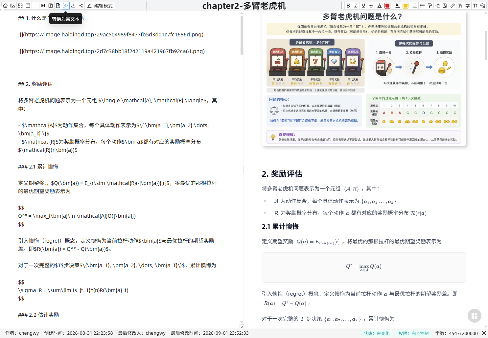
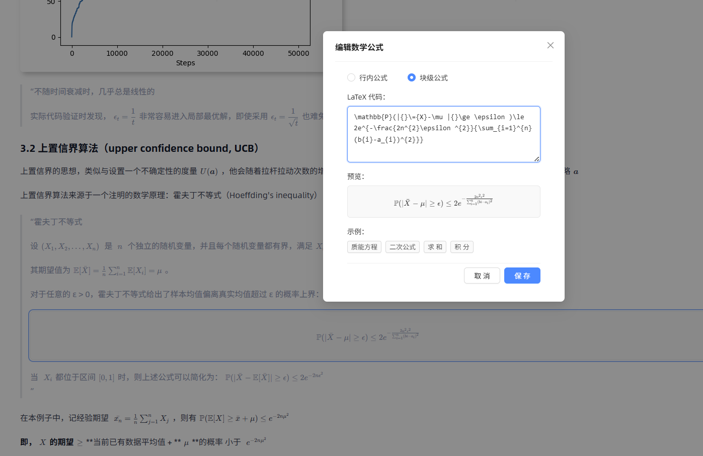
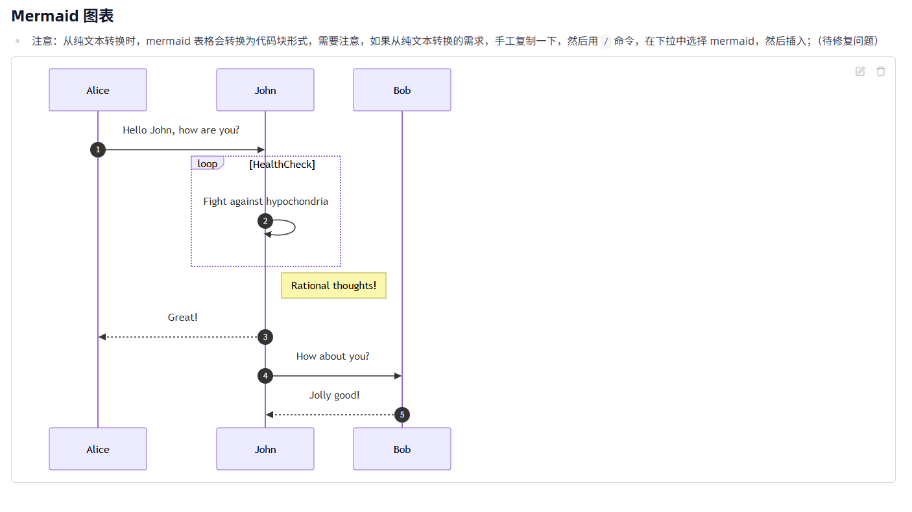
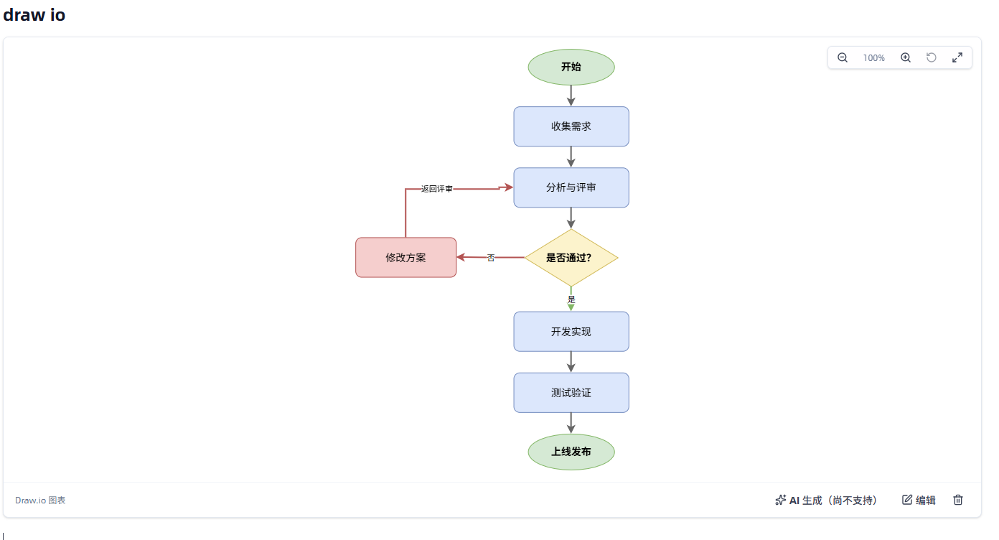
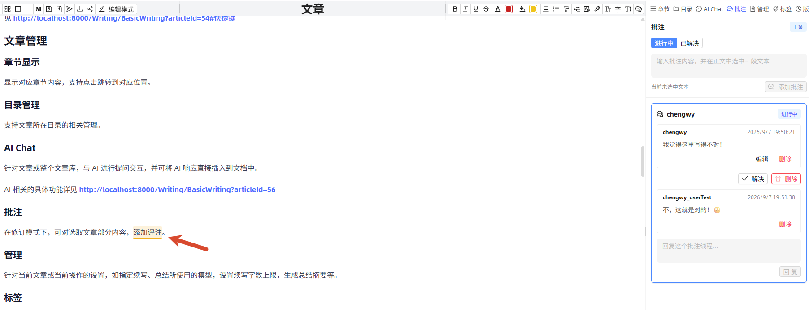
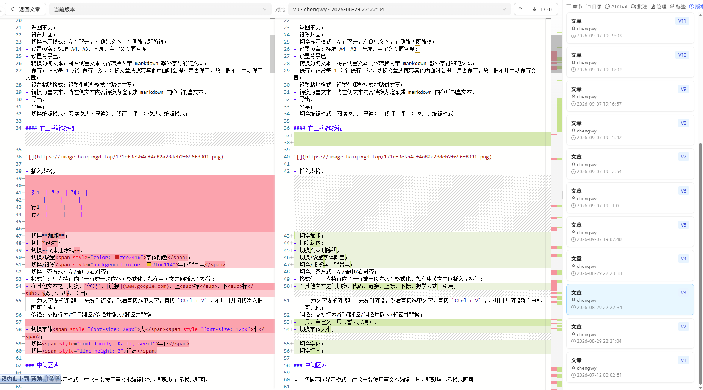
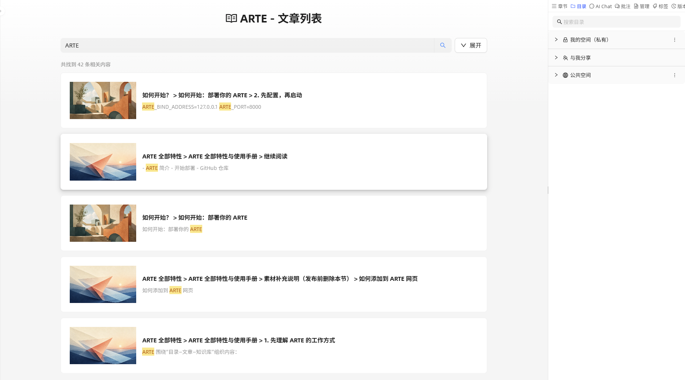

# ARTE

[简体中文](README.md) | [English](README.en.md)

ARTE（AI Rich Text Editor）是一个支持私有部署的富文本编辑与知识管理项目，提供 Markdown 编辑、数学公式与图表、文档分享与批注、历史版本、AI 辅助写作和知识库检索功能，可用于技术文档、产品手册和团队知识库管理。


## demo 体验地址

https://arte-demo.nas.haiqingd.top:1443/Writing/BasicWriting/?articleId=122
用户名: guest
密码: arte@2026

## Markdown、数学公式与图表

编辑器提供富文本、Markdown 源码和分屏显示模式，支持格式转换、章节导航、正文查找替换和保存状态提示。

- **Markdown 与富文本**：支持 Markdown 导入、导出和源码编辑，配合标题、列表、任务清单、表格与代码块；通过 `/` 命令快速插入内容。复杂富文本样式和自定义节点的 Markdown 转换存在表达边界。
- **数学公式**：通过 KaTeX 渲染行内与块级 LaTeX 公式，编辑时预览，插入后可再次修改。适合算法推导、学习笔记和技术说明。
- **Mermaid 流程图**：用文本描述流程图、时序图，直接在正文中展示；流程变化时修改源码即可。
- **Draw.io 图表**：在文档内绘制架构图、流程图和 UML，保存后展示预览，也能再次打开编辑，让图表跟着文档一起维护。

<details>
<summary>查看 Markdown、公式与图表截图</summary>









</details>

## 文档组织与媒体内容

支持多级目录、拖拽排序、文章移动和批量整理，并通过个人空间、与我分享和公共空间管理内容。文章可设置封面、摘要和标签，按目录、作者或类型筛选。

正文可插入图片、音频、视频、附件及思维导图。支持 Markdown 文件与带图片的 ZIP 导入、Markdown 导出，以及公共空间发布与撤回。默认部署将上传文件保存到持久化数据卷。

## 文档协作与历史版本

- **文档分享与权限**：文章和目录可分享给用户或角色，按权限阅读、批注或编辑；提供个人空间、与我分享和公共空间。
- **批注线程**：选中文字添加批注，在同一线程中回复、解决或重新打开问题，点击批注定位回正文。
- **历史版本与差异对比**：查看修改人、时间和版本内容，对比两次修改并逐处定位差异，找回旧段落或核对审校结果。
- **并发修改提醒**：通过版本与冲突提醒处理多人维护同一文档的情况。当前不提供多人光标同步、自动合并内容的实时协同编辑。

<details>
<summary>查看批注与版本对比截图</summary>





</details>

## AI 辅助写作

- **上下文补全与续写**：在段落中输入 `//`，结合光标附近和当前章节生成建议；按 `Tab` 或 `Enter` 接受，按 `Esc` 取消。
- **提示词写作**：通过 `/AI 写作` 描述任务，生成段落、说明或初稿，确认后插入正文。
- **摘要与翻译**：生成文章摘要、润色已有摘要；翻译结果可替换原文、插入原文后或作为引用保留。
- **文章问答与助手**：围绕当前文章提问、解释术语、提取步骤，也可配置模型与助手，将回答回填到写作位置。

AI 功能需要配置可用的模型服务；Docker 启动成功后仍需完成模型配置。

模型配置支持 API 地址、模型 ID、密钥与连通性测试，主要接入 OpenAI 兼容接口和 DeepSeek。助手可组合模型、提示词、知识库和上下文策略；对话支持流式输出、停止生成与重新生成。


## RAG 检索与 MCP 扩展

- **全文、向量与混合检索**：基于 Elasticsearch 的关键词检索与向量检索，支持用原词或自然语言寻找相关文章；保存后的正文异步建立索引。
- **RAG 知识库问答**：知识库助手检索文章片段作为回答上下文，适合跨文档整理信息、查找说明。单篇文章问答则直接围绕当前正文展开。
- **MCP 扩展入口**：后端包含 MCP Client / Server 支持及工具、资源、Prompt 和参数补全示例，便于开发者接入自己的工作流；当前示例不等于完整的文章管理 API。

关键词检索用于查找术语和原句，向量检索支持自然语言描述，结果展示相关片段与匹配高亮。检索范围结合文章和目录权限；当前主要索引正文文字，不自动解析图片、音频和任意附件。



更多使用方式见[项目介绍](docs/public/118-ARTE简介.md)和[完整功能手册](docs/public/119-ARTE全部特性.md)。

## 用户与角色管理

提供用户、角色、菜单和操作权限管理。系统功能权限与文档内容权限分别配置，可按团队分工授予管理、阅读、批注或编辑能力。

## Docker 一键部署

标准部署从 GHCR 拉取镜像，启动前端、后端、MySQL、Redis、Elasticsearch 和 Draw.io，宿主机无需安装 Java 或 Node.js。

安装 Docker Desktop，或 Docker Engine 与 Compose 插件。

首先从 [GitHub 仓库](https://github.com/CYLJ126/ai-rich-text-editor) 下载项目：点击 **Code → Download ZIP** 并解压，或使用 Git 克隆：

```sh
git clone https://github.com/CYLJ126/ai-rich-text-editor.git
cd ai-rich-text-editor
```

在项目根目录打开终端（ZIP 下载方式请进入解压后的目录），按系统执行：

```powershell
# Windows PowerShell
cd deploy
.\compose-up.ps1
```

```sh
# Linux / macOS
cd deploy
./compose-up.sh
```

脚本会等待核心服务全部健康后再返回。启动完成后打开
[http://localhost:8000](http://localhost:8000)，使用初始管理员账号登录：

- 用户名：`admin`
- 密码：`Aa111111`

首次登录后请立即修改管理员密码。部署到公网前，还应修改首次运行时复制到
`deploy/.env` 中的服务密码。HTTPS、本地源码构建、使用现有 MySQL/Elasticsearch
及日常运维请参阅[详细 Docker 部署手册](deploy/readme.md)。

也支持本地源码构建、接入已有 MySQL/Elasticsearch、自备 HTTPS 证书及可选 Kibana，参数与配置见详细部署手册。

## 许可证

除非文件或目录中另有说明，对于 ARTE 版权所有者有权授权的仓库内容，均采用
[MIT License](LICENSE) 发布，第三方库、模型、素材和部署组件分别适用其各自许可证。

MIT License **不会**取代或覆盖第三方代码、依赖库、素材、模型或服务的许可证、版权声明及
署名要求。特别是，部分后端源文件保留了其上游项目的 Apache-2.0 声明，运行时依赖也继续
适用各自的许可证。详情请参阅 [THIRD_PARTY_NOTICES.md](THIRD_PARTY_NOTICES.md) 和
[LICENSES/](LICENSES/)。

发布构建产物前，应针对实际解析出的精确依赖版本重新生成并审核完整的依赖及许可证清单。
仓库中的第三方声明是人工维护的摘要，不能替代发布时的正式审查。

