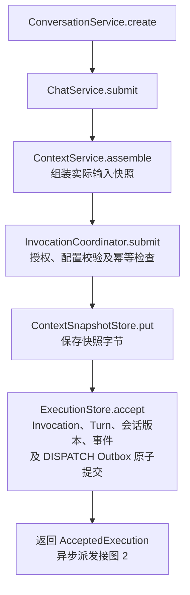
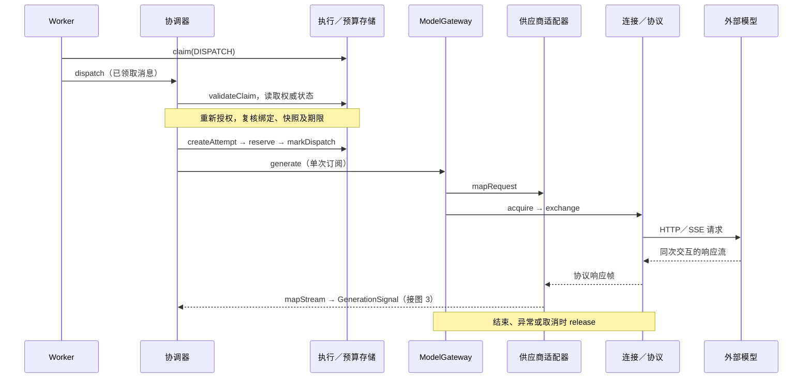
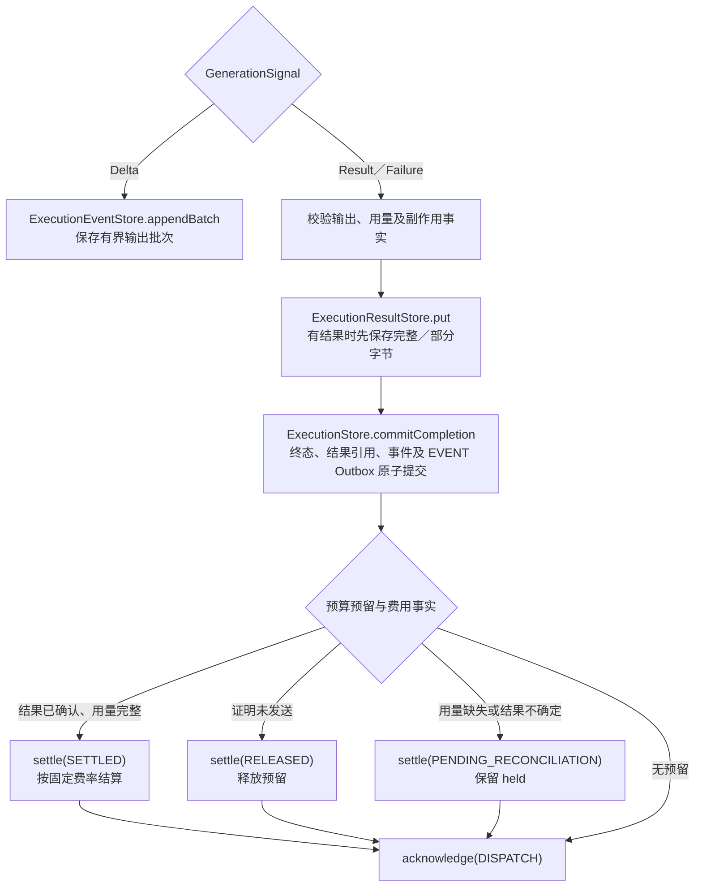
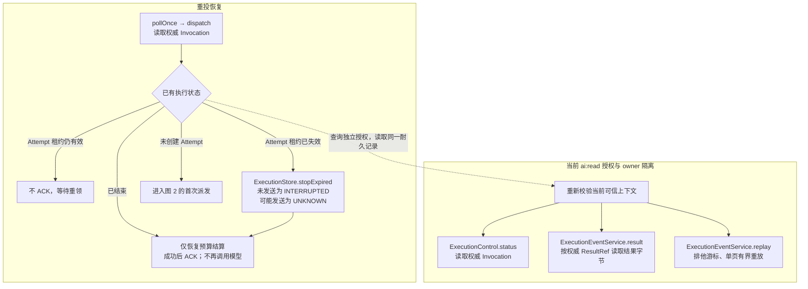

# 第 5～6 步：异步派发与最小生成闭环

已实现 Service 层完整链路：创建会话 → ChatService.submit 可靠受理 → Worker 领取 DISPATCH Outbox → Attempt／预算预留／发送标记 → ModelGateway 单次生成 → 输出事件／结果字节 → 耐久终态 → 预算结算 → 状态、结果及事件重放查询。新增运行实现均在 `com.arte.ainew`，复用前 4 步的控制面、字节存储及受控连接。

**图 1：会话创建与可靠受理**



**图 2：异步派发与单次模型交互**

Worker 为 `InvocationDispatchWorker`，协调器由 `InvocationCoordinator`／`GenerationDispatcher` 处理。仅首次派发进入模型；重复领取的恢复分支见图 4。处理期间分别调用 `renewClaim` 和 `renewLease` 续租。



**图 3：输出、耐久终态与预算结算**

图 2 的增量顺序保存为事件；结束信号提交终态。预检失败使用 `CompleteBeforeAttempt`；预算不足则在已创建 Attempt 上提交已知失败，均不调用模型。



**图 4：重投恢复与授权查询**

结算或基础设施故障时不 ACK，租约到期后重新领取。恢复只依据耐久记录，不重发结果不确定的模型请求；查询使用新的当前可信上下文。



## 实现分工

| 实现 | 责任 |
|---|---|
| `DefaultInvocationCoordinator` | submit 委托可靠受理组件；dispatch 委托生成派发组件 |
| `GenerationDispatcher` | 核验领取、重新授权、复核固定绑定与快照，创建单次 Attempt，预留、发送、续租、保存输出、结束及结算 |
| `InvocationDispatchWorker` | pollOnce 领取并发容量以内的消息，续租、处理后 ACK；支持 Spring 生命周期和显式自动轮询 |
| `DefaultExecutionControl` | status 在当前 ai:read 授权下读取权威 Invocation |
| `DefaultExecutionEventService` | result 按权威 ResultRef 读取完整／部分结果；replay 读取有界单页事件 |
| `NewAiExecutionConfiguration` | 独立开关、协调器替换、读取服务及 Worker 装配；缺少前置组件时启动失败 |

## 开启及测试入口

先完成 [受理配置](ADMISSION_IMPLEMENTATION.md) 和 [生成配置](GENERATION_IMPLEMENTATION.md)，手动执行建表脚本并通过 `BudgetAccountInitializer.initialize` 初始化账户。本步没有新增表，也不会在启动时执行 DDL 或初始化账户。预算初始化仍需要可信上下文及 ai:budget:admin 权限。

在已有配置上增加 [执行配置示例](examples/ainew-execution.yml)。三个功能开关分别为 `arte.ai-new.enabled`、`arte.ai-new-generation.enabled`、`arte.ai-new-execution.enabled`。执行开关默认关闭；开启后注册完整协调器和读取服务，替代仅受理的协调器。

本仓库已将完整参数接入 `backend/profile/app.properties`，可复制的版本见 [app.properties.example](../profile/app.properties.example)。Maven dev profile 将参数过滤到 `classpath:ainew/config/application.properties`，已有的 `application-ai.yml` 自动导入该运行时文件；修改参数后需要重新构建资源。不要仅在 Maven 参数文件中新增未被运行时模板引用的字段，也不要同时叠加两份不同的固定配置列表。

`ARTE_DEEPSEEK_API_KEY` 配置在实际 Java 进程的环境中。本机 zsh 可在 `~/.zshenv` 中配置并通过新终端或 `source ~/.zshenv` 加载；从该终端启动应用。已有 IDE 进程不会自动获取变量，需设置其 Run/Debug Configuration 的 Environment variables，或从已加载变量的终端重启 IDE。部署时使用服务／容器环境注入。参数文件及构建资源仅保存环境变量名称／引用，旧 Spring AI 的 DeepSeek Key 也改为该环境变量引用。

参数中的 `example-user`／主体与空间标识、费率均为测试示例。真实登录须将 subject-name 与 Authentication.getName() 对应，主体／空间与预算 owner 保持一致；数据库预算账户仍需显式初始化。

`arte.ai-new-execution.worker-enabled=false` 默认保持手动消费，装配阶段不访问数据库或供应商。集成测试可在 submit 成功后调用 `InvocationDispatchWorker.pollOnce()`，然后用**新建的当前可信上下文**调用 `ExecutionControl.status`、`ExecutionEventService.result`、`replay`。不要为读取重用已经过期的原执行上下文。Mono 是冷执行，测试订阅后才运行；`block` 仅用于测试入口，HTTP 事件线程返回 Mono／Flux。

需要后台消费时设置 `worker-enabled=true`，Spring 启动 Worker 自动轮询。此时会访问数据库，且有已受理任务时会调用所配置的模型。Worker 停止会取消本次订阅并停止轮询；没有耐久取消命令就不会伪造 CANCELLED 终态，遗留任务在租约失效后恢复。

`pollOnce()` 返回本批尝试处理的消息数量；消息处理失败会记录安全错误分类并保留未 ACK 的记录，因此返回数量不表示成功生成数量。业务完成以 status 为准。

### 手动初始化、派发与真实模型联调

提供了 [NewAiManualIT](../arte-app/src/test/java/com/arte/app/ainew/NewAiManualIT.java)，从 `backend/profile/app.properties` 只读取 `spring.datasource.druid.app.*` 物理数据源参数，AI 参数使用过滤后的 `ainew/config/application.properties`，只装配物理 appDataSource 与新 AI 组件。本地 profile 是 Maven 构建参数，不能直接作为 AI 运行配置覆盖列表；例如 bindings 的嵌套 capability 在资源过滤时补齐。修改 profile 中的 AI 参数后，先通过 Maven `test-compile` 重新生成资源再运行 IDE 测试。它不使用 arte-app 默认的 H2 测试配置，不依赖先启动完整应用，不执行建表脚本。IT 后缀不被默认 Surefire 单元测试扫描，需明确选择方法运行。

在 IDE 中将 Working directory 设置为 `backend/arte-app`，配置进程环境变量 `ARTE_DEEPSEEK_API_KEY`，然后分别运行：

| 方法 | 实际动作 |
|---|---|
| initializeExampleBudget | 使用当前配置的空间及 zhangsc 测试身份申请 ai:budget:admin，调用 BudgetAccountInitializer.initialize("example-budget", context)；重复执行不清空 held／charged，不调用模型 |
| dispatchOneBatch | 调用 Worker.pollOnce 并等待完成；没有待派发消息返回 0。会消费该数据库中的一批 DISPATCH，可能包含其他主体的任务 |
| submitTextAndDispatch | 初始化预算 → 创建新会话 → 提交文本 → 手动领取，直到本次调用结束 → 查询状态和模型结果；会写入真实数据库并调用真实模型 |

默认测试名称为 `zhangsc`；更换名称可设置 JVM 参数 `-Darte.ai-new.manual.subject=你的用户名`，仍须匹配固定 grants。这里构造已认证身份仅用于本地测试；生产入口必须从真实认证上下文取得身份，不能接受客户端自报用户名来创建已认证对象。

从项目根目录运行初始化方法：

```bash
mvn -o -f backend/pom.xml -pl arte-app -am \
  -Dmaven.compiler.proc=full -Dmaven.compiler.release=21 \
  -Dslf4j.provider=ch.qos.logback.classic.spi.LogbackServiceProvider \
  '-Dtest=NewAiManualIT#initializeExampleBudget' \
  -Dsurefire.failIfNoSpecifiedTests=false test
```

需要手动派发时，将选择器改为 `NewAiManualIT#dispatchOneBatch`；完整联调改为 `NewAiManualIT#submitTextAndDispatch`。不要仅调用 Mono 方法而不订阅；本测试使用 block 等待实际执行完成，正式响应式入口应返回组合后的 Mono／Flux。

| 配置 | 默认值／约束 |
|---|---|
| concurrency | 4，范围 1～32；每实例最多领取可立即执行的数量 |
| poll-interval | 1s，范围 100ms～1m；每批结束后等待 |
| outbox-lease／attempt-lease | 2m，范围 3s～5m；分别约每个租约的 1/3 续租 |
| reservation-retention | 1d，范围 1s～30d，且至少覆盖 maximum-timeout；到期不自动释放 held |

## 派发与恢复保证

Outbox 和 Attempt 使用不同的租约及 fencing token。新增 `ExecutionOutboxStore.validateClaim／renewClaim` 以数据库时钟检查完整身份，不允许已经失效的领取复活；Attempt 所有写入使用新读取的 Guard。只在存储明确返回 VERSION_CONFLICT 时有限次重新读取，模型交互不 retry。

每次创建 Worker 的身份唯一，不读取旧 ThreadLocal 用户或连接路由。多实例归属由数据库锁与版本仲裁；单实例也限制重复 pollOnce 重叠。生成信号只订阅一次，以最多 32 条的一批顺序追加事件，遵守已有输出字节上限和反压。先耐久保存结果字节，再原子提交终态、引用、事件及 EVENT Outbox，最后独立结算并 ACK DISPATCH。

重投时先读现状：

- 已结束：只恢复未完成的结算，不再次调用模型。
- 已有有效 Attempt：拒绝接管发送，保留消息供后续重领。
- 已有失效 Attempt：`ExecutionStore.stopExpired` 原子递增版本和 fencing；NOT_STARTED 收敛为 INTERRUPTED，可能发送收敛为 UNKNOWN。本阶段不自动创建第二次尝试。
- 未创建 Attempt 但权限、配置、快照或期限失效：耐久结束；队列中过期的调用成为 TIMED_OUT，不调用模型。

该链路提供至少一次消息处理与耐久防重。数据库无法与外部 HTTP 形成原子事务；在发送标记之后发生崩溃，即使无法判断是否实际发送，也保留 UNKNOWN，等待同次远端操作核对。UNKNOWN 保留会话活跃门闩。

完整且有效的生成结果提交 SUCCEEDED。供应商明确结束但输出不完整（如 length）保存部分结果，提交 FAILED／MODEL_OUTPUT_INCOMPLETE；存储检查实际结果字节的归属、类型、完整性标志、Schema、摘要和用量，非空证据字符串不能单独证明失败。断流、超时和不确定响应提交 UNKNOWN；供应商提供部分结果时仍可通过 result 读取，并检查 result 的 partial／complete。

## 预算及读取语义

预留按实际快照 maxInputTokens 和请求 maxOutputTokens 的容量上界、固定每百万 Token 费率计算。预留成功且发送标记提交之后才订阅网关。预算不足提交已知 FAILED，不发送。

完整结果或已确认的不完整结果，且 inputTokens／outputTokens 均为供应商报告时，按固定费率结算。确定未发送的废弃 Attempt 释放预留；缺少用量或外部结果不确定时记录 PENDING_RECONCILIATION 并保留 held，不估算实际费用、不补零。终态提交后结算失败不 ACK；重投从耐久终态恢复同一个结算键，避免再次生成或重复扣费。

所有读取重新检查 ai:read、主体及空间；跨 owner 返回 AI_NOT_FOUND。尚无权威结果引用时 result 返回 AI_RESULT_NOT_AVAILABLE；已经提交引用但字节缺失属于基础设施错误。replay 保留底层排他游标、单页上限和 CURSOR_EXPIRED 语义。

## 验证及当前边界

新增完整链路测试采用 H2 MySQL 模式和真实 localhost HTTP／SSE，覆盖正常生成、重复提交／投递、多实例并发、自动轮询、慢响应续租、流中断、截断结果、缺失用量、预算不足、队列过期、失效 Attempt、防重结算恢复及读取隔离。装配测试验证默认关闭、开启后默认不轮询、缺少前置组件失败、参数及未知字段严格校验。

从项目根目录运行回归：

```bash
mvn -o -f backend/pom.xml -pl arte-ai -am \
  -Dmaven.compiler.proc=full -Dmaven.compiler.release=21 \
  -Dslf4j.provider=ch.qos.logback.classic.spi.LogbackServiceProvider \
  '-Dtest=com.arte.ainew.admission.*Test,com.arte.ainew.persistence.*Test,com.arte.ainew.contract.*Test,com.arte.ainew.context.*Test,com.arte.core.interceptor.*Test' \
  -Dsurefire.failIfNoSpecifiedTests=false test
```

本次测试不访问当前数据库、不使用实际凭据、不调用真实供应商。实际 MySQL 锁竞争、驱动及隔离级别，以及真实供应商联调仍需部署验证。

本步新增 20 项测试（完整链路 14 项、装配 4 项、存储校验 2 项）；连同前 4 步、数据／上下文／持久化契约及拦截器回归，共 152 项通过；arte-app 编译通过。可参考 [完整链路测试](src/test/java/com/arte/ainew/admission/DispatchIntegrationTest.java) 中的实际组件装配、submit、pollOnce 和查询方式。

本阶段提供 Service 层测试入口。后续已接入会话创建／列表／详情／轮次查询及单条用户文本提交 HTTP Controller，提交契约见 [HTTP 接口说明](CHAT_HTTP_API.md)；执行状态／结果及单页耐久事件重放已接入，见 [执行查询接口](INVOCATION_HTTP_API.md)。预算 HTTP Controller、事件实时 watch／EVENT 发布者、耐久跨实例取消、UNKNOWN 的远端核对、动态路由、工具、历史上下文及多次安全重试仍待后续实现；watch／control／reconcile 明确返回未启用错误。现有手动 DDL 不变。
