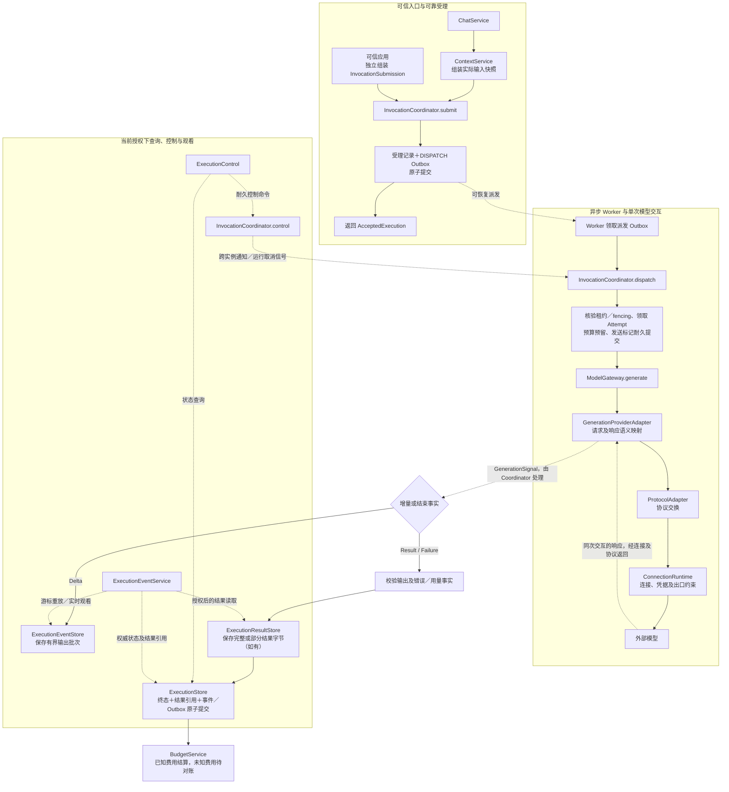

# AI 调用接口契约

适用于 `com.arte.ainew`。本次只声明方法及配套数据契约，不添加协调器、网关、适配器、Bean、HTTP API 或新的存储实现。

## 1. 最小生成链路

```text
ChatService → ContextService → InvocationCoordinator.submit
                                  ↓ 受理记录＋DISPATCH Outbox 提交
Worker → InvocationCoordinator.dispatch
          → 领取 Attempt／预算预留／发送标记耐久提交
          → ModelGateway.generate(GatewayCall<GenerationRequest>)
          → GenerationProviderAdapter／ProtocolAdapter／ConnectionRuntime
          → 输出保存／结果字节保存／终态与结果引用提交／预算结算

ExecutionControl／ExecutionEventService → 当前授权下查询、控制及观看
```



独立调用可由可信应用组装 InvocationSubmission，不必创建会话。入口不能绕过 Coordinator 调用 Gateway。

| 接口 | 本次声明 |
|---|---|
| InvocationCoordinator | submit、dispatch、reconcile、control |
| ModelGateway | generate，同次订阅返回增量及结果／失败事实 |
| ProviderAdapter | providerId、kind、capabilities、mapRequest、mapResult、mapError |
| GenerationProviderAdapter | mapStream，生成专用流映射 |
| ProtocolAdapter | definition、exchange，内部协议／SDK 类型保留泛型 |
| ConnectionRuntime | acquire、release、invalidate，以及实例内 Lease |
| CapabilityCatalog | resolve、discover、validate |
| BindingManager／ConnectionManager | 解析固定版本的运行配置 |
| ContextService | assemble、find |
| ChatService／AiActionService | submit、regenerate／execute |
| ConversationService | create、find、turn、history |
| ExecutionControl | status、request，首批目标为 Invocation |
| ExecutionEventService | replay、watch、result |
| ContextSnapshotStore／ExecutionResultStore | 实际输入／结果字节的防重保存及隔离读取 |
| 其他四类 Gateway | 已有专有输入对应的执行方法；媒体／远端应用补充 query、cancel |
| BusinessToolAdapter／ResourceContextAdapter | 工具声明及领域调用／资源类型及授权解析 |

已有预算、执行、事件、Outbox、准入目录和授权解析端口继续复用，本次不改变其实现。

## 2. 受理、执行与控制

- InvocationSubmission 是内部参数。Coordinator 计算规范化请求摘要、构造初始 Invocation，不接收客户端自报状态。生成消息必须与实际 ContextSnapshot 一致。
- 快照字节先可靠保存，再提交其引用；摘要覆盖实际内容，不以新分配 snapshotId 代替内容。未受理的孤立快照按保留策略回收。授权、来源、容量及快照有效期由应用边界核对。
- newTurn 表示本次新建轮次；重新生成时 Coordinator 加载原 Turn、追加候选引用，再按现有 Accept 契约提交，不改变原轮次身份、路径和输入。
- dispatch 只供内部 Worker 消费已领取的派发 Outbox，核验消息及 Attempt 租约／fencing，内部协调准入、预留、续租、发送、安全重试、输出和结算。不把每个内部步骤公开成入口可乱序调用的方法。
- GatewayCall 固定请求、绑定、已标记发送的 Attempt 和 runtime；允许刷新授权，不能更换 owner、扩大原授权范围或延长期限。构造对象不是数据库提交或有效租约的证明。
- reconcile 只核对 UNKNOWN 的同一次远端操作及费用，有证据才更新，不重发原请求。不支持核对时明确报告无法确认，保留未知结果及待对账预算。
- control 必须耐久保存命令及幂等事实，再返回回执；跨实例取消不能只依赖本地 cancellation。当前存储尚无控制命令持久化实现，本次声明不代表该保证已落地。
- 受理、创建会话需有效幂等键；控制命令使用 commandKey。会话创建防重及历史版本查询仍需后续实现。重复订阅业务命令必须防重；订阅取消不能证明远端未执行。

## 3. 生成流与供应商边界

GenerationSignal 把同次远端交互的增量和结束事实放在一个 Flux：

```text
Delta* → Result(ModelResult) → onComplete
或
Delta* → Failure(ExecutionError, Usage, 可选部分结果) → onComplete
```

适配实现必须保证唯一结束信号及有界聚合。不能独立订阅事件 Flux 和结果 Mono 来启动两次请求。Gateway 不内部 subscribe／retry，不把 onComplete 或 GenerationEvent.Finished 当成 Invocation 成功。完整输出仍需 Schema、工具配对、来源及完整性校验。

供应商业务失败保留用量和可能的副作用；部分结果的用量必须与 Failure 一致。订阅前校验及基础设施异常可 onError；Coordinator 结合已提交的发送事实分类，不能默认认为未执行、零费用或允许重试。

ProviderAdapter 的 Q／S 为内部协议／SDK 类型，R 为已登记的平台结果 DTO，注册键为 providerId＋kind。纯映射不做阻塞 I/O。生成流映射单独放在 GenerationProviderAdapter，其他能力不强行套入生成增量。能力声明不等于授权，不支持的特性明确拒绝。

ConnectionDefinition 首批覆盖 HTTP(S) 配置，使用 SecretRef。结构合法不等于出口安全，发送时仍检查目标、重定向、停用及凭据权限。ResolvedBinding.rate 缺失表示费率尚未解析，不能据此宣称免费。受管进程、MCP 会话及协议恢复矩阵后续扩展专用契约。

## 4. 查询与字节存储

- 查询携带当前可信 ExecutionContext；owner、执行 ID 及游标不授予访问权。应用接口不存在／不可见明确失败；基础存储 find 不存在可返回 empty。
- replay 有界单页；watch 以耐久事件为权威，通知仅唤醒回读。慢消费者缓冲有界，历史到实时切换不得遗漏，断线以排他游标恢复，取消观看不取消任务。游标过期读取 status 及权威结果，不静默丢弃历史。
- ExecutionResultStore 使用封闭 InvocationResult；Pending 媒体／远端任务不是已完成结果。先保存字节，再提交终态引用；查询核对 owner、权威引用、类型白名单、Schema 及摘要。
- 两个新字节存储端口暂未实现，也未注册到现有 ExecutionRecordCodec，未新增表或修改 DDL。后续需选择数据库／对象存储、编码及保留策略，不能假定现有编码器已支持新信封。
- Mono／Flux 不证明底层非阻塞；未来 MyBatis／SDK 阻塞调用须经有界调度桥接，不能占用事件线程。纯映射、注册元数据与句柄访问保持同步。

## 5. 后置接口

本次固定默认绑定和最小文本生成链路；其他 Gateway 的声明只固定已有专有类型，不承诺当前启用。

AssistantManager、SkillRegistry、DefinitionRegistry、ReleaseManager、MemoryService、ResourceRetrievalProvider、EvaluationService、WorkflowRuntime、AgentRuntime，以及控制面完整 CRUD、会话改名／删除／资料修改、动作转追问，保留后续阶段。它们需要专有版本定义、补丁、分页或 Run 契约，不用 Object／任意 Map 提前填满接口。动作执行入口先固定方法；动作定义、发布解析及运行仍需后续契约。

模型路由、分布式准入、重试和输出校验策略由后续协调实现按依赖拆分。Worker、策略、字节存储、事件观看和运行装配完成前，建表及本次声明仍不足以真实调用 AI。
