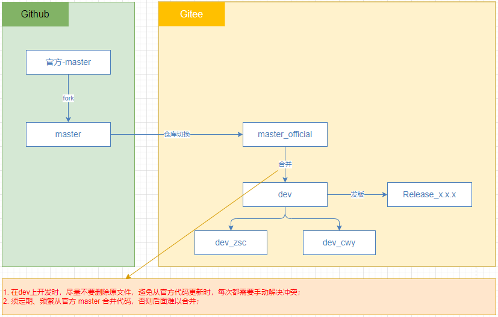

# NIP Front

## 文档说明

- src/components/RichTextEditor/doc/Tiptap.md ：富文本编辑器组件的 Tiptap 配置文档

## 代码分支

* Git 官方：https://github.com/ant-design/ant-design-pro
* Git fork：https://github.com/CYLJ126/ant-design-pro
* Gitee：https://gitee.com/cylj126/nobody-is-perfect-front



## 依赖

```bash
# 添加 KeepAlive 组件
yarn add react-activation

# 添加依赖，解决启动时 swagger ui 报 ModuleBuildError: ./node_modules/swagger-ui-dist/swagger-ui.css 的错
yarn add style-loader css-loader -D

# 国密
yarn add sm-crypto
yarn add -D @types/sm-crypto

# Tiptap 富文本
yarn add @rcode-link/tiptap-drawio @tiptap/core @tiptap/extension-character-count @tiptap/extension-code-block-lowlight @tiptap/extension-details @tiptap/extension-file-handler @tiptap/extension-highlight @tiptap/extension-image @tiptap/extension-list @tiptap/extension-mathematics @tiptap/extension-mention @tiptap/extension-placeholder @tiptap/extension-table @tiptap/extension-twitch @tiptap/extension-youtube @tiptap/markdown @tiptap/pm @tiptap/react @tiptap/starter-kit @tiptap/suggestion lowlight 
# 添加文本对齐扩展 https://tiptap.dev/docs/editor/extensions/functionality/textalign
yarn add @tiptap/extension-text-align

# 添加 JavaScript 实用工具库 lodash
yarn add lodash
yarn add @types/lodash -D

# Tiptap
# 添加任务列表扩展
yarn add @tiptap/extension-list
yarn add @tiptap/extension-list

# 上标下标
yarn add  @tiptap/extension-superscript @tiptap/extension-subscript

# 提及扩展
yarn add @tiptap/extension-mention

# 文字样式扩展
yarn add @tiptap/extension-text-style

# UniqueId 扩展
yarn add @tiptap/extension-unique-id

# 音频扩展
yarn add @tiptap/extension-audio
```

**AI**

```bash
yarn add @ai-sdk/react
yarn add @ai-sdk/openai
```

**整合 my-tiptap-block-editor 需要的依赖**

（一）AI
```bash
# Vercel AI SDK 的 DeepSeek 模型提供商适配器
yarn add @ai-sdk/deepseek

# Vercel AI SDK 的 OpenRouter 多模型路由提供商适配器
yarn add @openrouter/ai-sdk-provider

# Vercel AI SDK 核心库，提供流式对话、文本生成等 AI 能力
yarn add ai
```

（二）Tiptap

```bash
# Tiptap 气泡菜单扩展，选中文字时显示浮动工具栏
yarn add @tiptap/extension-bubble-menu
# Tiptap 代码块扩展（基础版，无语法高亮，与已有的 lowlight 版本选其一）
yarn add @tiptap/extension-code-block
# Tiptap 实时协作扩展，基于 Yjs CRDT 实现多人同时编辑
yarn add @tiptap/extension-collaboration
# Tiptap 拖拽手柄扩展（核心逻辑），允许拖拽移动编辑器节点
yarn add @tiptap/extension-drag-handle
# Tiptap 拖拽手柄的 React 组件封装，提供可渲染的拖拽按钮 UI
yarn add @tiptap/extension-drag-handle-react
# Tiptap 浮动菜单扩展，光标在空行时显示浮动操作菜单（如 / 指令菜单）
yarn add @tiptap/extension-floating-menu
# Tiptap 标题扩展（H1-H6），支持多级标题格式
yarn add @tiptap/extension-heading
# Tiptap 节点范围选择扩展，支持跨节点批量选择操作
yarn add @tiptap/extension-node-range
# Tiptap 文字样式扩展，作为颜色、字体等内联样式扩展的基础依赖
yarn add @tiptap/extension-text-style
# Tiptap Pro 扩展聚合包（需要 Tiptap Pro License 授权）
yarn add @tiptap/extensions
# Tiptap 与 Yjs 的官方绑定层，将 ProseMirror 状态同步到 Yjs Doc
yarn add @tiptap/y-tiptap
```

（三）其他
```bash
# 冲突：Vite 专属插件
~~yarn add @tailwindcss/vite~~
# Next.js 生态，与 antd-style 主题体系重复
~~yarn add next-themes~~
# Base UI 无样式 React 组件库（MUI 团队出品），提供可访问性原语组件
yarn add @base-ui/react
# Floating UI DOM 适配层，提供浮层/弹出框的精准定位计算能力
yarn add @floating-ui/dom
# Iconify 的 Logos 图标集（各种技术栈 logo），配合 Iconify 使用
yarn add @iconify-json/logos
# 用于构建可组合 UI 变体的工具函数，shadcn 组件体系的核心依赖
yarn add class-variance-authority
# Chart.js 图表库核心，Canvas 2D 渲染的轻量级图表库
yarn add chart.js
# Command 命令面板组件（⌘K 风格），基于 Radix UI 构建
yarn add cmdk
# 现代日期处理工具库，提供日期格式化、计算、比较等功能
yarn add date-fns
# LaTeX 数学公式渲染库，将 LaTeX 语法渲染为 HTML/MathML
yarn add katex
# Lucide 图标库的 React 版本，提供 1000+ 像素级清晰 SVG 图标
yarn add lucide-react
# Mermaid 流程图/时序图渲染库，将文本语法转换为 SVG 图表
yarn add mermaid
# 功能完整的日期选择器 React 组件，支持范围选择、禁用日期等
yarn add react-day-picker
# GitHub Star/Fork 统计徽章按钮的 React 组件封装
yarn add react-github-btn
# React 表单状态管理库，提供表单验证、提交、错误处理等能力
yarn add react-hook-form
# Markdown 渲染 React 组件，将 Markdown 文本转换为 React 元素
yarn add react-markdown
# 轻量级 Toast 通知组件，动画流畅，支持 Promise 状态通知
yarn add sonner
# Tailwind CSS 类名合并工具，智能处理类名冲突（与 clsx 配合使用）
yarn add tailwind-merge
# Tailwind CSS 动画工具类补充包，提供额外的 CSS 动画关键帧
yarn add tw-animate-css
# Yjs 协作协议层，实现 awareness（用户状态感知）等协作功能
yarn add y-protocols
# Yjs CRDT 核心库，实现分布式实时协作数据同步
yarn add yjs
# TypeScript 优先的数据校验库，提供运行时类型校验和类型推断
yarn add zod
# 支持代码高亮
yarn add highlight.js
```

（四）dev 依赖

```bash
# 冲突：@umijs/lint 内部已包含 ESLint 配置。引入完整 ESLint 体系与现有 Biome 体系重复，增加维护负担
~~yarn add @eslint/js~~
~~yarn add eslint~~
~~yarn add eslint-plugin-react-hooks~~
~~yarn add typescript-eslint~~
~~yarn add globals~~
# 冲突：Vite 专属插件，在 Umi 项目中无意义
~~yarn add eslint-plugin-react-refresh~~
# 冲突：Vite 专属插件
~~yarn add @vitejs/plugin-react~~
# 冲突：与 Umi 的构建体系完全不同
~~yarn add vite~~
# Umi 有自己的 Babel 配置体系，React Compiler 需要在 Umi 配置中通过特定方式启用，直接安装插件不会生效
# 在 config/config.ts 中通过 Umi 的 extraBabelPlugins 配置启用：extraBabelPlugins: ['babel-plugin-react-compiler']
~~yarn add babel-plugin-react-compiler~~
# Sass/SCSS 预处理器，支持变量、嵌套、混入等 CSS 扩展语法
# 这是 CLI 工具，不是运行时依赖，不应出现在 dependencies 或 devDependencies 中，且 shadcn 组件体系与 antd 组件体系会产生样式冲突
~~yarn add shadcn~~
# Tailwind CSS 排版插件，为 prose 类提供优美的文章/文档排版样式
yarn add @tailwindcss/typography
# PostCSS 自动添加 CSS 浏览器前缀插件（-webkit- 等）
yarn add autoprefixer
yarn add sass
```

**资源**

- Tiptap 官网：https://tiptap.dev/docs
- Tailwindcss 官网：https://www.tailwindcss.cn/
- Vercel AI SDK 官网：https://ai-sdk.dev/docs/foundations/overview

## 构建或启动

- 如果发现改了依赖或什么内容，没生效的，可以删除 `src/.umi` 目录 和 `node_modules/.cache` 目录，再 `yarn start` 启动；
- 如果发现没改依赖什么的，原来启动成功，重新启动又失败了，可以删除 `src/.umi` 目录 和 `node_modules/.cache` 目录，再 `yarn start` 启动；

## 项目结构

**app.tsx**

主入口文件，包含布局、路由、水印等配置，从后端加载菜单的逻辑在此。

**assets**

资源目录，包含全局资源，如图片、字体等。

**config**

配置目录，包含全局配置。routes.ts 废弃，从后端获取。

**components**

组件目录，包含全局组件。

（一）页面和布局等基础组件

- `Footer`：`src/components/Footer` ：页脚组件，用于在页面底部显示页脚信息。
- `HeaderDropdown`：`src/components/HeaderDropdown` ：头部下拉菜单组件，用于在页面顶部显示下拉菜单，包含用户信息、设置等。
- `PageWrapper`：`src/components/PageWrapper` ：页面包装器组件，用于在页面顶部和底部添加页脚和头部下拉菜单。
- `RightContent`：`src/components/RightContent` ：右侧内容组件，用于在页面右侧显示内容。
- `TabsLayout`：`src/components/TabsLayout` ：选项卡布局组件，用于在页面顶部显示选项卡，每个选项卡对应一个路由。

（二）表单、表格等相关组件

- `DynamicForm`：`src/components/DynamicForm` ：动态表单组件，用于根据后端返回的表单配置动态生成表单。
- `SearchForm`：`src/components/SearchForm` ：搜索表单组件，用于在页面顶部显示搜索表单。
- `SimpleTable`：`src/components/SimpleTable` ：简单表格组件，用于在页面显示简单表格。

（三）其他组件

- `MyColorPicker`：`src/components/MyColorPicker` ：颜色选择器组件，用于选择颜色。
- `ProgressBar`：`src/components/ProgressBar` ：进度条组件，用于显示操作进度。
- `TagsSelector`：`src/components/TagsSelector` ：标签选择器组件，用于选择标签。
- `TimeHeader`：`src/components/TimeHeader` ：时间头组件，用于在页面顶部显示时间信息。
- `RichTextEditor`：`src/components/RichTextEditor` ：基于 Tiptap 的富文本编辑器组件，默认支持 Markdown。

**icons**

图标目录，包含全局图标组件，可以自己添加图标，如到 [svgrepo](https://www.svgrepo.com/) 下载图标，然后添加到 `src/icons` 目录下。

app.tsx 中，从后端获取菜单信息并转换成前端路由时，不支持后端指定图标名，转换成对应图标，所以需要一个 IconMap 来映射图标名和图标组件。

**layouts**

布局目录，包含包含全局布局组件，通常不修改。

**locales**

国际化目录，包含全局国际化组件，可以自己添加国际化配置。

一般如果添加了菜单或页面提示信息什么的，需要在 `locales` 目录下添加对应的国际化配置，只添加 US、ZN、TW 三个配置即可。要使用国际化，可：

```ts
import { history, useIntl, useLocation } from '@umijs/max';

const intl = useIntl();
let label = intl.formatMessage(intlCode); // intlCode 要在 locales 中定义，如 menu.HomePage
```

### 页面

`src/pages` 目录下包含所有页面组件。

- `account`：`src/pages/account` ：个人账号管理页面，包含用户信息、密码修改等功能。
- `Administration`：`src/pages/Administration` ：管理员页面，包含用户管理、菜单管理、角色管理等功能。
- `HomePage`：`src/pages/HomePage` ：首页，包含欢迎信息、操作统计等功能。
- `Learn`：`src/pages/Learn` ：学习页面，包含组件使用示例、功能验证等功能。
- `Tools`：`src/pages/Tools` ：工具页面，包含一些常用的工具，如格式化文档等。
  - `CacheTest`：`src/pages/Tools/CacheTest` ：缓存测试页面，用于测试 KeepAlive 页面缓存功能。
- `user`：`src/pages/user` ：用户页面，包含登录页、注册页等。

