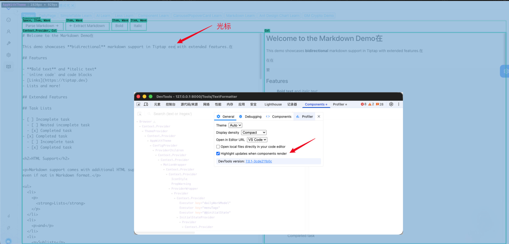

# Tiptap

## TODO

- 官网的文档几乎都在下面了，重点看API、扩展、示例；

## 资源

- [Git 源码](https://github.com/ueberdosis/tiptap)
  - [讨论](https://github.com/ueberdosis/tiptap/discussions)
- [官网文档](https://tiptap.dev/docs/editor/getting-started/overview)
  - [StarterKit extension](https://tiptap.dev/docs/editor/extensions/functionality/starterkit) ：一套包含核心标记和节点的完整套装。
  - [content extensions](https://tiptap.dev/docs/editor/extensions/overview) ：扩展，如图片、表格、图表、自定义节点。
    - [Functionality extensions](https://tiptap.dev/docs/editor/extensions/functionality) ：扩展程序并不总是用于呈现内容，它们还可以为编辑器提供额外功能，如字符计数器、占位符、历史记录、协作工具、文本编辑工具等。
    - [Nodes extensions](https://tiptap.dev/docs/editor/extensions/nodes) ：如果将文档视为一棵树，那么节点就是这棵树中的一种内容类型。节点的例子包括段落、标题或代码块。但节点不一定是独立的块，它们也可以与文本内联显示，例如 @mentions。
    - [Mark extensions](https://tiptap.dev/docs/editor/extensions/marks) ：标记类扩展，如加粗、代码渲染、链接等。
  - [Tiptap 社区扩展](https://github.com/ueberdosis/awesome-tiptap/#community-extensions)
    - [tiptap-comment-extension](https://github.com/sereneinserenade/tiptap-comment-extension)
      - [tiptap-velt-comments](https://www.npmjs.com/package/@veltdev/tiptap-velt-comments)
      - [tiptap-extension-comment-collaboration](https://github.com/b310-digital/tiptap-extension-comment-collaboration)
      - [tiptap-comments](https://www.npmjs.com/package/@rcode-link/tiptap-comments)
    - [tiptap-drawio-extension](https://github.com/radans/tiptap-drawio-extension)
    - [tiptap-extension-figma](https://github.com/haydenbleasel/tiptap-extensions/blob/main/packages/figma)
    - [tiptap-extension-iframely](https://github.com/haydenbleasel/tiptap-extensions/blob/main/packages/iframely)
    - [tiptap-extension-jira](https://github.com/haydenbleasel/tiptap-extensions/blob/main/packages/jira)
    - [tiptap-extension-figure](https://www.npmjs.com/package/@pentestpad/tiptap-extension-figure)：一个适用于 Tiptap 的扩展，可让您添加和编辑图片的说明文字，同时还可以对齐和调整图片大小。
    - [tiptap-extension-upload-image](https://github.com/carlosvaldesweb/tiptap-extension-upload-image) ：具有实时预览的无缝图像上传功能。轻松地将图像添加到您的内容中，同时在上传过程中填充动态占位符。通过这个直观的扩展增强您的编辑体验。
    - [tiptap-image-resize-and-alignment](https://github.com/harshtalks/tiptap-plugins/tree/main/packages/image-tiptap) ：它扩展了 Tiptap 图像扩展功能，以在 React.js 中支持图像调整大小和对齐。
    - [tiptap-extension-video](https://github.com/sereneinserenade/tiptap-extension-video)
    - [tiptap-extension-pagination](https://github.com/hugs7/tiptap-extension-pagination)
    - [tiptap-search-and-replace](https://github.com/sereneinserenade/tiptap-search-n-replace-demo)
  - [custom extension](https://tiptap.dev/docs/editor/extensions/custom-extensions) ：自行开发扩展。
    - [Tiptap 深度教程（四）：终极定制 - 从零创建你的专属扩展](https://juejin.cn/post/7573592952243535924)
  - [引入 Markdown 文档](https://tiptap.dev/docs/editor/markdown)
  - [Tiptap 指南](https://tiptap.dev/docs/guides)
- [官网示例](https://tiptap.dev/docs/examples)
- [ProseMirror Guide](https://prosemirror.net/docs/guide/)
- #[Tiptap 深度教程](https://juejin.cn/post/7535511727035891754)
- 社区示例：
  - Java 版后端 - [plugin-hybrid-edit-block](https://github.com/halo-sigs/plugin-hybrid-edit-block)
  - [Activepieces](https://github.com/activepieces/activepieces) - Open-source AI automation platform
  - [Docmost](https://github.com/docmost/docmost) - Open-source collaborative wiki and documentation software
    - 有 AI、Draw.io 等功能
  - 在线简历制作 - [Magic Resume](https://github.com/JOYCEQL/magic-resume) - Open-source AI resume
  - Chrome 浏览器扩展 - [PlaceNoter](https://github.com/sereneinserenade/placenoter/) - Chrome extension that replaces the new tab with a note-taking app
    - 此扩展程序用笔记应用程序替换您的新选项卡，因此您永远不必离开 chrome。
  - 项目管理（类似 Jira）- [Plane](https://github.com/makeplane/plane) - Open-source project management platform
  - 提供文本绘图支持 - [Text Diagram by Halo](https://github.com/halo-sigs/plugin-text-diagram) - Adds Mermaid and PlantUML diagram
  - 知识管理工具 - [think](https://github.com/fantasticit/think) - Collaborative web app with Markdown
  - Notion 风格的 AI 驱动的块编辑器- [Tiptap editor template](https://github.com/phyohtetarkar/tiptap-block-editor)
    - [Tiptap](https://tiptap.dev/) + [Vercel AI SDK](https://sdk.vercel.ai/) + [Shadcn](https://ui.shadcn.com/) + [Tailwindcss](https://tailwindcss.com/)
  - [Yiitap](https://github.com/pileax-ai/yiitap) - AI-powered, Notion-style WYSIWYG rich text editor
    - VUE 编写

**其他**

- Tailwind CSS
  - 官网：https://tailwindcss.com

    GitHub 源码：https://github.com/tailwindlabs/tailwindcss

- Ant Design：

  - Ant Design Pro：https://preview.pro.ant.design/welcome/
  - Ant Design 组件：https://ant.design/components/overview-cn/
  - Ant Design X：https://ant-design-x.antgroup.com/docs/spec/introduce-cn

### 其他框架

- https://github.com/hedgedoc/hedgedoc：支持公式、在线图片、代码
- https://github.com/remarkjs/react-markdown

## 概述

构建一个完全符合您产品需求、具备所需全部功能的富文本编辑器。Tiptap 将久经考验的 ProseMirror 库封装在一个现代化的、与框架无关的 API 中，并为您提供涵盖所有场景的扩展和功能。

Tiptap 是一个无头富文本编辑器框架，可帮助您构建完全符合您和客户需求的自定义编辑器。它基于 ProseMirror 构建，后者是一个经过实战检验的库，用于在网页上构建富文本编辑器。在底层实现中，Tiptap 大量依赖事件、命令和扩展，从而为编辑器开发提供了一个灵活且强大的 API。

```
┌─────────────────────────────────┐
│        你的应用层 (Your App)      │  ← 具体业务逻辑
├─────────────────────────────────┤
│       Tiptap 抽象层 (Tiptap)     │  ← 开发者友好的 API
├─────────────────────────────────┤
│      ProseMirror 核心层          │  ← 富文本编辑的底层引擎
├─────────────────────────────────┤
│         浏览器 DOM API           │  ← 原生浏览器能力
└─────────────────────────────────┘


Headless——关注点分离（Separation of Concerns）、框架无关性
┌─────────────────┐    ┌─────────────────┐
│   UI 表现层      │    │    编辑逻辑层     │
│                 │    │                 │
│ • 工具栏样式      │ ←→ │ • 文档状态       │
│ • 按钮布局       │    │ • 命令执行        │
│ • 主题配色       │    │ • 扩展管理        │
│ • 交互动画       │    │ • 事务处理        │
└─────────────────┘    └─────────────────┘
    (你负责)              (Tiptap负责)

```

> ProseMirror 并非一个即插即用的编辑器，而是一个用于构建富文本编辑器的强大"工具集"。它由 Marijn Haverbeke（《Eloquent JavaScript》的作者）创建，以其严谨的文档结构和强大的可扩展性而闻名。
>
> 如果把富文本编辑器比作建房子，那么 ProseMirror 就是提供钢筋、水泥等建筑材料的供应商，而 Tiptap 则是使用这些材料为你建好房子的建筑公司。
>
> **模式（Schema）**
>
> 在 ProseMirror 中，文档内容不是一堆随意的 HTML，而是由严格的"模式（Schema）"定义的结构化数据。这种结构化的方式意味着你可以：
>
> 1. 轻松地序列化和反序列化内容；
> 2. 进行精确的内容校验和过滤；
> 3. 实现复杂的内容转换和处理逻辑；
> 4. 保证在不同平台间的内容一致性；
>
> **强大的事务模型（Transaction Model）**
>
> 1. 原子性：要么全部成功，要么全部失败；
> 2. 可追溯性：每个更改都有完整的历史记录；
> 3. 协作友好：多人编辑时冲突解决更加可靠；
> 4. 性能优化：批量操作避免了多次重渲染；
>
> **虚拟 DOM 与增量更新**
>
> 这确保了即使在处理大型文档时，编辑器依然保持流畅的性能。
>
> **高性能与稳定性**
>
> Tiptap 无需重新发明轮子，而是直接利用了 ProseMirror 经过社区多年验证的、坚如磐石的核心：
>
> 1. 性能优化：ProseMirror 在大文档处理上有出色的性能表现；
> 2. 稳定性保证：经过众多大型项目的实战检验（如 Atlassian、GitLab、Notion 等）；
> 3. 持续演进：跟随 ProseMirror 的更新获得新特性；

### 基本概念

**Structure**

ProseMirror 采用严格的模式（[Schema](https://tiptap.dev/docs/editor/core-concepts/schema) ），该模式定义了文档允许的结构。文档由标题、段落及其他元素（称为节点）构成，形成一棵树。可以在节点上添加标记，例如用于强调其部分内容。命令（[Commands](https://tiptap.dev/docs/editor/api/commands) ）可通过编程方式修改该文档。

**State**

文档存储在一个状态中。更改会作为事务应用到该状态上。该状态包含当前内容、光标位置和选中内容的详细信息。您可以监听事件（hook into [events](https://tiptap.dev/docs/editor/api/events)），例如在事务应用之前对其进行修改。

**Content**

该文档在内部以 ProseMirror 节点（[ProseMirror node](https://prosemirror.net/docs/ref/#model.Node) ）的形式存储，可通过调用 `editor.getJSON()` 将其作为 Tiptap JSON 对象获取。Tiptap JSON 是存储和处理该文档的推荐格式。如：

```json
{
  "type": "doc",
  "content": [
    {
      "type": "paragraph",
      "attrs": {
        "textAlign": "center"
      },
      "content": [
        {
          "type": "text",
          "text": "Hello, "
        },
        {
          "type": "text",
          "text": "world",
          "marks": [
            {
              "type": "bold"
            },
            {
              "type": "italic"
            }
          ]
        },
        {
          "type": "text",
          "text": "!"
        }
      ]
    }
  ]
}
```

Tiptap JSON 文档是一个由节点组成的树。某些节点可以拥有子节点，但只有文本节点（即类型为 `type: 'text'` 的节点）才能包含文本。文本节点和其他内联节点可以应用标记。某些节点和标记可以拥有属性。

**Extensions**

扩展程序可在编辑器中添加节点、标记和/或功能（[nodes](https://tiptap.dev/docs/editor/extensions/nodes), [marks](https://tiptap.dev/docs/editor/extensions/marks), [functionalities](https://tiptap.dev/docs/editor/extensions/functionality) ）。其中许多扩展程序将命令绑定到了常用的键盘快捷键（[keyboard shortcuts](https://tiptap.dev/docs/editor/core-concepts/keyboard-shortcuts) ）上。

**Vocabulary**

ProseMirror 有其专属的术语，您在阅读时会不时（stumble upon，偶然发现）遇到这些词汇。以下是对文档中常用术语的简要概述。以下是按要求生成的 Markdown 表格，每个 `Description` 单元格中第一行为原文，第二行为中文翻译，中间用 `<br/>` 分隔。

| Word | Description |
| --- | --- |
| Schema | Configures the structure your content can have.<br/>配置你的内容可以具有的结构。 |
| Document | The actual content in your editor.<br/>编辑器中的实际内容。 |
| State | Everything to describe the current content and selection of your editor.<br/>描述编辑器当前内容和选区的一切信息。 |
| Transaction | A change to the state (updated selection, content, …)<br/>对状态的更改（更新选区、内容等）。 |
| Extension | Registers new functionality.<br/>注册新功能。 |
| Node | A type of content, for example a heading or a paragraph.<br/>一种内容类型，例如标题或段落。 |
| Mark | Can be applied to nodes, for example for inline formatting.<br/>可应用于节点，例如用于行内格式。 |
| Command | Execute an action inside the editor, that somehow changes the state.<br/>在编辑器内执行某个动作，从而改变状态。 |
| Decoration | Styling on top of the document, for example to highlight mistakes.<br/>文档之上的样式，例如用于高亮错误。 |

### Nodes and Marks

- [Nodes and Marks](https://tiptap.dev/docs/editor/core-concepts/nodes-and-marks)

如果将文档视为一棵树，那么节点就是这棵树中的一种内容类型。节点的例子包括段落、标题或代码块。但节点不一定是块状内容，它们也可以与文本内联显示，例如 @mentions。可以将它们视为可以以不同方式进行样式设置和操作的独立内容单元。

标记可以应用于节点的特定部分。加粗、斜体或删除线文本就是如此。链接（Link）也属于标记。不妨将它们视为对文本进行样式设置或注释（style or annotate text）的一种方式。

节点和标记在某些方面相似，但它们的应用场景不同。节点是文档的基本构成单元，用于定义内容的结构和层次关系。而标记则用于对文本进行样式设置或添加注释（annotate text）。它们可以应用于节点的任意部分，但不会改变文档的结构。

### Tiptap Schemas\*

- #[Tiptap Schemas](https://tiptap.dev/docs/editor/core-concepts/schema)

​		与许多其他编辑器不同，Tiptap 基于一个定义内容结构的模式。这使您能够定义文档中可能出现的节点类型、其属性以及它们的嵌套方式。该模式非常严格。您不能使用模式中未定义的任何 HTML 元素或属性。

​		举个例子：如果您将类似 `This is <strong>important</strong>` 的内容粘贴到 Tiptap 中，但没有处理 strong 标签的扩展程序，您看到的只会是 `This is important` ——而不会显示 strong 标签。

​		如果您想知道这种情况何时发生，可以在启用 enableContentCheck 选项后监听 contentError 事件。

​		如果你只使用提供的扩展，就不必太在意模式。如果你正在开发自己的扩展，了解模式的工作原理可能会有所帮助。

```ts
// the underlying ProseMirror schema
{
  nodes: {
    doc: {
      content: 'block+',
    },
    paragraph: {
      content: 'inline*',
        group
    :
      'block',
        parseDOM
    :
      [{tag: 'p'}],
        toDOM
    :
      () => ['p', 0],
    },
    text: {
      group: 'inline',
    },
  },
}
```

​		此处我们注册了三个节点：`doc`、`paragraph` 和 `text` 。`doc` 是根节点，允许包含一个或多个块级节点（block node）作为子节点（`content: 'block+'`）。由于 `paragraph` 属于块级节点组（`group: 'block'`），因此我们的文档只能包含段落（`paragraph`）。而段落允许包含零个或多个内联节点（inline node）作为子节点（`content: 'inline*'`），因此其中只能包含 `text` 节点。`parseDOM` 定义了节点如何从粘贴的 HTML 中解析；`toDOM` 定义了节点在 DOM 中的渲染方式。

​		在 Tiptap 中，每个节点（node）、标记（mark）和扩展（extension）都各自存放在独立的文件中，这使我们能够将逻辑进行拆分。在底层，整个 Schema 将被合并为一个整体。

```ts
// the Tiptap schema API
import { Node } from '@tiptap/core'

const Document = Node.create({
  name: 'doc',
  topNode: true,
  content: 'block+',
})

const Paragraph = Node.create({
  name: 'paragraph',
  group: 'block',
  content: 'inline*',
  parseHTML() {
    return [{ tag: 'p' }]
  },
  renderHTML({ HTMLAttributes }) {
    return ['p', HTMLAttributes, 0]
  },
})

const Text = Node.create({
  name: 'text',
  group: 'inline',
})
```

#### 节点模式（Node Schema）

* 节点（Node）类似于内容块，例如段落、标题、代码块、引用块等。
*  标记（Mark）可应用于节点的特定部分，例如 **粗体**、*斜体* 或 ~~删除线~~ 文本。[链接](https://tiptap.dev/docs/editor/core-concepts/schema#) 也属于标记。

**节点（Node）**

​		content 属性（content attribute）明确定义了节点可以包含何种类型的内容。ProseMirror 对此要求极为严格，这意味着任何不符合 Schema 的内容都会被丢弃。该属性期望接收一个字符串形式的名称或组名。以下是几个示例：

```ts
Node.create({
  // must have one or more blocks
  content: 'block+',

  // must have zero or more blocks
  content: 'block*',

  // allows all kinds of 'inline' content (text or hard breaks)
  content: 'inline*',

  // must not have anything else than 'text'
  content: 'text*',

  // can have one or more paragraphs, or lists (if lists are used)
  content: '(paragraph|list?)+',

  // must have exact one heading at the top, and one or more blocks below
  content: 'heading block+',
})
```

**标记（Mark）**

​		您可以使用 schema 的 `marks` 设置来定义哪些 marks 可以出现在节点内部。添加一个或多个 marks 名称或 marks 组，或者允许/禁止所有 marks，如下所示。

```ts
Node.create({
  // allows only the 'bold' mark
  marks: 'bold',

  // allows only the 'bold' and 'italic' marks
  marks: 'bold italic',

  // allows all marks
  marks: '_',

  // disallows all marks
  marks: '',
})
```

**组（Group）**

​		将此节点添加到一组扩展（extension）中，该组扩展可在 schema 的 [content](https://tiptap.dev/docs/editor/core-concepts/schema#content) 属性中被引用。

```ts
Node.create({
  // add to 'block' group
  group: 'block',

  // add to 'inline' group
  group: 'inline',

  // add to 'block' and 'list' group
  group: 'block list',
})
```

**内联（Inline）**

​		节点也可以内联渲染。当设置 `inline: true` 时，节点会与文本内联渲染，提及（mention）即属于这种情况。其效果更类似于标记（mark），但具备节点（node）的功能。一个区别在于生成的 JSON 文档：多个标记会同时应用，而内联节点则会产生嵌套结构。

```ts
Node.create({
  // renders nodes in line with the text, for example
  inline: true,
})
```

​		在某些情况下，如果您需要使用标记（mark）不支持的功能（例如节点视图），可以尝试使用行内节点（inline node）是否可行：

```ts
Node.create({
  name: 'customInlineNode',
  group: 'inline',
  inline: true,
  content: 'text*',
})
```

​		内联节点（inline node）的选择可能比较棘手（tricky），尤其是在行首或行尾处。一个快速的解决方法是：使用 CSS 在该元素后添加一个零宽空格（zero-width space）。

```ts
.customInlineNode::after {
  content: "\200B";
}
```

**原子（Atom）**

​		`atom: true` 的节点不可直接编辑，应视为一个整体单元。在编辑器上下文中不太可能使用该设置，但其效果如下所示：

```ts
Node.create({
  atom: true,
})
```

​		一个示例是 [`Mention`](https://tiptap.dev/docs/editor/extensions/nodes/mention) 扩展（extension），它在外观上类似于普通文本，但行为上更像一个独立单元。由于该节点不包含可编辑的文本内容，因此在复制此类节点时，其内容为空。不过好消息是，你可以控制这一行为。以下是 [`Mention`](https://tiptap.dev/docs/editor/extensions/nodes/mention) 扩展中的示例：

```ts
// Used to convert an atom node to plain text
renderText({ node }) {
  return `@${node.attrs.id}`
},
```

**可选（Selectable）**

​		除了已经可见的文本选择外，还存在一个不可见的节点选择。如果你想让节点可被选择，可以这样进行配置：

```ts
Node.create({
  selectable: true,
})
```

**可拖动（Draggable）**

​		使用此设置可以将所有节点配置为可拖动（默认情况下不可拖动）：

```ts
Node.create({
  draggable: true,
})
```

**代码（Code）**

用户期望代码表现出截然不同的行为。对于所有包含代码的节点，你都可以设置 `code: true` 以考虑这种差异。

```ts
Node.create({
  code: true,
})
```

**空白符（Whitespace）**

​		控制解析此节点中的空白的方式。

```ts
Node.create({
  whitespace: 'pre',
})
```

**定义（Defining）**

​		默认情况下，当节点的全部内容被替换（例如粘贴新内容）时，该节点会被移除。如果希望在执行此类替换操作时保留某个节点，则需将其配置为 `defining` 。

​		通常，这适用于 [`Blockquote`](https://tiptap.dev/docs/editor/extensions/nodes/blockquote) 、[`CodeBlock`](https://tiptap.dev/docs/editor/extensions/nodes/code-block) 、[`Heading`](https://tiptap.dev/docs/editor/extensions/nodes/heading) 和 [`ListItem`](https://tiptap.dev/docs/editor/extensions/nodes/list-item) 。

```ts
Node.create({
  defining: true,
})
```

**隔离（Isolating）**

​		对于应隔离光标（fence）以进行常规编辑操作（例如退格）的节点（如 TableCell），请将 `isolating: true` 。

```ts
Node.create({
  isolating: true,
})
```

**允许空白光标（Allow gap cursor）**

​		[`Gapcursor`](https://tiptap.dev/docs/editor/extensions/functionality/gapcursor) 扩展注册了一个新的模式属性（schema attribute），用于控制是否允许在该节点的任意位置显示空白光标（gap cursor）。

```ts
Node.create({
  allowGapCursor: false,
})
```

**表格角色（Table roles）**

​		[`Table`](https://tiptap.dev/docs/editor/extensions/nodes/table) 扩展注册了一个新的 schema 属性，用于配置节点（Node）的角色。允许的取值包括 `table`、`row`、`cell` 和 `header_cell` 。

```ts
Node.create({
  tableRole: 'cell',
})
```

#### 标记模式（Mark Schema）

**光标激活（Inclusive）**

​		如果不想在光标位于标记末尾时激活该标记，请将 inclusive 设为 `false` 。例如，[`Link`](https://tiptap.dev/docs/editor/extensions/marks/link) 标记就是如此配置的：

```ts
Mark.create({
  inclusive: false,
})
```

**包含标记（Excludes）**

​		默认情况下，所有标记（mark）可以同时应用。通过 excludes 属性，您可以定义哪些标记不得与该标记共存。例如，行内代码标记（inline code mark）排除所有其他标记（如粗体、斜体及其他所有标记）。

```ts
Mark.create({
  // must not coexist with the bold mark
  excludes: 'bold'
  // exclude any other mark
  excludes: '_',
})
```

**光标离开（Exitable）**

​		默认情况下，标记（mark）会“捕获”光标，即光标无法离开该标记区域，除非将光标从左向右移动到未带标记的文本中。如果将此选项设为 true，则当标记位于节点末尾时，光标可以离开该标记。例如，在使用代码标记（code mark）时，此功能非常有用。

```ts
Mark.create({
  // make this mark exitable - default is false
  exitable: true,
})
```

**标记添加到组（Group）**

​		将此标记添加到一组扩展（extension）中，以便在 schema 的 content 属性中引用。

```ts
Mark.create({
  // add this mark to the 'basic' group
  group: 'basic',
  // add this mark to the 'basic' and the 'foobar' group
  group: 'basic foobar',
})
```

**代码（Code）**

​		用户期望代码表现出截然不同的行为。对于所有包含代码的各类标记（mark），您都可以设置 `code: true` 以考虑这种差异。

```ts
Mark.create({
  code: true,
})
```

**节点跨越（Spanning）**

​		默认情况下，以 HTML 形式渲染时，标记（mark）可以跨越多个节点。将 `spanning: false` 设置为表示该标记不得跨越多个节点。

```ts
Mark.create({
  spanning: false,
})
```

#### ProseMirror schema

​		在某些使用场景下，您需要操作底层 schema。例如，当您使用 Tiptap 的协同文本编辑功能，或希望手动将内容渲染为 HTML 时，就需要用到它。

**选择一：带编辑器**

​		如果需要在客户端使用此功能，且无论如何都需要一个编辑器实例，则可通过编辑器获取：

```ts
import { Editor } from '@tiptap/core'
import Document from '@tiptap/extension-document'
import Paragraph from '@tiptap/extension-paragraph'
import Text from '@tiptap/extension-text'

const editor = new Editor({
  extensions: [
    Document,
    Paragraph,
    Text,
    // add more extensions here
  ])
})

const schema = editor.schema
```

**选择二：不带编辑器**

​		如果你仅需获取 schema（而无需初始化实际的编辑器），可以使用 `getSchema` 辅助函数。该函数需要传入一个可用扩展（extension）的数组，并会便捷地为你生成一个 ProseMirror schema。

```ts
import { getSchema } from '@tiptap/core'
import Document from '@tiptap/extension-document'
import Paragraph from '@tiptap/extension-paragraph'
import Text from '@tiptap/extension-text'

const schema = getSchema([
  Document,
  Paragraph,
  Text,
  // add more extensions here
])
```

#### 非法 Schema 处理

​		为跟踪并响应内容错误，Tiptap 支持检查所提供的内容是否符合由已注册扩展（extension）推导出的 Schema。要启用该功能，请将 `enableContentCheck` 选项设为 `true` ，这将激活内容检查，并触发 `contentError` 事件。可通过 `onContentError` 回调函数监听这些事件。默认情况下，该标志位设为 `false`，以保持与旧版本的兼容性。

​		注意，Tiptap 执行的内容检查对 JSON 类型的内容可做到 100% 准确；但若您以 HTML 形式提供内容，我们已尽力在缺失节点时发出告警，然而在某些情况下仍可能遗漏标记（mark），因此默认会回退至默认行为——即自动移除（strip）那些无法识别的内容。

**contentError 事件**

​		当编辑器初始化时提供的初始 `content` 与 schema 不兼容时，会触发 `contentError` 事件。

​		作为错误上下文的一部分，您将获得一个 `disableCollaboration` 函数。调用该函数会重新初始化编辑器，并禁用协作扩展（collaboration extension），从而确保被移除的内容不会与其他用户同步。

​		可以通过 `onContentError` 选项直接处理该事件，例如：

```ts
new Editor({
  enableContentCheck: true,
  content: invalidContent,
  onContentError({ editor, error, disableCollaboration }) {
    // your handler here
  },
  ...options,
})
```

​		或者，通过在编辑器实例（editor instance）上为 `contentError` 事件附加一个监听器。

```ts
const editor = new Editor({
  enableContentCheck: true,
  content: invalidContent,
  ...options,
})

editor.on('contentError', ({ editor, error, disableCollaboration }) => {
  // your handler here
})
```

​		如需更多实现示例，请参阅 [事件（events）](https://tiptap.dev/docs/editor/api/events) 章节。

**在不启用内容检查的情况下监听 contentError 事件**

​		如果希望在不启用内容检查的情况下监听 `contentError` 事件，请在初始化 Tiptap 编辑器时将 `emitContentError` 设置为 `true`：

```ts
new Editor({
  enableContentCheck: false,
  emitContentError: true,
  ...options,
})
```

​		此设置允许编辑器中存在非法（invalid）内容，但当内容非法时仍会收到通知。

**推荐的处理方式**

​		如何处理 schema 错误取决于您的具体应用和需求，但以下是我们的一些建议：

（一）无协同编辑（collaborative editing）场景

​		根据您的具体用例，系统默认的“移除未知内容”行为可确保您的内容始终处于已知的有效状态，便于后续编辑。

（二）有协同编辑（collaborative editing）场景

​		根据您的具体用例，您可能需要设置 `enableContentCheck` 标志位，并监听 `contentError` 事件。当接收到该事件时，您可以参考如下示例进行响应：

```ts
onContentError({ editor, error, disableCollaboration }) {
  // Removes the collaboration extension.
  disableCollaboration()

  // Since the content is invalid, we don't want to emit an update
  // Preventing synchronization with other editors or to a server
  const emitUpdate = false

  // Disable the editor to prevent further user input
  editor.setEditable(false, emitUpdate)

  // Maybe show a notification to the user that they need to refresh the app
}
```

### Keyboard shortcuts in Tiptap

- [Keyboard shortcuts in Tiptap](https://tiptap.dev/docs/editor/core-concepts/keyboard-shortcuts)

Tiptap 默认提供了合理的键盘快捷键设置。根据您的具体使用需求，您可能需要根据个人喜好调整这些快捷键。下面让我们先看看我们为您预设了哪些快捷键，然后再向您演示如何进行修改！

### Persistence

- [Persistence](https://tiptap.dev/docs/editor/core-concepts/persistence)

在设置好编辑器、完成配置并添加了一些内容后，您可能会想知道如何保存编辑器状态。由于 Tiptap 能够返回 HTML 或 JSON，您可以轻松地将内容保存到数据库、LocalStorage 或任何其他存储方案中，例如 sqlite 或 IndexedDB。

虽然保存 HTML 是可行的，且可能是获取可渲染内容最简单的方式，但我们建议使用 JSON 来保存编辑器状态，因为它更灵活、更易于解析，并且在需要时允许进行外部编辑，而无需额外运行 HTML 解析器。

**Persisting the state to LocalStorage**

```js
// 保存内容到 LocalStorage
// Save the editor content to LocalStorage
localStorage.setItem('editorContent', JSON.stringify(editor.getJSON()));

// Restore the editor content from LocalStorage
const savedContent = localStorage.getItem('editorContent');
if (savedContent) {
  editor.setContent(JSON.parse(savedContent));
}
```

```js
// 从 LocalStorage 初始化内容
const savedContent = localStorage.getItem('editorContent');
const editor = new Editor({
  content: savedContent ? JSON.parse(savedContent) : '',
  extensions: [
    // your extensions here
  ],
});
```

**Persisting the state to a database**

```js
// 向后端保存
// Save the editor content to a database
fetch('/api/editor/content', {
  method: 'POST',
  headers: {
    'Content-Type': 'application/json',
  },
  body: JSON.stringify(editor.getJSON()),
});
```

```js
// 从后端取回内容
// Restore the editor content from a database
fetch('/api/editor/content')
  .then((response) => response.json())
  .then((data) => {
    editor.setContent(data);
  })
  .catch((error) => {
    console.error('Error fetching editor content:', error);
  });
```

**Restoring the editor state in React**

如果你使用的是 React，可以在组件挂载时使用 useEffect 钩子来恢复编辑器状态。以下是一个针对 LocalStorage 情况的示例：

```react
function MyEditor() {
  const content = useMemo(() => {
    const savedContent = localStorage.getItem('editorContent')
    return savedContent ? JSON.parse(savedContent) : ''
  }, [])

  const editor = useEditor({
    content,
    extensions: [
      // your extensions here
    ],
  })

  return (
    <div>
      <EditorContent editor={editor} />
      <button
        onClick={() => {
          // Save the editor content to LocalStorage
          localStorage.setItem('editorContent', JSON.stringify(editor.getJSON()))
        }}
      >
        Save Content
      </button>
    </div>
  )
}
```

## 需求

**一、构建初始 Markdown**

**二、高级功能**

**三、精细化**

**四、AI 集成**

### 参考

- [VLOOK](https://madmaxchow.github.io/VLOOK/index-en.html)
- Notion
- iwrite - AI 辅助功能标杆；
- Manuskript - 专业写作结构参考；
- #[NovelAI](https://github.com/steven-tey/novel)
- #Scrivener（网页版/桌面端）；
- World Anvil；
- Reedsy Book Editor；
- #蛙蛙写作（杭州波形智能）：AI 小说创作全链路工具
- #笔灵AI小说生成器：网文创作垂直工具
- Sudowrite：虚构类写作专用 AI 工具；
- #每天读点故事：短篇/长篇投稿与出版平台；
- #番茄小说网：免费网文阅读与创作平台；——非AI功能参考
- #墨墨写作（网页版）；——未找到网站
- #灯果写作（网页版）；——未找到网站
- #豆瓣阅读作者后台；——非AI功能参考
- 小说精品屋：https://github.com/201206030/novel
- webnovel-writer:AI 网文创作系统（国内可直接访问）；
- novel-system：小说建站开源解决方案；
- 优采云内容工厂：集成 GEO 优化的开源内容方案；
- Novelist HTML Template - 适合作者的作品展示页面；
- FinchUI 语文素材网 - 响应式设计，适合作文/文学网站；
- NarrativeFlow 开源版：长文本连贯性工具；
- [BookStack](https://github.com/BookStackApp/BookStack)
- [PenX](https://github.com/penxio/penx)
- [Wiki.js](https://github.com/requarks/wiki)
- [novelWriter](https://src.fedoraproject.org/rpms/novelwriter.git)
- [WordGrinder](https://github.com/davidgiven/wordgrinder)
- Manuskript
- Tiptap：[tiptap.dev](https://tiptap.dev)
- Lexical：[github.com/facebook/lexical](https://github.com/facebook/lexical)
- Slate.js：[github.com/Vanessa219/vditor](https://github.com/Vanessa219/vditor)
- LlamaIndex：[github.com/run-llama/llama_index](https://github.com/run-llama/llama_index)
- LocalAI：[github.com/mudler/LocalAI](https://github.com/mudler/LocalAI)
- AnythingLLM：[github.com/Mintplex-Labs/anything-llm](https://github.com/Mintplex-Labs/anything-llm)
- OpenAI Writer：[github.com/ztjhz/ChatGPT-Writer](https://github.com/ztjhz/ChatGPT-Writer)

### UI

- #所见即所得；
- #支持切换编辑器显示模式：左右双开，左侧纯文本，右侧所见即所得；
- 页面大小：标准 A4、全屏（洁净模式）、50%、60%……
- 单屏时居中显示；
- 标题栏；
- chengwy：图片的双击后操作框（缩放，前后图片跳转，）
- chengwy：dark mode
  - zhangsc：antd 支持一套主题切换，可以基于此实现，同时可借助tailwind dark相关类名实现在dark模式下的样式

### #按钮栏

- #支持设置按钮顺序、显示哪些常用按钮，及切换到显示所有按钮；
- #按钮分类：
  - 编辑类：撤销/恢复、复制/粘贴、格式化、加粗、加颜色、斜体、删除线、高亮、引用
  - 显示、操作类：显示模式切换（默认只开右屏+侧边栏）、阅读模式（只读，支持评注）、修订模式、导出；
- Tip：大部分都有原生 Tiptap 组件，可先考虑使用原生组件；

**复制/粘贴**

- 内容格式化；
- 粘贴为列表、表格、代码、公式等；

**导出**

- 支持导出为 Markdown、PDF、HTML 等文件；（好像有 Pandoc 扩展）

### 文章

- 文章封面
- 单篇文章内的大纲跳转（toc渲染）
- 文章选项
  - 标题自动编号（格式、前缀后缀）
  - 默认页宽
  - 文章加密密码
- 文章排序
  - 随机一篇
  - 最热/最新/趋势

### 辅助栏

- 灵感；
- 书写补全；
- AI 功能：提示词管理、RAG、问答等；
- chengwy：演示模式（激光笔）

### 目录&标签

- TODO：是否支持目录链接（即一篇文章正常放在某个确定的目录节点下，但在另一个目录节点显示其虚链接？ <!-- cwy备注：没读懂这个虚连接是啥意思,文章链接的话直接用文章id可行吗？是指链接在前端展示的翻译需要到“目录名-文章名”的形式吗 -->

- **文集**：容器 （todo，先暂时只支持一个最大的）

- **目录节点**：树形结构
  - 目录节点新增、重命名、删除、拖拽排序、移动层级

- **文章**：挂载在某个目录节点下的具体内容

  - 文章新增、编辑、删除、移动
  - 当前文章定位
  - 多选文章操作（删除、导出、移动目录）
  - todo: 是否有必要以文章作为目录，文章下又挂文章？

### 搜索

- 支持全文搜索、高亮搜索；
  - es 倒排索引：全文搜索、语义搜索（看是否为付费功能）、knn 搜索；
- 点开文章时，定位到对应目录；

### 扩展

#### #基础扩展

* #从[官方扩展列表](https://tiptap.dev/docs/editor/extensions/overview)中选取需要的扩展集成
* #Mention extension
* #TaskList extension
* #Subscript extension & Superscript
* #[TextStyle extension](https://tiptap.dev/docs/editor/extensions/marks/text-style)
  * [Focus extension](https://tiptap.dev/docs/editor/extensions/functionality/focus)：Focus扩展会为获得焦点的节点添加一个CSS类。默认情况下，它添加的是 .has-focus，但你可以更改它。
    * 未必需要，若需要，可在页面设置开关，切换是否需要 focus 样式；
  * [Color extension](https://tiptap.dev/docs/editor/extensions/functionality/color)
  * [FontFamily extension](https://tiptap.dev/docs/editor/extensions/functionality/fontfamily)
  * [FontSize extension](https://tiptap.dev/docs/editor/extensions/functionality/fontsize)
  * [Line Height extension](https://tiptap.dev/docs/editor/extensions/functionality/line-height)：设置行高
  * [TextStyleKit extension](https://tiptap.dev/docs/editor/extensions/functionality/text-style-kit)
* Details extension & DetailsContent extension & DetailsSummary
* Audio extension、[tiptap-extension-video](https://github.com/sereneinserenade/tiptap-extension-video)
* [InvisibleCharacters extensions](https://tiptap.dev/docs/editor/extensions/functionality/invisiblecharacters)：此扩展添加了装饰器来显示不可打印的字符并帮助您提高可访问性。
  * 未必需要，若需要，可在页面设置开关，切换是否显示空白字符；
* [tiptap-extension-pagination](https://github.com/hugs7/tiptap-extension-pagination)
* [tiptap-search-and-replace](https://github.com/sereneinserenade/tiptap-search-n-replace-demo)

#### #代码

- #样式优化；
- #支持一键复制；

#### #公式

- #数学公式；
- #使用弹窗友好输入公式；

#### #字数统计

#### 图片

- #支持渲染链接，也支持拖动或复制本地图片；
- TODO：复制链接时，是 promt() 提示一个输入框，粘贴然后生成节点，还是先复制链接进去，然后选中点击按钮渲染成图片，或其他更友好的操作？
- 图片标题 <!-- cwy添加的需求 -->
- 图片懒加载<!-- cwy添加的需求 -->
- 图片管理
  - 按上传用户分类
  - 按文章分类
  - 多种图片存储格式的支持（服务器本地、图床、ftp、文件base64直接存库）
  - 上传图片返回url及图片id(并设置指定7天后删除。保存图片后删除过期时间)
  - 图片删除（文章删除时调用）
- 用户存储空间管理？

#### #列表

- #基础列表；
- 列表类型、折叠展开、提升/下沉为父/子列表节点；
- bug：二级列表无法从 markdown 渲染；

#### #表格

- #基础表格；
- #表格功能：新增/删除一（多）行/列；
- #支持合并单元格；
- 表格样式调整；
- 支持分页、导出、排序、筛选；

#### #mermaid

* #创建、展示、修改、删除；
* 支持从 markdown 格式转换为 mermaid 图表，而不是代码块；

#### next drawio

#### 附件上传与下载

#### 评注&修订

- 支持别人评注；
- 评注权限管理：添加、删除、查看、回复他人；
- 笔记/修订模式；
- 实现 [UniqueID extension](https://tiptap.dev/docs/editor/extensions/functionality/uniqueid)，做精准定位；

#### 快照

* [Integrate Snapshots into your editor](https://tiptap.dev/docs/editor/extensions/functionality/snapshot)

#### 协作编辑

* 需要实现一个对应的后端；
* 共享文章时，支持未登录方式，如输入口令即可获得相关权限，或一个唯一的链接，并支持不同的权限；
* [Collaboration extension](https://tiptap.dev/docs/editor/extensions/functionality/collaboration)
* [CollaborationCaret extension](https://tiptap.dev/docs/editor/extensions/functionality/collaboration-caret)

#### 比较

- 支持和历史版本比较，或和当前粘贴板内容比较；

#### 手绘

#### Iframe 或引用内容

- 自定义 React Node，或找找相应插件，支持嵌入 Iframe；

#### #表情包

* 本身就支持；
* 要扩展可以参考：https://tiptap.dev/docs/editor/extensions/nodes/emoji

#### #`/` 命令

* AI 功能；
* 编辑类、操作类功能；

#### #悬浮菜单

* #编辑类：字体变色、变字体、加粗、删除、斜体、高亮、上标、下标、切换列表等，及转换为行内数学公式、代码；
* 添加评注；

### 快捷键

**常用**

* #`Ctrl + B` ：加粗；
* `Ctrl + I` ：斜体；
* `Ctrl + U` ：下划线；
* #`Ctrl + C` ：复制；
* #`Ctrl + X` ：剪切；
* #`Ctrl + V` ：粘贴；
* #`Ctrl + Z` ：撤销；
* #`Ctrl + Y` ：重做 / 恢复；
* #`Ctrl + A` ：全选；
* `Ctrl + S` ：保存；
* `Ctrl + F` ：查找；
* `Ctrl + H` ：替换；

**文本格式与段落**

* #`Ctrl + Shift + E` ：居中；
* #`Ctrl + Shift + L` ：左对齐；
* #`Ctrl + Shift + R` ：右对齐；
* `Ctrl + 1` ：单倍行距；
* `Ctrl + 2` ：双倍行距；
* `Ctrl + 5` ：1.5 倍行距；
* `Ctrl + ]` ：增大字号；
* `Ctrl + [` ：减小字号；

**文本移动与选择**

* `Shift + 方向键` ：逐个字符 / 逐行选择；
* `Ctrl + 方向键` ：按单词选择；
* `Ctrl + 左右方向键` ：光标按单词移动；
* `Home / End` ：行首 / 行尾；
* `Ctrl + Home` ：文档开头；
* `Ctrl + End` ：文档结尾；
* `Shift + Home` ：选择到行首；
* `Shift + End` ：选择到行尾；

**其他**

* `Ctrl + M` ：插入行内公式；
* `Ctrl + Shift + M` ：插入行间公式；
* `` ：插入图片；
* `` ：翻译；
* `` ：总结；
* `` ：；

### 持久化

- #定时存储到 local storage；
- 上次阅读定位
- 定时存储到后端（mysql、elasticsearch）；
- 版本历史可追溯；

### 权限管理

- 支持分享给别人（权限：查看、编辑、评注、fork）；
- 打赏方案（指定某些文章需要打赏后阅读）

### AI

#### 配置

* 提示词管理；
* 历史问答记录管理；
* 模型、API KEY 等设置管理；

#### 问答

#### 补全

#### 续写

#### 润色

* AI 润色；
* AI 切换风格；

#### 文章

* AI 生成文章大纲内容；
* AI 对文章内容作评论、建议；
* AI 检查敏感内容、隐私内容；
* AI 格式化文档；
* AI 生成标签；
* AI 提取所有引用（如果引用了别人的文章，需要有一个引用列表）；

## 开发

### React 安装

- [React](https://tiptap.dev/docs/editor/getting-started/install/react)

### 核心 API

- #[API](https://tiptap.dev/docs/editor/api/editor)

可集成到工具栏。

**命令链 API：`editor.chain()`**

```typescript
// 基础语法
editor.chain().focus().toggleBold().run();

// 链式操作：先聚焦，再加粗，最后执行
editor
  .chain() // 开启命令链
  .focus() // 聚焦编辑器
  .toggleBold() // 切换加粗状态
  .run(); // 执行所有命令

// 复合操作示例
editor
  .chain()
  .focus()
  .clearContent() // 清空内容
  .setContent('<p>新内容</p>') // 设置新内容
  .selectAll() // 全选
  .run();
```

**状态检测 API：`editor.isActive()`**

```typescript
// 检测当前是否为加粗状态
editor.isActive('bold'); // 返回 true/false

// 检测是否为特定级别的标题
editor.isActive('heading', { level: 1 });

// 检测是否为列表项
editor.isActive('listItem');

// 检测是否有选中内容
editor.state.selection.empty; // 返回 true/false
```

**能力检测 API：`editor.can()`**

```typescript
// 检测是否可以执行某个命令
editor.can().chain().focus().toggleBold().run();

// 检测撤销能力
editor.can().undo();

// 检测重做能力
editor.can().redo();
```

#### Editor

- #[Editor instance API](https://tiptap.dev/docs/editor/api/editor)

编辑器实例是 Tiptap 的核心组件。它承担了构建一个可正常运行的 ProseMirror 编辑器的大部分核心工作，例如创建 EditorView、设置初始 EditorState 等。

##### 配置

**element**

该元素指定编辑器将绑定到的 HTML 元素。以下代码将 Tiptap 与具有 `.element` 类的元素集成：

```js
import { Editor } from '@tiptap/core';
import StarterKit from '@tiptap/starter-kit';

const editor = new Editor({
  element: document.querySelector('.element'),
  extensions: [StarterKit],
});
```

您甚至可以在将编辑器挂载到元素上之前先对其进行初始化。当 DOM 尚未可用或在服务器端渲染环境中时，此方法非常有用。只需使用 null 初始化编辑器，稍后再将其挂载即可。

```js
import { Editor } from '@tiptap/core';
import StarterKit from '@tiptap/starter-kit';

const editor = new Editor({
  element: null,
  extensions: [StarterKit],
});

// Later in your code
editor.mount(document.querySelector('.element'));
```

**extensions**

即使您只想允许段落，也必须将扩展名列表传递给 extensions 属性。

```js
import { Editor } from '@tiptap/core';
import StarterKit from '@tiptap/starter-kit';
import Document from '@tiptap/extension-document';
import Paragraph from '@tiptap/extension-paragraph';
import Text from '@tiptap/extension-text';
import Highlight from '@tiptap/extension-highlight';

new Editor({
  // Use the default extensions
  extensions: [StarterKit],

  // … or use specific extensions
  extensions: [Document, Paragraph, Text],

  // … or both
  extensions: [StarterKit, Highlight],
});
```

**content**

通过 content 属性，您可以为编辑器提供初始内容。该内容可以是 HTML 或 JSON 格式。

```js
import { Editor } from '@tiptap/core';
import StarterKit from '@tiptap/starter-kit';

new Editor({
  content: `<p>Example Text</p>`,
  extensions: [StarterKit],
});
```

**editable**

editable 属性决定了用户是否可以在编辑器中进行写入操作。

```js
import { Editor } from '@tiptap/core';
import StarterKit from '@tiptap/starter-kit';

new Editor({
  content: `<p>Example Text</p>`,
  extensions: [StarterKit],
  editable: false,
});
```

**textDirection**

textDirection 属性用于设置编辑器中所有内容的文本方向。此功能对于阿拉伯语和希伯来语等从右向左（RTL）的语言，或双向文本内容非常有用。

| Value       | Description                                       |
| :---------- | :------------------------------------------------ |
| `'ltr'`     | Sets left-to-right direction for all content.     |
| `'rtl'`     | Sets right-to-left direction for all content.     |
| `'auto'`    | Automatically detects direction based on content. |
| `undefined` | No direction attribute is added (default).        |

```js
import { Editor } from '@tiptap/core';
import StarterKit from '@tiptap/starter-kit';

new Editor({
  content: `<p>مرحبا بك في Tiptap</p>`,
  extensions: [StarterKit],
  textDirection: 'auto',
});
```

您还可以使用 setTextDirection 和 unsetTextDirection 命令为特定节点覆盖文本方向。更多详细信息请参阅 [commands documentation](https://tiptap.dev/docs/editor/api/commands)。

**autofocus**

启用 autofocus 后，初始化时可强制光标在编辑器中跳转。

| Value    | Description                                            |
| :------- | :----------------------------------------------------- |
| `start`  | Sets the focus to the beginning of the document.       |
| `end`    | Sets the focus to the end of the document.             |
| `all`    | Selects the whole document.                            |
| `Number` | Sets the focus to a specific position in the document. |
| `true`   | Enables autofocus.                                     |
| `false`  | Disables autofocus.                                    |
| `null`   | Disables autofocus.                                    |

```js
import { Editor } from '@tiptap/core';
import StarterKit from '@tiptap/starter-kit';

new Editor({
  extensions: [StarterKit],
  autofocus: false,
});
```

**enableInputRules**

默认情况下，Tiptap会启用所有输入规则（[input rules](https://tiptap.dev/docs/editor/extensions/custom-extensions/extend-existing#input-rules) ）。通过 enableInputRules，您可以控制这一设置。

```js
import { Editor } from '@tiptap/core';
import StarterKit from '@tiptap/starter-kit';

new Editor({
  content: `<p>Example Text</p>`,
  extensions: [StarterKit],
  enableInputRules: false,
});
```

或者，您也可以仅允许特定的输入规则。

```js
import { Editor } from '@tiptap/core';
import StarterKit from '@tiptap/starter-kit';
import Link from '@tiptap/extension-link';

new Editor({
  content: `<p>Example Text</p>`,
  extensions: [StarterKit, Link],
  // pass an array of extensions or extension names
  // to allow only specific input rules
  enableInputRules: [Link, 'horizontalRule'],
});
```

**enablePasteRules**

默认情况下，Tiptap会启用所有粘贴规则（[paste rules](https://tiptap.dev/docs/editor/extensions/custom-extensions/extend-existing#paste-rules) ）。通过 enablePasteRules，您可以控制这一设置。

```js
import { Editor } from '@tiptap/core';
import StarterKit from '@tiptap/starter-kit';

new Editor({
  content: `<p>Example Text</p>`,
  extensions: [StarterKit],
  enablePasteRules: false,
});
```

或者，您也可以仅允许特定的粘贴规则。

```js
import { Editor } from '@tiptap/core';
import StarterKit from '@tiptap/starter-kit';
import Link from '@tiptap/extension-link';

new Editor({
  content: `<p>Example Text</p>`,
  extensions: [StarterKit, Link],
  // pass an array of extensions or extension names
  // to allow only specific paste rules
  enablePasteRules: [Link, 'horizontalRule'],
});
```

**injectCSS**

默认情况下，Tiptap 会注入少量 CSS（[a little bit of CSS](https://github.com/ueberdosis/tiptap/tree/main/packages/core/src/style.ts)）。使用 injectCSS 即可禁用此功能。

```js
import { Editor } from '@tiptap/core';
import StarterKit from '@tiptap/starter-kit';

new Editor({
  extensions: [StarterKit],
  injectCSS: false,
});
import { Editor } from '@tiptap/core';
import StarterKit from '@tiptap/starter-kit';

new Editor({
  extensions: [StarterKit],
  injectCSS: true,
  injectNonce: 'your-nonce-here',
});
```

**injectNonce**

当你使用带有 nonce 的内容安全策略（Content-Security-Policy）时，你可以指定一个 nonce 添加到动态创建的元素中。

```js
import { Editor } from '@tiptap/core';
import StarterKit from '@tiptap/starter-kit';

new Editor({
  extensions: [StarterKit],
  injectCSS: true,
  injectNonce: 'your-nonce-here',
});
```

**enableExtensionDispatchTransaction**

是否启用扩展级别的事务分发。如果为 false，扩展无法定义自己的 dispatchTransaction 钩子。

```js
// 默认为 true
new Editor({
  enableExtensionDispatchTransaction: false,
});
```

**editorProps**

对于高级用例，您可以传递 editorProps，这些参数将由 ProseMirror 处理。您可以利用它来覆盖各种编辑器事件，或修改编辑器 DOM 元素的属性，例如添加一些 Tailwind 类。

```js
new Editor({
  // Learn more: https://prosemirror.net/docs/ref/#view.EditorProps
  editorProps: {
    attributes: {
      class: 'prose prose-sm sm:prose lg:prose-lg xl:prose-2xl mx-auto focus:outline-none',
    },
    transformPastedText(text) {
      return text.toUpperCase();
    },
  },
});
```

你可以利用这一点挂接到事件处理程序上，并传递——例如——一个自定义的粘贴处理器。

**parseOptions**

传递的内容将由 ProseMirror 进行解析。若要介入解析过程，您可以传递 parseOptions，这些选项随后将由 ProseMirror 处理。

```js
new Editor({
  // Learn more: https://prosemirror.net/docs/ref/#model.ParseOptions
  parseOptions: {
    preserveWhitespace: 'full',
  },
});
```

##### 方法

编辑器实例将提供一系列公共方法。这些方法是普通函数，可以返回任意类型的数据。它们将帮助您操作编辑器。

请不要将方法与命令（[commands](https://tiptap.dev/docs/editor/api/commands)）混淆。命令用于更改编辑器的状态（如内容、选区等），且仅返回 true 或 false。

**can()**

检查某个命令或命令链是否可以执行——而无需实际执行它。这对于启用/禁用或显示/隐藏按钮非常有用。

```js
// Returns `true` if the undo command can be executed
editor.can().undo();
```

**chain()**

创建一个命令链，以便同时调用多个命令。

```js
// Execute two commands at once
editor.chain().focus().toggleBold().run();
```

**destroy()**

停止编辑器实例并解除所有事件的绑定。

```js
// Hasta la vista, baby!
editor.destroy();
```

**getHTML()**

将当前编辑器文档作为 HTML 返回。

```js
editor.getHTML();
```

**getJSON()**

返回当前编辑器文档的 JSON 格式数据。

```js
editor.getJSON();
```

**getText()**

将当前编辑器文档作为纯文本返回。

| Parameter | Type | Description |
| :-- | :-- | :-- |
| options | blockSeparator?: string, textSerializers?: Record;string, TextSerializer | Options for the serialization. |

```js
// Give me plain text!
editor.getText();
// Add two line breaks between nodes
editor.getText({ blockSeparator: '\n\n' });
```

**getAttributes()**

获取当前选中节点或标记的属性。

| Parameter  | Type                           | Description              |
| :--------- | :----------------------------- | :----------------------- |
| typeOrName | string \| NodeType \| MarkType | Name of the node or mark |

```js
editor.getAttributes('link').href;
```

**isActive()**

返回当前选中的节点或标记是否处于活动状态。

| Parameter  | Type                | Description                    |
| :--------- | :------------------ | :----------------------------- |
| name       | string \| null      | Name of the node or mark       |
| attributes | Record<string, any> | Attributes of the node or mark |

```js
// Check if it’s a heading
editor.isActive('heading');
// Check if it’s a heading with a specific attribute value
editor.isActive('heading', { level: 2 });
// Check if it has a specific attribute value, doesn’t care what node/mark it is
editor.isActive({ textAlign: 'justify' });
```

**mount()**

将编辑器挂载到某个元素上。当您希望将编辑器挂载到一个尚未在 DOM 中存在的元素时，此功能非常有用。

```js
editor.mount(document.querySelector('.element'));
```

**unmount()**

从元素上卸载编辑器。当您希望先将编辑器从某个元素上卸载，但之后又想将其重新挂载到另一个元素上时，此操作非常有用。

```js
editor.unmount();
```

**registerPlugin()**

注册一个ProseMirror插件。

| Parameter | Type | Description |
| :-- | :-- | :-- |
| plugin | `Plugin` | A ProseMirror plugin |
| handlePlugins? | `(newPlugin: Plugin, plugins: Plugin[]) => Plugin[]` | Control how to merge the plugin into the existing plugins |

**setOptions()**

更新编辑器选项。

| Parameter | Type                     | Description       |
| :-------- | :----------------------- | :---------------- |
| options   | `Partial<EditorOptions>` | A list of options |

```js
// Add a class to an existing editor instance
editor.setOptions({
  editorProps: {
    attributes: {
      class: 'my-custom-class',
    },
  },
});
```

**setEditable()**

更新编辑器的可编辑状态。

| Parameter  | Type      | Description                                                     |
| :--------- | :-------- | :-------------------------------------------------------------- |
| editable   | `boolean` | `true` when the user should be able to write into the editor.   |
| emitUpdate | `boolean` | Defaults to `true`. Determines whether `onUpdate` is triggered. |

```js
// Make the editor read-only
editor.setEditable(false);
```

**unregisterPlugin()**

注销 ProseMirror 插件。

| Parameter       | Type    | Description |
| :-------------- | :------ | :---------- | ---------------- |
| nameOrPluginKey | `string | PluginKey`  | The plugins name |

**$node()**

详见 [NodePos class](https://tiptap.dev/docs/editor/api/node-positions) 。

##### 属性

**isEditable**

返回编辑器是可编辑还是只读。

```js
editor.isEditable;
```

**isEmpty**

检查是否有内容。

```js
editor.isEmpty;
```

**isFocused**

检查编辑器是否处于焦点状态。

```js
editor.isFocused;
```

**isDestroyed**

检查编辑器是否已被销毁。

```js
editor.isDestroyed;
```

**isCapturingTransaction**

检查编辑器是否正在捕获事务。

```js
editor.isCapturingTransaction;
```

#### Commands

- [Commands](https://tiptap.dev/docs/editor/api/commands)

所有扩展都可以添加额外命令（大多数扩展确实如此），请查阅相关节点、标记和功能的具体文档以了解更多详情。当然，您也可以添加包含自定义命令的扩展。

##### Content Editor commands

使用这些命令可在编辑器中动态插入、替换或删除内容。无论是初始化新文档、更新现有文档，还是管理用户选定内容，这些命令都能为您提供处理内容操作的工具。

**使用场景**

1. 初始化新文档：使用 setContent 命令从头开始，初始化一个空白文档或预定义模板；
2. 更新现有内容：使用 insertContent 或 insertContentAt 命令，根据用户交互添加新内容或更新特定部分；
3. 清除内容：使用 clearContent 命令删除所有内容，同时保持有效的文档结构；
4. 管理用户选择：根据用户选择，使用 insertContentAt 在特定位置或范围内插入或替换内容；

| Command | Description |
| --- | --- |
| clearContent | Deletes the current document while adhering to the editor's schema.<br/>在遵循编辑器 Schema 的前提下删除当前文档。 |
| insertContent | Adds content to the document using plain text, HTML, or JSON.<br/>使用纯文本、HTML 或 JSON 向文档中添加内容。 |
| insertContentAt | Inserts content at a specific position or range in the document.<br/>在文档中的特定位置或范围内插入内容。 |
| setContent | Replaces the entire document with a new one using JSON or HTML.<br/>使用 JSON 或 HTML 将整个文档替换为新文档。 |

**clearContent**

clearContent 命令会删除当前文档。由于架构要求，编辑器将保留至少一个空段落。参数：

- `emitUpdate?: boolean (true)` ：是否触发更新事件。默认值为 true（注意：此值在 v2 版本中已从 false 更改为 true）；

```js
// Clear content (emits update event by default)
editor.commands.clearContent();

// Clear content without emitting update
editor.commands.clearContent(false);
```

**cut**

此命令用于剪切内容并将其插入到指定位置。

```js
const from = editor.state.selection.from;
const to = editor.state.selection.to;

const endPos = editor.state.doc.nodeSize - 2;

// Cut out content from range and put it at the end of the document
editor.commands.cut({ from, to }, endPos);
```

**insertContent**

insertContent 命令将传入的值添加到文档中。参数：

- `value: Content` ：该命令非常灵活，支持将纯文本、HTML 甚至 JSON 作为参数；

```js
// Plain text
editor.commands.insertContent('Example Text');

// HTML
editor.commands.insertContent('<h1>Example Text</h1>');

// HTML with trim white space
editor.commands.insertContent('<h1>Example Text</h1>', {
  parseOptions: {
    preserveWhitespace: false,
  },
});

// JSON/Nodes
editor.commands.insertContent({
  type: 'heading',
  attrs: {
    level: 1,
  },
  content: [
    {
      type: 'text',
      text: 'Example Text',
    },
  ],
});

// Multiple nodes at once
editor.commands.insertContent([
  {
    type: 'paragraph',
    content: [
      {
        type: 'text',
        text: 'First paragraph',
      },
    ],
  },
  {
    type: 'paragraph',
    content: [
      {
        type: 'text',
        text: 'Second paragraph',
      },
    ],
  },
]);
```

**insertContentAt**

insertContentAt 方法将在指定的位置或范围内插入一个 HTML 字符串或节点。如果指定了范围，新内容将替换该范围内的原有内容。

- `position: number | Range` ：内容将被插入的位置或范围；
- `value: Content` ：待插入的内容。可以是纯文本、HTML 字符串或 JSON 节点；
- `options: Record<string, any>` ：；
  - updateSelection：控制是否将选定内容移动到新插入的内容处；
  - parseOptions：传递的内容将由 ProseMirror 进行解析。若要介入解析过程，您可以传递 parseOptions，这些选项随后将由 ProseMirror 处理；

```js
// Plain text
editor.commands.insertContentAt(12, 'Example Text');

// Plain text, replacing a range
editor.commands.insertContentAt({ from: 12, to: 16 }, 'Example Text');

// HTML
editor.commands.insertContentAt(12, '<h1>Example Text</h1>');

// HTML with trim white space
editor.commands.insertContentAt(12, '<p>Hello world</p>', {
  updateSelection: true,
  parseOptions: {
    preserveWhitespace: 'full',
  },
});

// JSON/Nodes
editor.commands.insertContentAt(12, {
  type: 'heading',
  attrs: {
    level: 1,
  },
  content: [
    {
      type: 'text',
      text: 'Example Text',
    },
  ],
});

// Multiple nodes at once
editor.commands.insertContentAt(12, [
  {
    type: 'paragraph',
    content: [
      {
        type: 'text',
        text: 'First paragraph',
      },
    ],
  },
  {
    type: 'paragraph',
    content: [
      {
        type: 'text',
        text: 'Second paragraph',
      },
    ],
  },
]);
```

**setContent**

setContent 命令会用新内容替换文档。您可以传入 JSON 或 HTML。这基本上与初始化时设置内容相同。参数：

- content：新内容可以是字符串（JSON 或 HTML）、片段或 ProseMirror 节点。编辑器只会渲染符合模式规范的内容；

选项：

- `parseOptions?: Record<string, any>` ：用于配置解析的选项。有关 parseOptions 的更多信息，请参阅 ProseMirror 文档（[ProseMirror documentation](https://prosemirror.net/docs/ref/#model.ParseOptions)）；
- `errorOnInvalidContent?: boolean` ：如果内容无效，是否抛出错误；
- `emitUpdate?: boolean (true)` ：是否触发更新事件。默认值为 true；

```js
// Plain text
editor.commands.setContent('Example Text');

// HTML
editor.commands.setContent('<p>Example Text</p>');

// JSON
editor.commands.setContent({
  type: 'doc',
  content: [
    {
      type: 'paragraph',
      content: [
        {
          type: 'text',
          text: 'Example Text',
        },
      ],
    },
  ],
});

// With options
editor.commands.setContent('<p>Example Text</p>', {
  emitUpdate: false,
  parseOptions: {
    preserveWhitespace: 'full',
  },
  errorOnInvalidContent: true,
});
```

##### Nodes and marks commands\*

Tiptap 提供了用于轻松操作节点和标记的命令。

节点和标记是 Tiptap 编辑器的基本构成单元。节点代表内容元素，如段落、标题或图片，而标记则提供内联格式设置，例如加粗、斜体或超链接。

使用场景：

1. 创建新节点：使用 createParagraphNear 或 splitBlock 在选定区域附近添加新节点；
2. 管理节点结构：使用 setNode、lift 或 toggleNode 等命令更新、替换或提升节点；
3. 标记操作：使用 toggleMark、setMark 或 unsetMark 等命令来切换、设置或清除标记；
4. 内容清理：使用 clearNodes、unsetAllMarks 或 resetAttributes 移除不需要的标记或节点；

以下是该表格的中文翻译，`Description` 列中第一行为原文，第二行为中文翻译，中间用 `<br/>` 分隔：

| Command | Description |
| --- | --- |
| clearNodes | Clears all nodes while adhering to the editor's schema.<br/>在遵循编辑器 Schema 的前提下清除所有节点。 |
| createParagraphNear | Creates a new paragraph node near the current selection.<br/>在当前选区附近创建一个新的段落节点。 |
| deleteNode | Deletes the selected node.<br/>删除选中的节点。 |
| extendMarkRange | Expands the current selection to encompass the specified mark.<br/>扩展当前选区以包含指定的标记。 |
| exitCode | Exits the current code block and continues editing in a new default block.<br/>退出当前代码块，并在新的默认块中继续编辑。 |
| joinBackward | Joins two nodes backwards from the current selection.<br/>从当前选区向后合并两个节点。 |
| joinForward | Joins two nodes forwards from the current selection.<br/>从当前选区向前合并两个节点。 |
| lift | Lifts a node up into its parent node.<br/>将节点提升到其父节点中。 |
| liftEmptyBlock | Lifts the currently selected empty textblock.<br/>提升当前选中的空文本块。 |
| newlineInCode | Inserts a new line in the current code block.<br/>在当前代码块中插入一个新行。 |
| resetAttributes | Resets specified attributes of a node to its default values.<br/>将节点的指定属性重置为其默认值。 |
| setMark | Adds a new mark at the current selection.<br/>在当前选区添加一个新的标记。 |
| setNode | Replaces a given range with a specified node.<br/>用指定的节点替换给定的范围。 |
| splitBlock | Splits the current node into two nodes at the current selection.<br/>在当前选区处将当前节点拆分为两个节点。 |
| toggleMark | Toggles a specific mark on and off at the current selection.<br/>在当前选区切换特定标记的启用/禁用状态。 |
| toggleNode | Toggles a node with another node.<br/>在两个节点之间进行切换。 |
| toggleWrap | Wraps the current node with a new node or removes a wrapping node.<br/>用新节点包裹当前节点，或移除包裹节点。 |
| undoInputRule | Undoes the most recent input rule that was triggered.<br/>撤销最近触发的一条输入规则。 |
| unsetAllMarks | Removes all marks from the current selection.<br/>移除当前选区中的所有标记。 |
| unsetMark | Removes a specific mark from the current selection.<br/>从当前选区中移除特定的标记。 |
| updateAttributes | Sets attributes of a node or mark to new values.<br/>将节点或标记的属性设置为新值。 |

##### List commands

在 Tiptap 编辑器中，列表是组织内容的关键组成部分。Tiptap 提供了多种命令，可让您轻松操作列表结构。使用场景：

1. 创建和切换列表：使用 toggleList 创建列表或在不同列表类型之间切换；
2. 嵌套和取消嵌套列表项：使用 liftListItem 和 sinkListItem 等命令将列表项提升或下沉；
3. 拆分和包裹列表项：使用 splitListItem 和 wrapInList 高效地拆分或包裹列表项；
4. 优化列表键盘行为：使用 List Keymap 扩展，通过额外的键盘映射处理程序来优化列表行为；
5. “List Keymap”扩展添加了额外的键映射处理程序，用于更改列表中“退格键”和“删除键”的默认行为。它修改了默认行为，使得在列表项开头按下退格键时，该内容会被移至上方的列表项中；

| Command | Description |
| --- | --- |
| liftListItem | Attempts to lift the list item around the current selection up into a wrapping parent list.<br/>尝试将当前选区所在的列表项提升到其父级列表中。<br/>`editor.commands.liftListItem()` |
| sinkListItem | Sinks the list item around the current selection down into a wrapping child list.<br/>将当前选区所在的列表项下沉到其子级列表中。<br/>`editor.commands.sinkListItem()` |
| splitListItem | Splits one list item into two separate list items.<br/>将一个列表项拆分为两个独立的列表项。<br/>参数：`typeOrName: string ` - 应拆分为两个独立列表项的节点类型。<br/>`editor.commands.splitListItem('bulletList')` |
| toggleList | Toggles between different types of lists.<br/>在不同类型的列表之间切换。<br/>`editor.commands.liftListItem()` |
| wrapInList | Wraps a node in the current selection in a list.<br/>将当前选区中的节点包裹到一个列表中。<br/>`editor.commands.liftListItem()` |

**toggleList**

参数：

- `listTypeOrName: string | NodeType` ：应用于包装列表的节点类型；
- `itemTypeOrName: string | NodeType` ：应用于列表项的节点类型；
- `keepMarks?: boolean` ：是否应将标记（mark）保留为列表项；
- `attributes?: Record<string, any>` ：应该应用于列表的属性。此项为可选；

```js
// toggle a bullet list with list items
editor.commands.toggleList('bulletList', 'listItem');

// toggle a numbered list with list items
editor.commands.toggleList('orderedList', 'listItem');
```

**wrapInList**

参数：

- `typeOrName: string | NodeType` ：应被包裹在列表中的节点类型；
- `attributes?: Record<string, any>` ：应该应用于列表的属性。此项为可选；

```js
// wrap a paragraph in a bullet list
editor.commands.wrapInList('paragraph');
```

##### Selection commands\*

Tiptap 编辑器提供了用于管理文档中选区和焦点的编辑器命令。以下是对关键选区命令的概述，这些命令可帮助您管理光标移动、选区以及焦点行为。使用场景：

1. 管理焦点与模糊：使用 focus 和 blur 控制焦点行为；
2. 删除和选择内容：使用 deleteSelection 和 selectAll 等命令高效管理内容；
3. 在文档中导航：使用 scrollIntoView 滚动到特定位置或节点，并使用 selectNodeBackward、selectNodeForward 或 selectParentNode 选择特定节点；

以下是该表格的中文翻译，`Description` 列中第一行为原文，第二行为中文翻译，中间用 `<br/>` 分隔：

| Command | Description |
| --- | --- |
| blur | Removes focus from the editor.<br/>移除编辑器的焦点。 |
| deleteRange | Deletes everything in a range.<br/>删除指定范围内的所有内容。 |
| deleteSelection | Deletes the current selection or cursor position.<br/>删除当前选区或光标位置的内容。 |
| enter | Simulates an Enter key press, creating a new line.<br/>模拟按下回车键，创建一个新行。 |
| focus | Sets focus back to the editor and moves the cursor to a specified position.<br/>将焦点重新设置到编辑器，并将光标移动到指定位置。 |
| keyboardShortcut | Triggers a ShortcutEvent with a given name.<br/>触发一个具有指定名称的快捷键事件。 |
| scrollIntoView | Scrolls the view to the current selection or cursor position.<br/>将视图滚动到当前选区或光标位置。 |
| selectAll | Selects the entire document.<br/>选中整个文档。 |
| selectNodeBackward | Selects the node before the current textblock if the cursor is at the start of a textblock.<br/>如果光标位于文本块的起始位置，则选中当前文本块前面的节点。 |
| selectNodeForward | Selects the node after the current textblock if the cursor is at the end of a textblock.<br/>如果光标位于文本块的末尾位置，则选中当前文本块后面的节点。 |
| selectParentNode | Moves the selection to the parent node of the currently selected node.<br/>将选区移动到当前选中节点的父节点。 |
| setNodeSelection | Creates a new NodeSelection at a given position.<br/>在指定位置创建一个新的节点选区。 |
| setTextSelection | Controls the text selection by setting it to a specified range or position.<br/>通过将文本选区设置为指定范围或位置来控制它。 |

##### forEach command

遍历一个条目数组（an array of items）。参数：

- `items: any[]` ：条目数组；
- `fn: (item: any, props: CommandProps & { index: number }) => boolean` ：一个用于对你的条目执行任何操作的函数；

```js
const items = ['foo', 'bar', 'baz'];

editor.commands.forEach(items, (item, { commands }) => {
  return commands.insertContent(item);
});
```

##### selectTextblockEnd command

如果当前文本块是有效的文本块，selectTextblockEnd 会将光标移至该文本块的末尾。

```js
editor.commands.selectTextblockEnd();
```

##### selectTextblockStart command

如果该文本块是有效的文本块，selectTextblockStart 会将光标移至当前文本块的开头。

```js
editor.commands.selectTextblockStart();
```

##### setMeta command

将元数据属性存储在当前事务中。参数：

- `key: string` ：元数据的名称。您可以随时使用 [getMeta](https://prosemirror.net/docs/ref/#state.Transaction.getMeta)获取其值；
- `value: any` ：在元数据中存储任何值；

```js
// Prevent the update event from being triggered
editor.commands.setMeta('preventUpdate', true);

// Store any value in the current transaction.
// You can get this value at any time with tr.getMeta('foo').
editor.commands.setMeta('foo', 'bar');
```

#### Tiptap Utilities - Tiptap 工具\*

Tiptap 实用工具是对编辑器 API 的补充，提供了能够优化并扩展您与编辑器及内容交互的工具。

| Utility Name | Description |
| --- | --- |
| HTML Utility | Handles JSON and HTML transformations server-side.<br/>在服务端处理 JSON 与 HTML 之间的转换。 |
| JSX | Use JSX to control the way your extensions render to HTML.<br/>使用 JSX 控制扩展渲染为 HTML 的方式。 |
| Position Utilities | Track and update positions in your editor as the document changes.<br/>在文档变化时追踪并更新编辑器中的位置。 |
| Static Renderer | Render JSON content as HTML, markdown, or React components without an editor instance.<br/>在无需编辑器实例的情况下，将 JSON 内容渲染为 HTML、Markdown 或 React 组件。——TODO：用户自定义页面？ |
| Suggestion Utility | Adds customizable autocomplete suggestions to the editor.<br/>向编辑器添加可自定义的自动补全建议。——TODO：集成 AI？by zhangsc |
| Tiptap for PHP | Integrates Tiptap functionalities into PHP projects.<br/>将 Tiptap 功能集成到 PHP 项目中。 |

#### Node Positions - 节点位置

节点位置（NodePos）描述了节点、其子节点及其父节点的具体位置，便于在它们之间进行导航。节点位置的设计深受 DOM 的启发，并基于 ProseMirror 的 [ResolvedPos](https://prosemirror.net/docs/ref/#model.ResolvedPos) 实现。

创建新节点位置最简单的方法是使用 Editor 实例中的辅助函数。这样，您始终能使用正确的 Editor 实例，并可直接调用 API。

```js
// set up your editor somewhere up here

// The NodePosition for the outermost document node
const $doc = editor.$doc;

// Get all nodes of type 'heading' in the document
const $headings = editor.$nodes('heading');

// Filter by attributes
const $h1 = editor.$nodes('heading', { level: 1 });

// Pick nodes directly
const $firstHeading = editor.$node('heading', { level: 1 });

// Create a new NodePos via the $pos method when the type is unknown
const $myCustomPos = editor.$pos(30);
```

```js
// 创建自己的 NodePos 实例
// You need to have an editor instance and a position you want to map to
const myNodePos = new NodePos(100, editor);
```

NodePos 允许您像在浏览器中操作文档 DOM 一样遍历文档。您可以访问父节点、子节点和同级节点。

```js
// 示例：获取并更新 codeBlock 节点的内容

// get the first codeBlock from your document
const $codeBlock = editor.$node('codeBlock');

// get the previous NodePos of your codeBlock node
const $previousItem = $codeBlock.before;

// easily update the content
$previousItem.content = '<p>Updated content</p>';
```

```js
// 示例：在条目符号列表中选择条目并插入新条目

// get a bullet list from your doc
const $bulletList = editor.$node('bulletList');

// get all listItems from your bulletList
const $listItems = $bulletList.querySelectorAll('listItem');

// get the last listItem
const $lastListItem = $listItems[0];

// insert a new listItem after the last one
editor.commands.insertContentAt($lastListItem.after, '<li>New item</li>');
```

NodePos 类是您将主要使用的类。它描述了节点的具体位置、其子节点、父节点，以及在它们之间轻松导航的方法。该类深受 DOM 的启发，并基于 ProseMirror 的 ResolvedPos 实现。

**方法**

| Method | Arguments | Returns | Description |
| --- | --- | --- | --- |
| `constructor` | `pos` (number), `editor` (object) | `NodePos` | Creates a new `NodePos` instance at the given position (`pos`) within the specified `editor` instance.<br/>在指定的 `editor` 实例中，于给定位置（`pos`）处创建一个新的 `NodePos` 实例。 |
| `closest` | `nodeType` (string) | `NodePos` or `null` | Finds the closest matching `NodePos` going up the document structure. Returns `null` if no match is found.<br/>沿文档结构向上查找最匹配的 `NodePos`。如果未找到匹配项，则返回 `null`。 |
| `querySelector` | `nodeType` (string), `attributes` (object) | `NodePos` or `null` | Finds the first matching `NodePos` going down the document structure. Can be filtered by attributes.<br/>沿文档结构向下查找第一个匹配的 `NodePos`。可通过属性进行筛选。 |
| `querySelectorAll` | `nodeType` (string), `attributes` (object) | `Array<NodePos>` | Finds all matching `NodePos` instances going down the document structure. Can be filtered by attributes.<br/>沿文档结构向下查找所有匹配的 `NodePos` 实例。可通过属性进行筛选。 |
| `setAttribute` | `attributes` (object) | `NodePos` | Sets the specified attributes on the current `NodePos`.<br/>在当前 `NodePos` 上设置指定的属性。 |

（一）constructor

参数：

- `pos` – 您要映射到的位置
- `editor` – 您要使用的编辑器实例

返回值：`NodePos`

```js
const myNodePos = new NodePos(100, editor);
```

---

（二）closest

获取当前 NodePos 实例向上遍历深度时最近的匹配节点。如果没有找到匹配的 NodePos，则返回 `null`。

返回值：`NodePos | null`

```js
const closest = myNodePos.closest('bulletList');
```

---

（三）querySelector

获取当前 NodePos 实例向下遍历深度时第一个匹配的 NodePos 实例。如果没有找到匹配的 NodePos，则返回 `null` 。您还可以通过第二个参数按属性进行筛选。

返回值：`NodePos | null`

```js
const firstHeading = myNodePos.querySelector('heading');
const firstH1 = myNodePos.querySelector('heading', { level: 1 });
```

---

（四）querySelectorAll

获取当前 NodePos 实例向下遍历深度时所有匹配的 NodePos 实例。如果没有找到匹配的 NodePos，则返回一个空数组。您还可以通过第二个参数按属性进行筛选。

返回值：`Array<NodePos>`

```js
const headings = myNodePos.querySelectorAll('heading');
const h1s = myNodePos.querySelectorAll('heading', { level: 1 });
```

---

（五）setAttribute

为当前 NodePos 实例设置属性。

返回值：`NodePos`

```js
myNodePos.setAttribute({ level: 1 });
```

**Properties**

| Property | Type | Description |
| --- | --- | --- |
| `node` | `Node` (ProseMirror Node) | The ProseMirror node at the current `NodePos`.<br/>当前 `NodePos` 位置的 ProseMirror 节点。 |
| `parent` | `NodePos` | The parent node of the current `NodePos`.<br/>当前 `NodePos` 的父节点。 |
| `children` | `Array<NodePos>` | The child nodes of the current `NodePos`.<br/>当前 `NodePos` 的子节点。 |
| `firstChild` | `NodePos` or `null` | The first child node of the current `NodePos`, or `null` if none exists.<br/>当前 `NodePos` 的第一个子节点，如果不存在则为 `null`。 |
| `lastChild` | `NodePos` or `null` | The last child node of the current `NodePos`, or `null` if none exists.<br/>当前 `NodePos` 的最后一个子节点，如果不存在则为 `null`。 |
| `pos` | `number` | The position of the node in the document.<br/>节点在文档中的位置。 |
| `from` | `number` | The starting position of the node.<br/>节点的起始位置。 |
| `to` | `number` | The ending position of the node.<br/>节点的结束位置。 |
| `range` | `number` | The range (from–to) of the node at the current `NodePos`.<br/>当前 `NodePos` 处节点的范围（from–to）。 |
| `content` | `string` | The content of the node at the current `NodePos`. You can set this to update the node's content.<br/>当前 `NodePos` 处节点的内容。设置此属性可更新节点的内容。 |
| `attributes` | `Object` | The attributes of the node at the current `NodePos`.<br/>当前 `NodePos` 处节点的属性。 |
| `textContent` | `string` | The text content of the node at the current `NodePos`.<br/>当前 `NodePos` 处节点的文本内容。 |
| `depth` | `number` | The depth (level) of the node in the document structure.<br/>节点在文档结构中的深度（层级）。 |
| `size` | `number` | The size of the node at the current `NodePos`.<br/>当前 `NodePos` 处节点的大小。 |
| `before` | `NodePos` or `null` | The previous node before the current `NodePos`, or `null` if none exists.<br/>当前 `NodePos` 前面的上一个节点，如果不存在则为 `null`。 |
| `after` | `NodePos` or `null` | The next node after the current `NodePos`, or `null` if none exists.<br/>当前 `NodePos` 后面的下一个节点，如果不存在则为 `null`。 |

（一）node

当前 NodePos 位置的 ProseMirror Node。

返回值：`Node`

```js
const node = myNodePos.node;
node.type.name; // 'paragraph'
```

---

（二）element

当前 NodePos 位置的 DOM 元素。

返回值：`Element`

```js
const element = myNodePos.element;
element.tagName; // 'P'
```

---

（三）content

当前 NodePos 位置的内容。您可以设置一个新值来更新节点的内容。

返回值：`string`

```js
const content = myNodePos.content;
myNodePos.content = '<p>Updated content</p>';
```

---

（四）attributes

当前 NodePos 位置的属性。

返回值：`Object`

```js
const attributes = myNodePos.attributes;
attributes.level; // 1
```

---

（五）textContent

当前 NodePos 位置的文本内容。

返回值：`string`

```js
const textContent = myNodePos.textContent;
```

---

（六）depth

当前 NodePos 位置的深度。

返回值：`number`

```js
const depth = myNodePos.depth;
```

---

（七）pos

当前 NodePos 位置的位置。

返回值：`number`

```js
const pos = myNodePos.pos;
```

---

（八）size

当前 NodePos 位置的大小。

返回值：`number`

```js
const size = myNodePos.size;
```

---

（九）from

当前 NodePos 位置的起始位置。

返回值：`number`

```js
const from = myNodePos.from;
```

---

（十）to

当前 NodePos 位置的结束位置。

返回值：`number`

```js
const to = myNodePos.to;
```

---

（十一）range

当前 NodePos 位置的范围。

返回值：`number`

```js
const range = myNodePos.range;
```

---

（十二）parent

当前 NodePos 位置的父级 NodePos。

返回值：`NodePos`

```js
const parent = myNodePos.parent;
```

---

（十三）before

当前 NodePos 位置前面的 NodePos。如果前面没有 NodePos，则返回 `null`。

返回值：`NodePos | null`

```js
const before = myNodePos.before;
```

---

（十四）after

当前 NodePos 位置后面的 NodePos。如果后面没有 NodePos，则返回 `null`。

返回值：`NodePos | null`

```js
const after = myNodePos.after;
```

---

（十五）children

当前 NodePos 位置的子级 NodePos 实例。

返回值：`Array<NodePos>`

```js
const children = myNodePos.children;
```

---

（十六）firstChild

当前 NodePos 位置的第一个子级 NodePos 实例。如果没有子级，则返回 `null`。

返回值：`NodePos | null`

```js
const firstChild = myNodePos.firstChild;
```

---

（十七）lastChild

当前 NodePos 位置的最后一个子级 NodePos 实例。如果没有子级，则返回 `null`。

返回值：`NodePos | null`

```js
const lastChild = myNodePos.lastChild;
```

#### Resizable Node Views - 可调整大小的节点视图

一个小型的、与框架无关的NodeView，用于包装任何HTMLElement（如图片、iframe、视频等），并添加可配置的调整大小手柄。它处理用户交互，应用最小/最大约束，可选择保持宽高比，并提供用于实时更新和提交的回调函数。

1. 将您的元素包裹在一个容器 + 修饰器中；
2. 添加可配置的调整大小手柄（角落和边缘）；
3. 在拖动过程中持续触发 onResize 事件；
4. 当用户完成调整大小时仅触发一次 onCommit（用于保存新的属性）；
5. 支持最小/最大限制、宽高比锁定（通过配置或 Shift 键），以及类自定义；
6. 在激活时添加 data-resize-state 属性和可选的调整大小 CSS 类；

**选项**

- `directions?: ResizableNodeViewDirection[]` Default: `['bottom-left', 'bottom-right', 'top-left', 'top-right']` Allowed: `'top' | 'right' | 'bottom' | 'left' | 'top-right' | 'top-left' | 'bottom-right' | 'bottom-left'`
- `min?: Partial<{ width: number; height: number; }>` Default: `{ width: 8, height: 8 }` (pixels)
- `max?: Partial<{ width: number; height: number; }>` Default: `undefined` (no max)
- `preserveAspectRatio?: boolean` Default: `false` When `true` always preserves aspect ratio. When `false`, pressing `Shift` while dragging temporarily preserves aspect ratio.
- `className?: { container?: string; wrapper?: string; handle?: string; resizing?: string }` Optional class names applied to container, wrapper, each handle, and a class added while actively resizing.

**回调函数**

- `onResize(width, height)`: update the element visually (style.width/height) while dragging.
- `onCommit(width, height)`: persist final dimensions (e.g., `editor.commands.updateAttributes(...)`).
- `onUpdate(node, decorations, innerDecorations)`: return `true` to accept updates or `false` to re-create the node view.

```js
const pos = getPos();
if (pos !== undefined) {
  editor.commands.updateAttributes('image', { width, height });
}
```

**示例 - Minimal image extension node view**

```js
// inside addNodeView()
return ({ node, getPos, HTMLAttributes }) => {
  const img = document.createElement('img');
  img.src = HTMLAttributes.src;

  // copy non-size attributes to element
  Object.entries(HTMLAttributes).forEach(([key, value]) => {
    if (value == null) return;
    if (key === 'width' || key === 'height') return;
    img.setAttribute(key, String(value));
  });

  // instantiate ResizableNodeView
  return new ResizableNodeView({
    element: img,
    node,
    getPos,
    onResize: (w, h) => {
      img.style.width = `${w}px`;
      img.style.height = `${h}px`;
    },
    onCommit: (w, h) => {
      const pos = getPos();
      if (pos === undefined) return;
      // persist new size to the node
      editor.commands.updateAttributes('image', { width: w, height: h });
    },
    onUpdate: (updatedNode) => {
      if (updatedNode.type !== node.type) return false;
      return true;
    },
    options: {
      directions: ['bottom-right', 'bottom-left', 'top-right', 'top-left'],
      min: { width: 50, height: 50 },
      preserveAspectRatio: false, // hold Shift to lock aspect ratio
      className: {
        container: 'my-resize-container',
        wrapper: 'my-resize-wrapper',
        handle: 'my-resize-handle',
        resizing: 'is-resizing',
      },
    },
  });
};
```

**注意点**

1. 该类不会注入视觉样式（visual style）；请为 `[data-resize-handle]` 、`is-resizing` 等提供 CSS 样式（示例仅提供基本样式）；
2. 目前，contentEditable 节点尚未完全支持，也无法调整其内容的大小；

**行为细节和边缘情况**

1. 宽高比 + 约束：当保持宽高比时，约束会捕捉首先达到最小/最大值的尺寸，并按比例计算另一个尺寸——宽高比不会被破坏；
2. Shift 键：在调整大小时，按下 Shift 键可切换临时的宽高比锁定（当 preserveAspectRatio 为 false 时）；

**示例 - 缩放图片**

```js
import './styles.scss';

import Document from '@tiptap/extension-document';
import Image from '@tiptap/extension-image';
import Paragraph from '@tiptap/extension-paragraph';
import Text from '@tiptap/extension-text';
import { Dropcursor } from '@tiptap/extensions';
import { EditorContent, useEditor } from '@tiptap/react';
import { useCallback } from 'react';

export default () => {
  const editor = useEditor({
    extensions: [
      Document,
      Paragraph,
      Text,
      Image.configure({
        resize: {
          enabled: true,
          alwaysPreserveAspectRatio: true,
        },
      }),
      Dropcursor,
    ],
    content: `
        <p>This is a basic example of implementing images. Drag to re-order.</p>
        
        
      `,
  });

  const addImage = useCallback(() => {
    const url = window.prompt('URL');

    if (url) {
      editor.chain().focus().setImage({ src: url }).run();
    }
  }, [editor]);

  if (!editor) {
    return null;
  }

  return (
    <>
      <div className="control-group">
        <div className="button-group">
          <button onClick={addImage}>Set image</button>
        </div>
      </div>
      <EditorContent editor={editor} />
    </>
  );
};
```

#### Events in Tiptap - Tiptap 中的事件

编辑器会触发一些您可以挂钩的不同事件。让我们先看看所有可用的事件。

| Event Name | Description |
| --- | --- |
| `beforeCreate` | Before the editor view is created.<br/>在编辑器视图创建之前。 |
| `create` | When the editor is fully initialized and ready.<br/>当编辑器完全初始化并准备就绪时。 |
| `update` | When there is a change in the content.<br/>当内容发生变化时。 |
| `selectionUpdate` | When the selection changes within the editor.<br/>当编辑器内的选区发生变化时。 |
| `transaction` | When the editor state changes due to any operation.<br/>当编辑器状态因任何操作而发生变化时。 |
| `focus` | When the editor gains focus.<br/>当编辑器获得焦点时。 |
| `blur` | When the editor loses focus.<br/>当编辑器失去焦点时。 |
| `destroy` | When the editor instance is being destroyed.<br/>当编辑器实例正在被销毁时。 |
| `paste` | When content is pasted into the editor.<br/>当内容粘贴到编辑器中时。 |
| `drop` | When content is dropped into the editor.<br/>当内容拖放到编辑器中时。 |
| `delete` | When content is deleted from the editor.<br/>当内容从编辑器中删除时。 |
| `contentError` | The content does not match the schema. Read more here<br/>内容与 Schema 不匹配。更多信息请点击[此处](https://tiptap.dev/docs/editor/core-concepts/schema#invalid-schema-handling)。 |

有 3 种方法注册事件监听器。

**（一）配置**

你可以在新创建的编辑器实例上立即定义你的事件监听器：

```js
const editor = new Editor({
  onBeforeCreate({editor}) {
    // Before the view is created.
  },
  onCreate({editor}) {
    // The editor is ready.
  },
  onUpdate({editor}) {
    // The content has changed.
  },
  onSelectionUpdate({editor}) {
    // The selection has changed.
  },
  onTransaction({editor, transaction}) {
    // The editor state has changed.
  },
  onFocus({editor, event}) {
    // The editor is focused.
  },
  onBlur({editor, event}) {
    // The editor isn’t focused anymore.
  },
  onDestroy() {
    // The editor is being destroyed.
  },
  onPaste(event: ClipboardEvent, slice: Slice) {
    // The editor is being pasted into.
  },
  onDrop(event: DragEvent, slice: Slice, moved: boolean) {
    // The editor is being pasted into.
  },
  onDelete({type, deletedRange, newRange, partial, node, mark, from, to, newFrom, newTo}) {
    // Content was deleted from the editor (either a node or mark).
  },
  onContentError({editor, error, disableCollaboration}) {
    // The editor content does not match the schema.
  },
})
```

**（二）绑定**

你可以在一个正在运行的编辑器实例上注册你的事件监听器：

```js
editor.on('beforeCreate', ({ editor }) => {
  // Before the view is created.
});

editor.on('create', ({ editor }) => {
  // The editor is ready.
});

editor.on('update', ({ editor }) => {
  // The content has changed.
});

editor.on('selectionUpdate', ({ editor }) => {
  // The selection has changed.
});

editor.on('transaction', ({ editor, transaction }) => {
  // The editor state has changed.
});

editor.on('focus', ({ editor, event }) => {
  // The editor is focused.
});

editor.on('blur', ({ editor, event }) => {
  // The editor isn’t focused anymore.
});

editor.on('destroy', () => {
  // The editor is being destroyed.
});

editor.on('paste', ({ event, slice, editor }) => {
  // The editor is being pasted into.
});

editor.on('drop', ({ editor, event, slice, moved }) => {
  // The editor is being destroyed.
});

editor.on('delete', ({ type, deletedRange, newRange, partial, node, mark }) => {
  // Content was deleted from the editor (either a node or mark).
});

editor.on('contentError', ({ editor, error, disableCollaboration }) => {
  // The editor content does not match the schema.
});
```

如果你之后需要解除这些事件监听器，应该使用 `.on()` 注册你的事件监听器，并使用 `.off()` 来解除绑定。

```js
const onUpdate = () => {
  // The content has changed.
};

// Bind …
editor.on('update', onUpdate);

// … and unbind.
editor.off('update', onUpdate);
```

**（三）扩展**

将事件监听器移动到自定义扩展（或节点、或标记）中也是可行的。以下是实现方式：

```js
import {Extension} from '@tiptap/core'

const CustomExtension = Extension.create({
  onBeforeCreate({editor}) {
    // Before the view is created.
  },
  onCreate({editor}) {
    // The editor is ready.
  },
  onUpdate({editor}) {
    // The content has changed.
  },
  onSelectionUpdate({editor}) {
    // The selection has changed.
  },
  onTransaction({editor, transaction}) {
    // The editor state has changed.
  },
  onFocus({editor, event}) {
    // The editor is focused.
  },
  onBlur({editor, event}) {
    // The editor isn’t focused anymore.
  },
  onDestroy() {
    // The editor is being destroyed.
  },
  onPaste(event: ClipboardEvent, slice: Slice) {
    // The editor is being pasted into.
  },
  onDrop(event: DragEvent, slice: Slice, moved: boolean) {
    // The editor is being pasted into.
  },
  onDelete({type, deletedRange, newRange, partial, node, mark}) {
    // Content was deleted from the editor (either a node or mark).
  },
  onContentError({editor, error, disableCollaboration}) {
    // The editor content does not match the schema.
  },
})
```

#### Input Rules - 输入规则

- [ProseMirror input rules docs](https://prosemirror.net/docs/ref/#inputrules.InputRule)

输入规则是 Tiptap 中的一项强大功能，它允许你在输入文本时自动转换文本。它们可用于为格式设置、插入内容或根据文本中的特定模式（specific pattern）触发命令创建快捷方式。

输入规则是基于模式的触发器，用于监视特定的文本输入并自动将其转换为其他内容。例如，键入 `**bold**` 可以自动将文本转换为粗体格式，或者在行首键入 `1.` 可以创建有序列表。输入规则对于实现类似 Markdown 的快捷方式和改善用户体验特别有用。

Tiptap 在内部使用输入规则来提供许多默认快捷方式（如列表、块引用和标记）。输入规则被定义为匹配用户输入的正则表达式。当检测到该模式时，规则会执行一个转换操作——例如应用一个标记、插入一个节点或执行一个命令。

输入规则通常通过 addInputRules() 方法在扩展中注册（节点、标记或通用扩展）。Tiptap 提供了像 markInputRule 和 nodeInputRule 这样的辅助函数，以简化对标记和节点的输入规则的创建。

- `markInputRule` ：根据模式应用标记（如粗体、斜体、高亮）；
- `nodeInputRule` ：根据某种模式插入或转换节点（如图片、图表、自定义块）；

这两个函数都接受至少具有以下属性的配置对象：

- `find` ：匹配输入模式的正则表达式。；
- `type` ：要应用/插入的标记或节点类型；
- `getAttributes`（可选）：从正则表达式匹配中提取并返回属性的函数；
- `undoable`（可选）：输入规则是否可以撤销，默认为 true；

使用 `getAttributes` 提取信息

getAttributes 函数允许您从匹配的输入中提取数据并将其作为属性传递给节点或标记。这对于像图像或图形这样的节点特别有用，在这些节点中您想要从用户的输入中捕获 src、alt 或 title 等值。

```js
addInputRules()
{
  return [
    nodeInputRule({
      find: /!\[(.*?)\]\((.*?)(?:\s+"(.*?)")?\)$/, // Matches 
      type: this.type,
      getAttributes: match => {
        const [, alt, src, title] = match
        return {src, alt, title}
      },
    }),
  ]
}
,
```

在此示例中，当用户键入 `` 之类的内容时，输入规则会从匹配中提取 alt、src 和 title，并将它们作为属性传递给节点。

1. getAttributes 中的 match 参数是正则表达式的结果，因此您可以对其进行解构以获取捕获的组；
2. 您可以使用 getAttributes 设置节点或标记支持的任何属性，例如链接的 href、图像的 src 或自定义数据字段；
3. 如果不需要提取属性，可以省略 getAttributes；

#### Paste Rules - 粘贴规则

粘贴规则是 Tiptap 中的一项强大功能，允许您在将内容粘贴到编辑器中时自动转换内容。它们可用于根据粘贴文本中的特定模式创建格式化、插入内容或触发命令的快捷方式。

粘贴规则是基于模式的触发器，当文本或内容被粘贴到编辑器中时，它们会检测特定的文本或内容，并自动将其转换为其他内容。例如，粘贴 `**bold**` 会自动将文本转换为粗体格式，或者粘贴图片的 URL 会创建一个图片节点。粘贴规则特别适用于实现类似 Markdown 的快捷方式，并提升从外部源粘贴内容时的用户体验。

Tiptap 使用粘贴规则为粘贴内容提供许多默认快捷方式和行为。粘贴规则定义为匹配粘贴文本的正则表达式或自定义匹配器。当检测到模式时，规则会执行转换，例如应用标记、插入节点或运行命令。

粘贴规则通常使用 addPasteRules() 方法在扩展（节点、标记或通用扩展）内注册。 Tiptap 提供了 markPasteRule 和 nodePasteRule 等辅助函数来简化标记和节点粘贴规则的创建。

要添加自定义粘贴规则，请在您的扩展中定义 addPasteRules() 方法。此方法应返回一个粘贴规则数组。

**示例 - 使用粘贴规则创建高亮标记**

```js
import { Mark, markPasteRule } from '@tiptap/core';

const HighlightMark = Mark.create({
  name: 'highlight',

  addPasteRules() {
    return [
      markPasteRule({
        find: /(?:==)((?:[^=]+))(?:==)/g, // Matches ==highlight==
        type: this.type,
      }),
    ];
  },
});
```

**示例 - 使用粘贴规则创建自定义图形节点**

```js
import { Node, nodePasteRule } from '@tiptap/core';

const FigureNode = Node.create({
  name: 'figure',

  addPasteRules() {
    return [
      nodePasteRule({
        find: /!\[(.*?)\]\((.*?)(?:\s+"(.*?)")?\)/g, // Matches 
        type: this.type,
        getAttributes: (match) => {
          const [, alt, src, title] = match;
          return { src, alt, title };
        },
      }),
    ];
  },
});
```

Tiptap 提供了两个辅助函数来简化粘贴规则的创建：

- `markPasteRule` ：根据粘贴内容中的模式应用标记（如粗体、斜体、高亮）；
- `nodePasteRule` ：根据粘贴内容中的模式来插入或转换节点（如图片、图表、自定义块）；

这两个函数都接受至少具有以下属性的配置对象：

- `find` ：用于匹配粘贴模式的正则表达式或匹配函数；
- `type` ：要应用/插入的标记或节点类型；
- `getAttributes` ：用于从正则表达式匹配中提取并返回属性的函数；
- `getContent` ：提供节点内容的函数或值；

getAttributes 函数允许你从匹配的输入中提取数据，并将其作为属性传递给节点或标记。这对于图像或图表等节点尤其有用，你可以从粘贴的内容中捕获 src、alt 或 title 等值。

**示例 - 在节点粘贴规则中使用 getAttributes**

```js
addPasteRules()
{
  return [
    nodePasteRule({
      find: /!\[(.*?)\]\((.*?)(?:\s+"(.*?)")?\)/g, // Matches 
      type: this.type,
      getAttributes: match => {
        const [, alt, src, title] = match
        return {src, alt, title}
      },
    }),
  ]
}
,
```

在此示例中，当用户粘贴类似 `` 之类的内容时，粘贴规则会从匹配中提取 alt、src 和 title，并将它们作为属性传递给节点。

**示例 - 在标记粘贴规则中使用 getAttributes**

```js
addPasteRules()
{
  return [
    markPasteRule({
      find: /\*\*([^*]+)\*\*/g, // Matches **bold**
      type: this.type,
      getAttributes: match => {
        // You can extract custom attributes here if needed
        return {}
      },
    }),
  ]
}
,
```

提示：

1. getAttributes 中的 match 参数是正则表达式的结果，因此您可以对其进行解构以获取捕获的组；
2. 您可以使用 getAttributes 设置节点或标记支持的任何属性，例如链接的 href、图像的 src 或自定义数据字段；
3. 如果不需要提取属性，可以省略 getAttributes；
4. 在正则表达式中使用 g（全局）标志来匹配粘贴内容中的所有匹配项；

### 性能优化

通过 React Developer Tools 观察，`useEditor` Hook 所在的组件会在编辑器每次状态变化时都触发重新渲染：

1. 每次按键都会导致 TiptapEditor 组件重渲染；
2. MenuBar 组件也会跟着重渲染；
3. 在长文档编辑时会造成明显的性能下降；



注：左边为纯文本编辑器，右边为 Tiptap 编辑器。打开 React Developer Tools，勾选 Highlight updates when components render，在纯文本编辑器中快速输入文字，观察组件重渲染情况，发现编辑内容时，随时都会触发重新渲染。Tiptap 提供了 `EditorProvider` 和 `useCurrentEditor` 来解决这个问题。

不过，在 Tiptap 编辑器中编辑时，所见即所得，且不会触发渲染，不用优化。（上面的问题应该是已经被解决了，出处：https://juejin.cn/post/7536086728110899227）

## Markdown

- #[Introduction into Markdown with Tiptap](https://tiptap.dev/docs/editor/markdown)
- [MarkedJS](https://marked.js.org/)
- marked 可配置选项： [marked documentation](https://marked.js.org/using_advanced#options)

```bash
npm install @tiptap/markdown
```

Markdown 扩展为您的 Tiptap 编辑器提供了双向（bidirectional） Markdown 支持——将 Markdown 字符串解析为 Tiptap 的 JSON
格式，并将编辑器内容序列化回 Markdown 格式。

1. Markdown 解析：将 Markdown 字符串转换为 Tiptap JSON；
2. Markdown 序列化：将编辑器内容导出为 Markdown；
3. 自定义分词器（Custom Tokenizers）：添加对自定义 Markdown 语法的支持；
4. 可扩展架构（Extensible Architecture）：每个扩展都可以定义自己的解析和渲染逻辑；
5. 简化自定义语法创建的工具：createBlockMarkdownSpec、createInlineMarkdownSpec 等；
6. HTML 支持：使用 Tiptap 现有的 HTML 解析功能，解析嵌入在 Markdown 中的 HTML；

Markdown 扩展充当了 Markdown 文本与 Tiptap 的 JSON 文档结构之间的桥梁。它通过用支持 Markdown
的实现覆盖现有方法和属性，扩展了基础编辑器功能，从而实现了 Markdown 与 Tiptap 富文本编辑器之间的无缝集成。

```js
// Set initial content
const editor = new Editor({
  extensions: [StarterKit, Markdown],
  content: '# Hello World\n\nThis is **Markdown**!',
  contentType: 'markdown',
});

// Insert content
editor.commands.insertContent('# Hello World\n\nThis is **Markdown**!');
```

结构：

```
   Markdown String
      ↓
   MarkedJS Lexer (Tokenization)
      ↓
   Markdown Tokens
      ↓
   Extension Parse Handlers
      ↓
   Tiptap JSON
```

或反向：

```
   Tiptap JSON
      ↓
   Extension Render Handlers
      ↓
   Markdown String
```

**限制**

Markdown 扩展的当前实现存在一些限制：

- 尚不支持评论：Markdown 不支持评论等一些高级功能。将 Markdown 内容解析到包含评论的文档时请务必谨慎，因为如果评论被 Markdown 内容替换，可能会丢失；
- 表格中的多个子节点：虽然支持 Markdown 表格，但每个单元格仅允许有一个子节点，因为 Markdown 语法无法表示多个子节点；

**MarkedJS**

该扩展将 MarkedJS 集成作为其解析器：

1. 快速且轻量级（Fast and Lightweight）：目前最快的 Markdown 解析器之一；
2. 可扩展（Extensible）：自定义分词器（Custom tokenizers）支持非标准 Markdown 语法；
3. 符合 CommonMark 规范（CommonMark Compliant）：遵循 CommonMark 规范；
4. 经过实战检验（Battle-tested）：广泛应用于生产环境，且持续积极开发；

Lexer API 将 Markdown 分解为与 Tiptap 节点结构自然映射的标记（token），使集成过程简洁且易于维护。该扩展在浏览器和服务器环境中运行效果完全一致。

### 配置

* #[Install and Setup the Markdown Package](https://tiptap.dev/docs/editor/markdown/getting-started/installation)

**缩进样式**

配置嵌套结构（列表、代码块）在序列化 Markdown 中的缩进方式：

```ts
Markdown.configure({
  indentation: {
    style: 'space', // 'space' or 'tab'
    size: 2, // Number of spaces or tabs
  },
})
```

**自定义 Mark 实例**

如果您需要使用自定义版本的 marked 或对其进行预配置：

```ts
import { marked } from 'marked'

// Configure marked
marked.setOptions({
  gfm: true, // GitHub Flavored Markdown (GFM)
  breaks: true,
})

// Use custom marked instance
Markdown.configure({
  marked: marked,
})
```

你也可以直接把 marked 选项传给扩展：

```ts
Markdown.configure({
  markedOptions: {
    gfm: true, // GitHub Flavored Markdown
    breaks: false, // Convert \n to <br>
    pedantic: false, // Strict Markdown mode
  },
})
```

可配置选项参见 [marked documentation](https://marked.js.org/using_advanced#options) 。

**验证安装**

```ts
// Check if Markdown manager is available
console.log(editor.markdown) // Should log the MarkdownManager instance

// Try parsing
const json = editor.markdown.parse('# Hello')
console.log(json)
// { type: 'doc', content: [...] }

// Try serializing
const markdown = editor.markdown.serialize(json)
console.log(markdown)
// # Hello
```

#### 常见问题

**扩展未找到**

如果出现 `@tiptap/markdown` 未找到的错误：

1. 确保已安装：`npm list @tiptap/markdown` ；
2. 清除构建缓存和 node_modules；
3. 重新安装依赖项；

**Markdown 未解析**

如果 Markdown 未被解析：

1. 确保在设置初始内容时使用 `contentType: 'markdown'` ；
2. 或者在调用 `setContent()` 时使用 `contentType: 'markdown'` 选项；

**TypeScript 错误**

如果出现 TypeScript 错误：

1. 确保已安装 `@tiptap/core`（它包含类型定义）；
2. 更新两个包到最新版本；
3. 检查 `tsconfig.json` 是否包含正确的模块解析配置；

```json
{
  "compilerOptions": {
    "moduleResolution": "node",
    "esModuleInterop": true
  }
}
```

### 术语 - Glossary

* #[Markdown Glossary for Tiptap](https://tiptap.dev/docs/editor/markdown/glossary#tiptap-json)

#### 标记 - Token

一个普通的 JavaScript 对象，表示解析后的 Markdown 的一部分。例如，一个标题 token 可能看起来像
`{ type: "heading", depth: 2, text: "Hello" }`。令牌是描述文档结构的“积木（lego bricks）”。

- token 是由 [MarkedJS](https://marked.js.org/) 解析器生成的 Markdown 语法的结构化表示。
- 每个 token 都有一个 `type`（如 `heading` 、`paragraph` 、`list` 等）。
- 每个 token可能包含与该类型相关的附加属性（如标题的 `depth` 、列表的 `ordered` 等）。
- token 还可以在 `tokens` 或 `items` 等属性中包含嵌套 token，表示 Markdown 内容的层次结构。
- token 不能直接被 Tiptap 使用；它需要转换为 Tiptap 的 JSON 格式。
- token 通过 [Tokenizer](https://tiptap.dev/docs/editor/markdown/glossary#tokenizer) 创建。
- 可以通过实现 [自定义 Tokenizer](https://tiptap.dev/docs/editor/markdown/advanced-usage/custom-tokenizer) 来创建自己的
  token。

> **注意**：MarkedJS 自带了标准 Markdown 语法的内置 tokenizer，但你可以通过提供自定义 tokenizer 来扩展或替换这些
> tokenizer。
>
> 你可以在 [MarkedJS 类型](https://github.com/markedjs/marked/blob/master/src/Tokens.ts) 中找到默认 token 的列表。

#### Tiptap 文档结构 - Tiptap JSON

- 与 Markdown 无关，是 Tiptap 和 ProseMirror 用于表示文档结构的 JSON 格式。
- Tiptap JSON 由节点（node）和标记（mark）组成，每个都有一个 `type` ，可选的 `attrs` ，以及可选的 `content` 或 `text` 。
- 节点表示块级元素（如段落、标题、列表），而标记表示内联格式（如粗体、斜体、链接）。
- Tiptap JSON 是分层的，节点包含其他节点或文本，反映了文档的结构。
- 我们可以使用 token 来创建 Tiptap 可以理解的 Tiptap JSON。

#### 分词器 - Tokenizer

一组函数（或规则），扫描原始 Markdown 文本并决定如何将其片段转换为 token。例如，它识别 `## Heading` 并生成一个 `heading`
token。你可以自定义或覆盖 tokenizer 以改变 Markdown 的解释（interpreted）方式。

你可以在 [自定义 Tokenizers](https://tiptap.dev/docs/editor/markdown/advanced-usage/custom-tokenizer) 指南中了解如何创建自定义
tokenizer。

#### 语法解析器 - Lexer

编排器（orchestrator），遍历整个 Markdown
字符串，按顺序应用 [tokenizers](https://tiptap.dev/docs/editor/markdown/glossary#tokenizer)，并生成完整的 token
列表。可以将其视为不断将文本输入 tokenizer 直到整个输入被标记化（tokenized）的机器。

你不需要直接操作 lexer，因为 Tiptap 已经创建了一个 lexer 实例，该实例将在你的编辑器生命周期内作为 MarkedJS 实例的一部分重复使用。

这个 lexer 实例会自动注册来自你扩展的所有 [tokenizers](https://tiptap.dev/docs/editor/markdown/glossary#tokenizer)。

### 基础使用

`getMarkdown()`

将编辑器内容序列化为 Markdown。

```ts
const markdown = editor.getMarkdown()
console.log(markdown)
// # Hello
//
// This is a **test**.
```

`*Content()`

所有内容命令都支持 contentType 选项：

```ts
// 1. Initial content
const editor = new Editor({
  extensions: [StarterKit, Markdown],
  content: '# Hello World\n\nThis is **markdown**!',
  contentType: 'markdown',
})

// 2. Replace all content
editor.commands.setContent('# New Content', {contentType: 'markdown'})

// 3. Insert at cursor
editor.commands.insertContent('**Bold** text', {contentType: 'markdown'})

// 4. Insert at specific position
editor.commands.insertContentAt(10, '## Heading', {contentType: 'markdown'})

// 5. Replace a range
editor.commands.insertContentAt({from: 10, to: 20}, '**Replace**', {contentType: 'markdown'})
```

`MarkdownManager`

若需更多控制选项，请通过 editor.markdown 访问 MarkdownManager：

```ts
// Parse Markdown to JSON
const json = editor.markdown.parse('# Hello World')
console.log(json)
// { type: 'doc', content: [...] }

// Serialize JSON to Markdown
const markdown = editor.markdown.serialize(json)
console.log(markdown)
// # Hello World
```

当在编辑器上下文之外处理 JSON 内容时，这非常有用。

**GitHub Flavored Markdown (GFM)**

为表格和任务列表等功能启用 GFM。

```ts
import { Markdown } from '@tiptap/markdown'
import StarterKit from '@tiptap/starter-kit'
import Table from '@tiptap/extension-table'
import TableRow from '@tiptap/extension-table-row'
import TableCell from '@tiptap/extension-table-cell'
import TableHeader from '@tiptap/extension-table-header'
import TaskList from '@tiptap/extension-task-list'
import TaskItem from '@tiptap/extension-task-item'

const editor = new Editor({
  extensions: [
    StarterKit,
    Table,
    TableRow,
    TableCell,
    TableHeader,
    TaskList,
    TaskItem,
    Markdown.configure({
      markedOptions: { gfm: true },
    }),
  ],
})
```

**内联格式化（Inline Formatting）**

标准Markdown格式自动运行。

```ts
const markdown = `
**bold text** or __bold text__
*italic text* or _italic text_
***bold and italic***
[Link Text](https://example.com)
\`inline code\`
`

editor.commands.setContent(markdown, {contentType: 'markdown'})
const result = editor.getMarkdown() // Formatting preserved
```

**使用块级元素（Working with Block Elements）**

标题、列表和代码块等块级元素均能正常显示。

（一）Headings

```ts
const markdown = `
# Heading 1
## Heading 2
### Heading 3
#### Heading 4
##### Heading 5
###### Heading 6
`
```

（二）Lists

```ts
// Unordered lists
const markdown = `
- Item 1
- Item 2
  - Nested item 2.1
  - Nested item 2.2
- Item 3
`

// Ordered lists
const markdown = `
1. First item
2. Second item
   1. Nested item 2.1
   2. Nested item 2.2
3. Third item
`
```

（三）Code Blocks

```ts
const markdown = `
\`\`\`javascript
function hello() {
  console.log('Hello World')
}
\`\`\`
`
```

（四）Blockquotes

```ts
const markdown = `
> This is a blockquote.
> It can span multiple lines.
>
> > And can be nested.
`
```

（五）在 Markdown 中处理 HTML

Markdown 扩展可以通过 Tiptap 现有的 parseHTML 方法解析嵌入在 Markdown 中的 HTML。

```ts
const markdown = `
# Heading

<div class="custom">
  <p>This HTML will be parsed</p>
</div>

Regular **Markdown** continues here.
`

editor.commands.setContent(markdown, {contentType: 'markdown'})
```

HTML 会根据你扩展程序的 parseHTML 规则进行解析，从而支持自定义 HTML 节点。

#### 最佳实践

始终使用 `contentType` 并在设置 Markdown 内容时将其设置为 `markdown`（否则会被视为 HTML）：

```ts
editor.commands.setContent(markdown, {contentType: 'markdown'})
```

包含所有需要的扩展，否则内容可能会丢失：

```ts
const editor = new Editor({
  extensions: [StarterKit, Markdown], // StarterKit 覆盖了大多数常见的节点
})
```

测试往返转换，以确保您的自定义 Markdown 内容在解析 → 序列化过程中保持不变：

```ts
editor.commands.setContent('# Hello **World**', {contentType: 'markdown'})
const result = editor.getMarkdown() // 应与原始内容匹配
```

#### 核心组件

##### `MarkdownManager`

​    `MarkdownManager` 类是处理解析和序列化的核心引擎。

- 包装并配置 MarkedJS 实例；
- 维护一个扩展处理器的注册表；
- 创建词法分析器 [Lexer](https://tiptap.dev/docs/editor/markdown/glossary/#lexer)
  实例，并注册所有分词器 [Tokenizers](https://tiptap.dev/docs/editor/markdown/glossary/#tokenizer)；
- 协调 Markdown 标记和 Tiptap JSON 节点之间的转换；

##### `Markdown` 扩展

​    `Markdown` 扩展是你添加到编辑器中的主要扩展。它提供：

- 覆盖编辑器上所有与内容相关的命令，以支持 Markdown 输入/输出；
- `getMarkdown()` 方法将内容序列化为 Markdown；
- `setContent()` 命令带有 `contentType: 'markdown'` 选项，用于解析 Markdown 输入；
- 通过 `editor.markdown` 访问 [
  `MarkdownManager`](https://tiptap.dev/docs/editor/markdown/getting-started/basic-usage#markdownmanager) 实例；

##### 扩展处理器 - Extension Handlers

每个 Tiptap 扩展都可以通过配置扩展来提供 Markdown 支持：

```ts
const MyExtension = Node.create({
  // ...

  renderMarkdown: (token, helpers) => { /* ... */
  },
  parseMarkdown: (node, helpers) => { /* ... */
  },
  markdownTokenizer: { /* ... */},
})
```

这些处理器在 Markdown 标记和 Tiptap 节点之间进行双向转换，并由 `MarkdownManager`
自动注册，从中创建分词器（Tokenizer）并将它们注册到词法分析器（Lexer）。

### 自定义 Markdown 分词器 - Custom Markdown Tokenizers

* [Custom Markdown Tokenizers](https://tiptap.dev/docs/editor/markdown/advanced-usage/custom-tokenizer)

自定义分词器可扩展 Markdown 解析器，以支持非标准或自定义语法。本指南将介绍分词器的工作原理以及如何创建自己的分词器。

标记化器是一类函数，用于识别并解析自定义 Markdown 语法，将其转换为标记（tokens）。它们会注册到 MarkedJS 中，并在词法分析阶段运行，即在
Tiptap 的解析处理程序处理这些标记之前。

```
Markdown String
      ↓
Custom Tokenizers (identify custom syntax)
      ↓
Standard MarkedJS Lexer
      ↓
Markdown Tokens
      ↓
Extension Parse Handlers
      ↓
Tiptap JSON
```

**何时使用自定义分词器**

在以下情况下使用自定义分词器：

- 支持自定义内联语法（例如，`++插入的文本++`、`==高亮==`）；
- 支持自定义块级语法（例如，`:::note`、`!!!warning`）；
- 短代码（例如，`[[embed:video-id]]`）；
- 自定义 Markdown 扩展；
- 领域特定的标记；

**分词器结构**

分词器是一个具有以下属性的对象：

```ts
type MarkdownTokenizer = {
  name: string // 分词名称（必须唯一）
  level?: 'block' | 'inline' // 级别：块或内联
  start?: (src: string) => number // 分词开始的位置
  tokenize: (src, tokens, lexer) => MarkdownToken | undefined
}
```

#### 属性说明

##### `name`（必需）

你的分词类型的唯一标识符：

```ts
{
  name: 'highlight',
  // ...
}
```

此名称将在注册解析处理器时使用。

##### `level`（可选）

指定分词器是在块级还是内联级别操作：

```ts
{
  level: 'inline', // 'block' 或 'inline'
  // ...
}
```

- **`inline`**：用于内联元素，如粗体、斜体、自定义标记（默认）；
- **`block`**：用于块级元素，如自定义容器、警告框；

##### `start`（可选）

一个函数，返回分词可能在源字符串中开始的索引。这是一种优化，以避免不必要的解析尝试：

```ts
{
  start: (src) => {
    // 在源字符串中查找 '==' 出现的位置
    return src.indexOf('==')
  },
  // ...
}
```

这种优化有助于 MarkedJS 跳过不相关的文本部分。如果省略，MarkedJS 将会在每个位置尝试你的分词器。

##### `tokenize`（必需）

主要的解析函数，用于识别和分词你的语法：

```ts
{
  tokenize: (src, tokens, lexer) => {
    // 尝试在 src 的开头匹配你的语法
    const match = /^==(.+?)==/.exec(src)

    if (match) {
      return {
        type: 'highlight',
        raw: match[0],        // 完整的匹配字符串
        text: match[1],       // 捕获的内容
        tokens: lexer.inlineTokens(match[1]), // 解析的内容
      }
    }

    // 如果没有匹配，返回 undefined
    return undefined
  },
}
```

该函数接收：

- `src`：剩余要解析的源文本；
- `tokens`：先前解析的分词（通常不需要）；
- `lexer`：用于分词子内容的帮助函数；

因此，如上所述，Markdown 内容的流程为：

```
Markdown => 分词器 => 解析器 => 分词 => markdown.parse() => Tiptap JSON
```

从 Tiptap JSON 返回到 Markdown：

```
Tiptap JSON => markdown.render() => Markdown
```

#### 创建分词器

##### 创建内联分词器

让我们创建一个用于高亮语法 (`==text==`) 的分词器。

```ts
import {Node} from '@tiptap/core'

const Highlight = Node.create({
  name: 'highlight',

  // ... 其他配置（parseHTML, renderHTML, 等）

  // 定义自定义分词器
  // 注意 - 这是将 Markdown 字符串转换为 **分词**
  markdownTokenizer: {
    name: 'highlight', // 分词的名称 - 必须是唯一的，并且会被解析函数捕获
    level: 'inline', // 分词器级别 - 内联或块

    // 此函数应返回 src 字符串中语法的索引
    // 或者如果没有找到则返回 -1。这是一种优化，以避免不必要的运行分词器
    start: src => {
      return src.indexOf('==')
    },

    // tokenize 函数从 src 字符串中提取信息并返回一个分词对象
    // 或者如果没有匹配，则返回 undefined
    tokenize: (src, tokens, lexer) => {
      // 在 src 的开头匹配 ==text==
      const match = /^==([^=]+)==/.exec(src)

      if (!match) {
        return undefined
      }

      return {
        type: 'highlight',
        raw: match[0], // '==text=='
        text: match[1], // 'text'
        tokens: lexer.inlineTokens(match[1]), // 解析内联内容
      }
    },
  },

  // 解析分词到 Tiptap JSON
  // 注意 - 这是消费 **分词** 并将其转换为 Tiptap JSON
  parseMarkdown: (token, helpers) => {
    return helpers.applyMark('highlight', helpers.parseInline(token.tokens || []))
  },

  // 渲染回 Markdown
  renderMarkdown: (node, helpers) => {
    const content = helpers.renderChildren(node)
    return `==${content}==`
  },
})
```

**使用扩展**

```ts
import {Editor} from '@tiptap/core'
import StarterKit from '@tiptap/starter-kit'
import {Markdown} from '@tiptap/markdown'
import Highlight from './Highlight'

const editor = new Editor({
  extensions: [StarterKit, Markdown, Highlight],
})

// 使用自定义语法解析 Markdown
editor.commands.setContent('This is ==highlighted text==!', {contentType: 'markdown'})

// 获取 Markdown
console.log(editor.getMarkdown())
// This is ==highlighted text==!
```

##### 创建块级分词器

让我们创建一个用于注释块的分词器：

```
:::note
这是一个注释
:::
```

```ts
import {Node} from '@tiptap/core'

const Admonition = Node.create({
  name: 'admonition',
  group: 'block',
  content: 'block+',

  addAttributes() {
    return {
      type: {
        default: 'note',
      },
    }
  },

  parseHTML() {
    return [
      {
        tag: 'div[data-admonition]',
        getAttrs: node => ({
          type: node.getAttribute('data-type'),
        }),
      },
    ]
  },

  renderHTML({node, HTMLAttributes}) {
    return [
      'div',
      {'data-admonition': '', 'data-type': node.attrs.type},
      0, // 内容
    ]
  },

  markdownTokenizer: {
    name: 'admonition',
    level: 'block',

    start: src => {
      return src.indexOf(':::')
    },

    tokenize: (src, tokens, lexer) => {
      // 匹配 :::类型\n内容\n:::
      const match = /^:::(\w+)\n([\s\S]*?)\n:::/.exec(src)

      if (!match) {
        return undefined
      }

      return {
        type: 'admonition',
        raw: match[0],
        admonitionType: match[1], // 'note', 'warning' 等
        text: match[2], // 内容
        tokens: lexer.blockTokens(match[2]), // 解析块级内容
      }
    },
  },

  parseMarkdown: (token, helpers) => {
    return {
      type: 'admonition',
      attrs: {
        type: token.admonitionType || 'note',
      },
      content: helpers.parseChildren(token.tokens || []),
    }
  },

  renderMarkdown: (node, helpers) => {
    const type = node.attrs?.type || 'note'
    const content = helpers.renderChildren(node.content || [])

    return `:::${type}\n${content}\n:::\n\n`
  },
})
```

**使用块级分词器**

```
const markdown = `
# 文档

:::note
这是一个包含 **粗体** 文本的注释。
:::

:::warning
这是一个警告！
:::
`

editor.commands.setContent(markdown, { contentType: 'markdown' })
```

##### 带有嵌套内容的分词器

```ts
const Emoji = Node.create({
  name: 'emoji',
  group: 'inline',
  inline: true,

  addAttributes() {
    return {
      name: {default: null},
    }
  },

  parseHTML() {
    return [
      {
        tag: 'emoji',
        getAttrs: node => ({name: node.getAttribute('data-name')}),
      },
    ]
  },

  renderHTML({node}) {
    return ['emoji', {'data-name': node.attrs.name}]
  },

  markdownTokenizer: {
    name: 'emoji',
    level: 'inline',

    start: src => {
      return src.indexOf(':')
    },

    tokenize: (src, tokens, lexer) => {
      // 匹配 :emoji_name:
      const match = /^:([a-z0-9_+]+):/.exec(src)

      if (!match) {
        return undefined
      }

      return {
        type: 'emoji',
        raw: match[0],
        emojiName: match[1],
      }
    },
  },

  parseMarkdown: (token, helpers) => {
    return {
      type: 'emoji',
      attrs: {
        name: token.emojiName,
      },
    }
  },

  renderMarkdown: (node, helpers) => {
    return `:${node.attrs?.name || 'unknown'}:`
  },
})
```

##### 使用解析器辅助函数

​    `lexer` 参数提供了用于解析嵌套内容的辅助函数。

`lexer.inlineTokens(src)`

解析内联内容（适用于内联级别的分词器）：

```ts
tokenize: (src, tokens, lexer) => {
  const match = /^\[\[([^\]]+)\]\]/.exec(src)

  if (match) {
    return {
      type: 'custom',
      raw: match[0],
      tokens: lexer.inlineTokens(match[1]), // 解析内联内容
    }
  }
}
```

`lexer.blockTokens(src)`

解析块级内容（适用于块级分词器）：

```ts
tokenize: (src, tokens, lexer) => {
  const match = /^:::\w+\n([\s\S]*?)\n:::/.exec(src)

  if (match) {
    return {
      type: 'container',
      raw: match[0],
      tokens: lexer.blockTokens(match[1]), // 解析块级内容
    }
  }
}
```

##### 正则表达式最佳实践

**使用 `^` 从开始处匹配**

始终将正则表达式锚定在字符串的开头：

```
// ✅ 好 - 从开头匹配
/^==(.+?)==/

// ❌ 不好 - 可以在任何地方匹配
/==(.+?)==/
```

**使用非贪婪匹配**

使用 `+?` 或 `*?` 而不是 `+` 或 `*` 以更好地控制：

```
// ✅ 好 - 在第一个闭合处停止
/^==(.+?)==/

// ❌ 不好 - 匹配过多
/^==(.+)==/
```

**测试边缘情况**

用以下情况测试你的正则表达式：

- 空内容：`====`
- 嵌套语法：`==text **bold** text==`
- 多个出现：`==one== ==two==`
- 未闭合的语法：`==text`

```
// 处理未闭合的语法
const match = /^==([^=]+)==/.exec(src)
if (!match) {
  return undefined // 未匹配，让标准解析器处理
}
```

**高级：状态分词器**

对于复杂的语法，维护跨分词的状态：

```ts
let nestedLevel = 0

const tokenizer = {
  name: 'nested',
  level: 'block',

  tokenize: (src, tokens, lexer) => {
    if (src.startsWith('{{')) {
      nestedLevel++
      // 处理打开
    }

    if (src.startsWith('}}')) {
      nestedLevel--
      // 处理关闭
    }

    // 根据状态处理
  },
}
```

##### 调试分词器

**记录分词输出**

```ts
tokenize: (src, tokens, lexer) => {
  const match = /^==(.+?)==/.exec(src)

  if (match) {
    const token = {
      type: 'highlight',
      raw: match[0],
      tokens: lexer.inlineTokens(match[1]),
    }

    console.log('分词结果:', token)
    return token
  }

  console.log('没有匹配:', src.substring(0, 20))
  return undefined
}
```

**独立测试**

独立测试你的分词器：

```ts
const src = '==highlighted text== and more'
const match = /^==(.+?)==/.exec(src)

console.log('匹配:', match)
// ['==highlighted text==', 'highlighted text==']

// 调整正则表达式
const betterMatch = /^==([^=]+)==/.exec(src)
console.log('更好的匹配:', betterMatch)
// ['==highlighted text==', 'highlighted text']
```

**检查分词注册表**

验证你的分词器已注册：

```ts
console.log(editor.markdown.instance)
// 检查 MarkedJS 实例配置
```

##### 常见陷阱

**（一）忘记返回 `undefined`**

当你的语法不匹配时，始终返回 `undefined` ：

```ts
// ✅ 好
tokenize: (src, tokens, lexer) => {
  const match = /^==(.+?)==/.exec(src)
  if (!match) {
    return undefined // 重要！
  }
  return {
    /* 分词 */
  }
}

// ❌ 不好 - 返回假值
tokenize: (src, tokens, lexer) => {
  const match = /^==(.+?)==/.exec(src)
  return match
    ? {
      /* 分词 */
    }
    : null // 应该是 undefined
}
```

**（二）未包含 `raw`**

始终在 `raw` 中包含完整的匹配字符串：

```ts
return {
  type: 'highlight',
  raw: match[0], // 包括分隔符的完整匹配
  text: match[1], // 仅内容
}
```

**（三）错误的级别**

确保 `level` 与你的分词器的目的匹配：

```ts
// 内联元素（在文本中）
{
  level: 'inline'
}

// 块级元素（独立）
{
  level: 'block'
}
```

**（四）消耗过多**

小心不要超出你的语法范围：

```ts
// ✅ 好 - 在闭合分隔符处停止
/^==([^=]+)==/

// ❌ 不好 - 可能会消耗多个块
/^==([\s\S]+)==/
```

### 自定义 Markdown 解析 - Custom Markdown Parsing

* [Custom Markdown Parsing](https://tiptap.dev/docs/editor/markdown/advanced-usage/custom-parsing)

本指南将引导你完成在 Tiptap 编辑器中实现自定义 Markdown
解析的过程。在本教程结束时，你将能够从 [Tokens](https://tiptap.dev/docs/editor/markdown/glossary#token)
中提取 [Tiptap JSON](https://tiptap.dev/docs/editor/markdown/glossary#tiptap-json)。

扩展可以提供自定义解析逻辑来处理特定的 Markdown token。这是通过 `markdown.parse` 处理程序完成的。

解析处理程序接收来自 MarkedJS 的 Markdown token，并返回 Tiptap JSON 内容，这些内容可以被编辑器使用。除了 token
之外，解析函数还接收一个包含实用函数的 `helpers` 对象，以帮助解析。

这些实用函数对于创建节点、标记或解析 `token.tokens` 中的子 `MarkedJS` 令牌非常有帮助。

```javascript
const MyHeading = Node.create({
  name: 'customHeading',
  // ...

  markdownTokenName: 'heading', // 要处理的令牌类型（可选，默认为扩展名称）
  parseMarkdown: (token, helpers) => {
    return {
      type: 'heading',
      attrs: { level: token.depth },
      content: helpers.parseInline(token.tokens || []),
    }
  },
})
```

在这个例子中，解析处理程序处理一个由 MarkedJS 传递给我们的 Markdown 管理器的 `heading` token。这个 token 在这个例子中被捕获并转换成一个具有
`heading` 节点类型的 Tiptap 节点。

从 token 中提取适当的 `level` 属性，并使用 `helpers.parseInline()` 函数解析其内联内容（因为标题只能包含标记或内联文本）。

> **重要**：token 上的属性可能因 [Tokenizer](https://tiptap.dev/docs/editor/markdown/glossary#tokenizer) 的配置方式而异。

#### 解析辅助函数

如上所述，`helpers` 对象提供了用于解析子 token 或创建节点和标记的实用函数。让我们逐一了解每个辅助函数及其用法。

**使用 `helpers.parseInline(tokens)` 解析内联级别的子 token**

此辅助函数接受一个 token 列表，并尝试将其解析为内联内容（带标记的文本节点）。它不会验证 token 是否实际上是内联
token，因此请确保只传递内联 token。

该函数返回可以作为 Tiptap 节点的 `content` 的 `TiptapJSON[]` 。

```javascript
parse: (token, helpers) => {
  const content = helpers.parseInline(token.tokens || [])

  return {
    type: 'paragraph',
    content,
  }
}
```

**使用 `helpers.parseChildren(tokens)` 解析块级子 token**

类似于 `parseInline()`，但它将 token 解析为块级内容（例如，列表项、块引用、代码块等）。它不会验证 token 是否实际上是块级
token，因此请确保只传递块级 token。

该函数返回可以作为 Tiptap 节点的 `content` 的 `TiptapJSON[]` 。

```javascript
parse: (token, helpers) => {
  // 解析嵌套的块内容（例如，列表项）
  const content = helpers.parseChildren(token.tokens || [])

  return {
    type: 'blockquote',
    content,
  }
}
```

**使用 `helpers.parseInline()` 和 `helpers.applyMark()` 解析标记**

使用 `helpers.applyMark()` 将标记应用于内容：

```javascript
const Bold = Mark.create({
  name: 'bold',

  markdownTokenName: 'strong',
  parseMarkdown: (token, helpers) => {
    const content = helpers.parseInline(token.tokens || []) // 解析标记内的内联内容
    return helpers.applyMark('bold', content) // 将 'bold' 标记应用于解析后的内容
  },
})
```

#### Markdown 中的 HTML 解析

当 Markdown 包含 HTML 时，它会使用你的扩展现有的 `parseHTML` 方法进行解析。

```markdown
# Regular Markdown

<custom-component data-foo="bar">
  <p>This HTML is parsed by your extensions</p>
</custom-component>

More **Markdown** here.
```

#### 定义 Markdown token 名称

在将 token 解析为节点或标记时，可能会出现 token 与你的节点或标记名称不一一对应的情况。在这种情况下，你可以使用
`markdownTokenName` 来指定要解析的 token 名称以及你的节点或标记类型名称。

```javascript
const CustomBold = Mark.create({
  name: 'bold',
  // ...

  markdownTokenName: 'strong', // 在解析时匹配 'strong' 令牌
  parseMarkdown: (token, helpers) => { /* ... */ },
  renderMarkdown: (node, helpers) => { /* ... */ },
})
```

这在以下情况下很有用：

- Markdown token 名称与你的节点名称不同；
- 多个 Markdown 令牌映射到同一个节点类型；
- 一个节点类型可以序列化为多种 Markdown 格式；

#### 回退解析

如果没有扩展处理特定的 token 类型，MarkdownManager 会为常见 token 提供回退解析：

- `paragraph` → `{ type: 'paragraph' }`
- `heading` → `{ type: 'heading', attrs: { level } }`
- `text` → `{ type: 'text', text }`
- `html` → 使用扩展的 `parseHTML` 方法解析

你可以通过为这些 token 类型提供自己的处理程序来覆盖此行为。

#### 调试解析

记录令 token 以理解 MarkedJS 生成的内容：

```javascript
const markdown = '# Hello **World**'
const tokens = editor.markdown.instance.lexer(markdown)
console.log(JSON.stringify(tokens, null, 2))
```

#### 单独解析 token

```javascript
const token = {
  type: 'heading',
  depth: 1,
  tokens: [{ type: 'text', text: 'Hello' }],
}

const helpers = {
  parseInline: tokens => [{ type: 'text', text: 'Hello' }],
  // ... 其他辅助函数
}

const result = myExtension.options.markdown.parse(token, helpers)
console.log(result)
```

#### 性能考虑

**延迟解析**

对于大型文档，可以按需解析：

```javascript
let cachedJSON = null

function getJSON() {
  if (!cachedJSON) {
    cachedJSON = editor.markdown.parse(largeMarkdownString)
  }
  return cachedJSON
}
```

**增量更新**

不要在每次更改时重新解析整个文档，而是更新特定部分：

```javascript
editor.commands.insertContentAt(position, newMarkdown, { contentType: 'markdown' })
```

#### 示例

**自定义标题解析器**

让我们为 `customHeading` 扩展构建一个自定义标题解析器，该解析器将提取标题级别并为每个标题生成唯一 ID。

```javascript
import { Node } from '@tiptap/core'

const CustomHeading = Node.create({
  name: 'customHeading',

  // ... 其他配置

  parseMarkdown: (token, helpers) => {
    const level = token.depth || 1 // 我们可以从令牌中获取标题级别

    // 添加自定义属性
    return {
      type: 'customHeading',
      attrs: {
        level,
        id: `heading-${Math.random()}`, // 生成 ID
      },
      content: helpers.parseInline(token.tokens || []), // 解析标题令牌的内联内容
    }
  },
})
```

**自定义 YouTube 嵌入解析器**

让我们为 `youtube` 令牌创建一个自定义解析器，将令牌转换为带有适当嵌入属性的 `youtubeEmbed` 节点。

```javascript
import { Node } from '@tiptap/core'

const YoutubeEmbed = Node.create({
  name: 'youtubeEmbed',
  atom: true, // 这是一个自包含节点

  // ... 其他配置

  parseMarkdown: (token) => {
    // 这些属性是从 youtube 令牌中提取的
    // 我们假设一个自定义分词器从 Markdown 语法中提供了这些令牌
    // 如：
    const videoId = token.videoId || ''
    const start = token.start || 0
    const width = token.width || 560
    const height = token.height || 315

    // 因为这是一个原子节点，我们不需要 helpers 来解析任何子节点，因为这个节点是自包含的。
    return {
      type: 'youtubeEmbed',
      attrs: {
        videoId,
        start,
        width,
        height,
      },
    }
  },
})
```

### 自定义 Markdown 序列化 - Custom Markdown Serializing

* [Custom Markdown Serializing](https://tiptap.dev/docs/editor/markdown/advanced-usage/custom-serializing)

本指南将引导你完成在 Tiptap 编辑器中实现自定义 Markdown 序列化的流程。在本教程结束时，你将能够将 Tiptap JSON（Tiptap
JSON）序列化为 Markdown 内容。

将 Tiptap JSON 内容序列化为 Markdown 通过 `markdown.render` 处理程序完成。转换为 Markdown 字符串的过程由扩展配置中的
`renderMarkdown` 函数处理。该函数的复杂程度可以从简单的字符串返回到更复杂的逻辑，考虑节点的属性、子节点、嵌套和出现的上下文。以下参数传递给渲染函数：

- `node`：要序列化的 Tiptap JSON 节点。
- `helpers`
  ：包含辅助渲染的实用函数的对象（详情请参阅[渲染辅助函数](https://tiptap.dev/docs/editor/markdown/advanced-usage/custom-serializing#render-helper-functions)）。
- `context`
  ：提供有关节点在文档树中的位置的附加上下文的对象（详情请参阅[渲染上下文](https://tiptap.dev/docs/editor/markdown/advanced-usage/custom-serializing#render-context)）。

渲染函数的返回值应是一个表示节点的 Markdown 等价物的字符串，该字符串将与其他字符串连接以形成完整的 Markdown 文档。

```javascript
const CustomHeading = Node.create({
  name: 'customHeading',

  // ...

  renderMarkdown: (node, helpers) => {
    const content = helpers.renderChildren(node.content)
    return `# ${content}\n\n`
  },
})
```

#### 渲染辅助函数 - Render Helper Functions

如上所述，`helpers` 对象提供了用于渲染子节点和格式化内容的实用函数。让我们逐一介绍这些辅助函数并看看它们如何使用。

`helpers.renderChildren(nodes, separator)`

​    `helpers.renderChildren` 函数将接受一个 Tiptap JSON 节点列表，并使用各自的渲染处理程序将每个节点渲染为 Markdown
字符串。它接受一个可选的 `separator` 参数，可以用来将渲染后的子节点用特定字符串连接（默认为 `''` ）。

```javascript
render: (node, helpers) => {
  // 渲染所有子节点
  const content = helpers.renderChildren(node.content || [])

  return `> ${content}\n\n`
}
```

或者使用自定义分隔符：

```javascript
render: (node, helpers) => {
  // 用换行符连接列表项
  const items = helpers.renderChildren(node.content || [], '\n')

  return items + '\n\n'
}
```

`helpers.indent(content)`

​    `helpers.indent(content)` 函数将根据当前上下文级别和配置的缩进样式（空格或制表符）为提供的内容字符串的每一行添加缩进。这对于渲染嵌套结构（如列表）非常有用。

```javascript
render: (node, helpers) => {
  const content = helpers.renderChildren(node.content || [])

  return helpers.indent(content) // 根据当前上下文级别缩进渲染的内容
}
```

`helpers.wrapInBlock(prefix, content)`

​    `helpers.wrapInBlock` 函数将使用前缀包裹每行内容，这对于块级元素（如引用块或代码块）非常有用。

```javascript
render: (node, helpers) => {
  const content = helpers.renderChildren(node.content || [])

  // 为引用块每行添加 "> "
  return helpers.wrapInBlock('> ', content)
}
```

#### 序列化标记 - Serializing Marks

标记的处理方式不同，因为它们包装内联内容，并需要应用于节点内的文本。在渲染标记时，通常希望先渲染节点的子节点，然后用适当的
Markdown 语法包裹该内容。

```javascript
const Bold = Mark.create({
  name: 'bold',

  renderMarkdown: (node, helpers) => {
    const content = helpers.renderChildren(node) // 直接渲染节点
    return `**${content}**` // 返回你的标记语法
  },
})
```

**带属性的标记**

```javascript
const Link = Mark.create({
  name: 'link',

  // ...

  parseMarkdown: (token, helpers) => {
    const content = helpers.parseInline(token.tokens || [])

    // 我们可以使用第三个参数来应用标记的属性
    return helpers.applyMark('link', content, {
      href: token.href,
      title: token.title || null,
    })
  },

  renderMarkdown: (node, helpers) => {
    const content = helpers.renderChildren(node)
    const href = node.attrs?.href || ''
    const title = node.attrs?.title

    if (title) {
      return `[${content}](${href} "${title}")`
    }
    return `[${content}](${href})`
  },
})
```

#### 渲染上下文 - Render Context

渲染处理程序的第三个参数是一个上下文对象，其中包含有关当前节点在文档树中的位置的信息，如索引、级别、父类型和自定义元数据。

```javascript
renderMarkdown: (node, helpers, context) => {
  const lines = []

  lines.push(`我是我在父上下文中的第 ${context.index} 个子节点。`) // 该节点在其父节点中的零基索引
  lines.push(`我的当前嵌套级别是 ${context.level}`) // 当前嵌套级别（对于每个具有 `indenting: true` 的父节点增加 1）
  lines.push(`我的父节点类型是 ${context.parentType}`) // 父节点类型
  lines.push(`我的自定义元数据是 ${JSON.stringify(context.meta)}`) // 可以由父节点设置的自定义元数据

  return lines.join('\n')
}
```

#### 带有缩进的渲染 - Rendering with Indentation

​    `isIndenting` 标志告诉 MarkdownManager 一个节点会增加嵌套级别：

```javascript
const CustomNode = Node.create({
  name: 'customNode',

  // ...

  markdownOptions: {
    indentsContent: true,
  },

  renderMarkdown: (node, helpers, context) => {
    // 如果使用了 helpers.indent()，子节点将在 context.level + 1 下渲染
    const content = helpers.renderChildren(node.content || [])
    return content
  },
})
```

这对于正确缩进嵌套列表和代码块非常重要。

**自定义缩进逻辑**

你可以实现自定义缩进：

```javascript
render: (node, helpers, context) => {
  const content = helpers.renderChildren(node.content || [])

  // 根据级别添加自定义缩进
  const indent = '  '.repeat(context.level)
  const lines = content.split('\n')
  const indented = lines.map(line => indent + line).join('\n')

  return indented
}
```

#### 调试序列化 - Debug Serialization

在序列化之前记录 JSON 结构：

```javascript
const json = editor.getJSON()
console.log(JSON.stringify(json, null, 2))

const markdown = editor.markdown.serialize(json)
console.log(markdown)
```

**隔离调试序列化**

```javascript
const node = {
  type: 'heading',
  attrs: { level: 1 },
  content: [{ type: 'text', text: 'Hello' }],
}

const renderHelpers = {
  renderChildren: nodes => 'Hello',
  // ... 其他辅助函数
}

const markdown = myExtension.options.markdown.render(node, renderHelpers, {})
console.log(markdown)
```

#### 性能考虑 - Performance Considerations

**缓存序列化**

缓存 Markdown 序列化结果：

```javascript
let markdownCache = null
let lastJSON = null

editor.on('update', () => {
  markdownCache = null // 使缓存失效
})

function getMarkdown() {
  const currentJSON = editor.getJSON()

  if (markdownCache && JSON.stringify(lastJSON) === JSON.stringify(currentJSON)) {
    return markdownCache
  }

  lastJSON = currentJSON
  markdownCache = editor.getMarkdown()
  return markdownCache
}
```

#### 示例 - Examples

**自定义标题渲染器**

```javascript
const CustomHeading = Node.create({
  name: 'customHeading',

  renderMarkdown: (node, helpers, context) => {
    const level = node.attrs?.level || 1 // 从节点属性中获取标题级别
    const prefix = '#'.repeat(level) // 根据级别创建适当的前缀
    const content = helpers.renderChildren(node.content || []) // 渲染标题的内联内容

    return `${prefix} ${content}\n\n` // 根据我们拥有的信息构建 Markdown 字符串
  },
})
```

**YouTube 嵌入渲染器**

在这种情况下，我们希望将 `youtubeEmbed` 节点序列化回一个 Markdown 字符串，该字符串可以由我们的自定义 YouTube
分词器解析。对于这个示例，语法将是 `` 。

```javascript
const YouTubeEmbed = Node.create({
  name: 'youtubeEmbed',

  renderMarkdown: (node, helpers) => {
    // 我们可以从节点中提取属性
    const videoId = node.attrs?.videoId || ''
    const start = node.attrs?.start || 0
    const width = node.attrs?.width || 800
    const height = node.attrs?.height || 450

    // 并将属性传递给 Markdown 字符串
    return `\n\n`
  },
})
```

**渲染带缩进的列表项**

对于这个示例，我们希望渲染一个自定义列表节点，其中包含列表项，每个列表项的语法应为 `=> item` 。

```javascript
const CustomList = Node.create({
  name: 'customList',

  // ...

  markdownOptions: {
    indentsContent: true,
  },

  renderMarkdown: (node, helpers, context) => {
    // 我们使用自定义分隔符来用换行符连接列表项
    const items = helpers.renderChildren(node.content || [], '\n')

    return items
  },
})

const CustomListItem = Node.create({
  name: 'customListItem',

  // ...

  renderMarkdown: (node, helpers, context) => {
    // 首先我们提取列表项的第一个子节点作为内容（段落节点）
    // 并保留其余的子节点以便手动渲染
    const [content, ...children] = node.content
    const output = [`=> ${content}`]

    // 现在我们只渲染直接子节点的内容
    const mainContent = helpers.renderChildren(node.content || [])

    // 现在我们需要遍历子节点并将它们也缩进
    if (children && children.length > 0) {
      children.forEach((child) => {
        const childContent = helpers.renderChildren([child]) // 渲染子节点 - 这也会递归地渲染其子节点
        if (childContent) {
          // 将子节点内容的行拆分并缩进每行
          const indentedChild = childContent
            .split('\n')
            .map((line) => (line ? helpers.indent(line) : ''))
            .join('\n')
          output.push(indentedChild) // 这将推送带有此级别正确缩进的子节点
        }
      })
    }

    return output.join('\n') // 用换行符连接所有行
  },
})
```

由于这非常冗长，Tiptap 从 `@tiptap/markdown` 包中导出了一个 `renderNestedMarkdownContent()` 辅助函数，可以用来简化这一点：

```javascript
import {Node} from '@tiptap/core'
import {renderNestedMarkdownContent} from '@tiptap/markdown'

const CustomListItem = Node.create({
  name: 'customListItem',

  // ...

  renderMarkdown: (node, helpers, context) => {
    return renderNestedMarkdownContent(node, helpers, '=> ', context)
  },
})
```

### Markdown 指南 - Guides TODO

* [Integration Markdown in Custom Extensions](https://tiptap.dev/docs/editor/markdown/guides/integrate-markdown-in-your-extension)
* [Create a Highlight Mark with Markdown Support](https://tiptap.dev/docs/editor/markdown/guides/create-a-highlight-mark)
* [Create a Admonition Block with Markdown Support](https://tiptap.dev/docs/editor/markdown/guides/create-a-admonition-block)
* [Create an Emoji Inline Node with Markdown Support](https://tiptap.dev/docs/editor/markdown/guides/create-a-emoji-inline-block)

### 示例 - Examples TODO

* [Examples](https://tiptap.dev/docs/editor/markdown/examples)

### Markdown API TODO

- [Markdown API](https://tiptap.dev/docs/editor/markdown/api/editor)

## 扩展

- [Extensions in Tiptap](https://tiptap.dev/docs/editor/core-concepts/extensions)
- [社区扩展](https://github.com/ueberdosis/awesome-tiptap#community-extensions)

扩展可以：

1. 为节点和标记添加属性以存储额外数据；
2. 一次性将全局属性应用于多个扩展（适用于文本对齐、行高及其他属性）；
3. 添加命令以执行自定义编辑器行为；
4. 监听焦点、失焦、更新等事件；
5. 添加快捷键以快速访问功能；

| 插件名 | 功能 | 说明 |
| --- | --- | --- |
| @tiptap/react | React 框架集成层 | `useEditor`、`EditorContent`、`EditorProvider` 等核心 Hook 和组件 |
| @tiptap/starter-kit | 官方精选扩展集合 | 段落、标题、粗体、斜体、列表、链接等 15+ 常用扩展 |
| @tiptap/extension-highlight |  |  |
| @tiptap/extension-text-align |  |  |
| @tiptap/extension-typography |  |  |
| @types/prosemirror-view |  | TypeScript 类型声明文件 |
| @types/prosemirror-state |  | TypeScript 类型声明文件 |
| @tiptap/extension-code-block-lowlight | 代码块渲染 | 要安装 lowlight 依赖 |
|  |  |  |
|  |  |  |
|  |  |  |
|  |  |  |
|  |  |  |
|  |  |  |
|  |  |  |

### 扩展的三大类型

1. 节点（Nodes）：文档的骨架。节点定义了文档的结构，通常是块级元素，常见的节点扩展：
1. `Paragraph` - 段落
1. `Heading` - 标题（h1 - h6）
1. `CodeBlock` - 代码块
1. `Blockquote` - 引用块
1. `BulletList` / `OrderedList` - 列表
1. `Table` - 表格
1. `Image` - 图片

1. 标记（Marks）：文本的装饰。标记为内联文本添加样式或元数据，但不改变文档结构，常见的标记扩展：
1. `Bold` / `Italic` / `Strike` - 文字样式
1. `Link` - 链接
1. `Code` - 行内代码
1. `TextStyle` - 文字颜色/背景色

1. 功能扩展（Extensions）：编辑器的能力。功能扩展提供不直接对应特定节点或标记的能力，常见的标记扩展：
1. `History` - 撤销/重做
1. `Placeholder` - 占位符提示
1. `CharacterCount` - 字符计数
1. `Collaboration` - 实时协作
1. `Dropcursor` - 拖拽光标
1. `Gapcursor` - 间隙光标

### Nodes extensions TODO

- [Nodes extensions](https://tiptap.dev/docs/editor/extensions/nodes)

### Mark extensions TODO

- [Mark extensions](https://tiptap.dev/docs/editor/extensions/marks)

### Functionality extensions TODO

- [Functionality extensions](https://tiptap.dev/docs/editor/extensions/functionality)

### StarterKit extension

- [StarterKit extension](https://tiptap.dev/docs/editor/extensions/functionality/starterkit)

StarterKit 汇集了最受欢迎的 Tiptap 扩展程序。如果您刚刚入门，这款扩展程序非常适合您。其扩展包括：

1. 节点：
1. [`Document`](https://tiptap.dev/docs/editor/extensions/nodes/document)
2. [`Blockquote`](https://tiptap.dev/docs/editor/extensions/nodes/blockquote)
3. [`BulletList`](https://tiptap.dev/docs/editor/extensions/nodes/bullet-list)
4. [`CodeBlock`](https://tiptap.dev/docs/editor/extensions/nodes/code-block)
5. [`Document`](https://tiptap.dev/docs/editor/extensions/nodes/document)
6. [`HardBreak`](https://tiptap.dev/docs/editor/extensions/nodes/hard-break)
7. [`Heading`](https://tiptap.dev/docs/editor/extensions/nodes/heading)
8. [`HorizontalRule`](https://tiptap.dev/docs/editor/extensions/nodes/horizontal-rule)
9. [`ListItem`](https://tiptap.dev/docs/editor/extensions/nodes/list-item)
10. [`OrderedList`](https://tiptap.dev/docs/editor/extensions/nodes/ordered-list)
11. [`Paragraph`](https://tiptap.dev/docs/editor/extensions/nodes/paragraph)
12. [`Text`](https://tiptap.dev/docs/editor/extensions/nodes/text)

2. 标记：
1. [`Bold`](https://tiptap.dev/docs/editor/extensions/marks/bold)
2. [`Code`](https://tiptap.dev/docs/editor/extensions/marks/code)
3. [`Italic`](https://tiptap.dev/docs/editor/extensions/marks/italic)
4. [`Link`](https://tiptap.dev/docs/editor/extensions/marks/link) (New in v3)
5. [`Strike`](https://tiptap.dev/docs/editor/extensions/marks/strike)
6. [`Underline`](https://tiptap.dev/docs/editor/extensions/marks/underline) (New in v3)

3. 扩展：
1. [`Dropcursor`](https://tiptap.dev/docs/editor/extensions/functionality/dropcursor)
2. [`Gapcursor`](https://tiptap.dev/docs/editor/extensions/functionality/gapcursor)
3. [`Undo/Redo`](https://tiptap.dev/docs/editor/extensions/functionality/undo-redo)
4. [`ListKeymap`](https://tiptap.dev/docs/editor/extensions/functionality/listkeymap) (New in v3)
5. [`TrailingNode`](https://tiptap.dev/docs/editor/extensions/functionality/trailing-node) (New in v3)

4. 其他功能：HardBreak、HorizontalRule、History（撤销重做）等；

### 自定义扩展\*

- #[How to develop a custom extension](https://tiptap.dev/docs/editor/extensions/custom-extensions)

#### 创建新扩展

* [Create a new extension](https://tiptap.dev/docs/editor/extensions/custom-extensions/create-new)

**创建一个扩展**

​		扩展（extension）为 Tiptap 添加新功能，你在本文中会频繁看到“扩展”一词，甚至节点（node）和标记（mark）也常被统称为扩展。但这里也存在字面意义上的扩展（literal extension）：这类扩展无法向编辑器 Schema 中添加内容（如节点和标记所能做的那样），但可以增加功能或改变编辑器的行为。

* 节点（node）扩展；
* 标记（mark）扩展；
* 功能（Functionality）扩展（literal extension）；

​		一个值得学习的典型示例是 [`TextAlign`](https://tiptap.dev/docs/editor/extensions/functionality/textalign) 。

```ts
import { Extension } from '@tiptap/core'

const CustomExtension = Extension.create({
  name: 'customExtension',

  // Your code goes here.
})
```

​		您还可以使用回调函数来创建扩展。当您希望封装扩展的逻辑时（例如，定义事件处理程序或其他自定义逻辑），这种方法非常有用。

```ts
import { Extension } from '@tiptap/core'

const CustomExtension = Extension.create(() => {
  // Define variables or functions to use inside your extension
  const customVariable = 'foo'

  function onCreate() {}
  function onUpdate() {}

  return {
    name: 'customExtension',
    onCreate,
    onUpdate,

    // Your code goes here.
  }
})
```

​		详细了解[扩展 API（Extension API）](https://tiptap.dev/docs/editor/extensions/custom-extensions/create-new/extension)。

**创建一个节点（node）**

​		如果将文档视为一棵树，那么[节点（node）](https://tiptap.dev/docs/editor/extensions/nodes) 就是该树中的一种内容类型。可供参考的优秀示例包括 [`Paragraph`](https://tiptap.dev/docs/editor/extensions/nodes/paragraph)、[`Heading`](https://tiptap.dev/docs/editor/extensions/nodes/heading) 和 [`CodeBlock`](https://tiptap.dev/docs/editor/extensions/nodes/code-block) 。

```ts
import { Node } from '@tiptap/core'

const CustomNode = Node.create({
  name: 'customNode',

  // Your code goes here.
})
```

​		你还可以使用回调函数来创建节点。如果你希望封装扩展的逻辑（例如定义事件处理器或其他自定义逻辑），这种方法会非常有用。

```ts
import { Node } from '@tiptap/core'

const CustomNode = Node.create(() => {
  // Define variables or functions to use inside your extension
  const customVariable = 'foo'

  function onCreate() {}
  function onUpdate() {}

  return {
    name: 'customNode',
    onCreate,
    onUpdate,

    // Your code goes here.
  }
})
```

​		节点（Node）不一定是块级元素，也可以以内联方式与文本一同渲染，例如用于 [@mentions](https://tiptap.dev/docs/editor/extensions/nodes/mention)。

​		有关 [Node API](https://tiptap.dev/docs/editor/extensions/custom-extensions/create-new/node) 的更多信息，请参阅相关文档。

**创建一个标记（mark）**

​		一个或多个标记（mark）可以应用于[节点](https://tiptap.dev/docs/editor/extensions/nodes)，例如用于添加行内格式。可供参考的良好示例包括 [`Bold`](https://tiptap.dev/docs/editor/extensions/marks/bold)、[`Italic`](https://tiptap.dev/docs/editor/extensions/marks/italic) 和 [`Highlight`](https://tiptap.dev/docs/editor/extensions/marks/highlight) 。

```ts
import { Mark } from '@tiptap/core'

const CustomMark = Mark.create({
  name: 'customMark',

  // Your code goes here.
})
```

​		你还可以使用回调函数来创建标记（mark）。当你希望封装扩展（extension）的逻辑时（例如定义事件处理器或其他自定义逻辑），这种方式非常有用。

```ts
import { Mark } from '@tiptap/core'

const CustomMark = Mark.create(() => {
  // Define variables or functions to use inside your extension
  const customVariable = 'foo'

  function onCreate() {}
  function onUpdate() {}

  return {
    name: 'customMark',
    onCreate,
    onUpdate,

    // Your code goes here.
  }
})
```

​		详细了解 [Mark API](https://tiptap.dev/docs/editor/extensions/custom-extensions/create-new/mark)。

##### 发布独立扩展（standalone extension）

​		如果你想为 Tiptap 创建并发布自己的扩展，可以使用我们的命令行工具（CLI）来初始化项目。只需运行 `npm init tiptap-extension` 并按提示操作即可。该 CLI 工具将为你创建一个新文件夹，其中包含已预配置的项目，以及基于 Rollup 的构建脚本。

​		如果你想在本地测试自己的扩展，可在扩展项目目录中运行 `npm link` ，

然后在你的目标项目（例如一个 Vite 应用）中运行 `npm link YOUR_EXTENSION`。

**分享**

当一切正常运行时，别忘了将其[分享给社区](https://github.com/ueberdosis/tiptap/issues/819)，或提交到我们的 [awesome-tiptap](https://github.com/ueberdosis/awesome-tiptap) 仓库。

#### 扩展（Extension）API

* #[Extension API](https://tiptap.dev/docs/editor/extensions/custom-extensions/create-new/extension)

​		Tiptap 的强大之处在于其灵活性。您可以从零开始创建自己的扩展，打造专为您的需求量身定制的独特编辑器体验。

​		所有扩展（无论是节点、标记还是功能变更）都采用相同的底层扩展结构。而且，Tiptap 中的一切均基于扩展构建。

##### 创建扩展

​		扩展为 Tiptap 添加新能力。您将在文档中频繁看到“扩展（extension）”一词，甚至节点（node）和标记（mark）也被称为扩展。但除此之外，还存在字面意义上的“扩展（extension）”——这类扩展无法向 Schema 添加内容（如节点和标记所能做的那样），但可以添加功能或改变编辑器的行为。

​		一个典型示例是监听编辑器事件并对其执行相应操作的扩展，如下所示：

```ts
import { Extension } from '@tiptap/core'

const CustomExtension = Extension.create({
  name: 'customExtension',

  onUpdate() {
    console.log(this.editor.getJSON())
  },
})
```

​		您也可以使用回调函数来创建扩展。当您希望封装扩展内部逻辑（例如定义事件处理器或其他自定义逻辑）时，这种方式尤为有用。

```ts
import { Extension } from '@tiptap/core'

const CustomExtension = Extension.create(() => {
  // 定义可在扩展内部使用的变量或函数
  const customVariable = 'foo'

  function onCreate() {}
  function onUpdate() {}

  return {
    name: 'customExtension',
    onCreate,
    onUpdate,

    // 您的代码在此处编写。
  }
})
```

​		该扩展监听编辑器的 `update` 事件，并将编辑器当前的 JSON 表示形式输出至控制台。

​		它可通过如下方式安装到编辑器中：

```ts
import { Editor } from '@tiptap/core'

const editor = new Editor({
  extensions: [CustomExtension],
})

// 或在 React 或 Vue 中使用

const editor = useEditor({
  extensions: [CustomExtension],
})
```

​		此 `extensions` 数组可包含任意数量的扩展。它们将按数组中列出的顺序安装；若指定了 `priority` 属性，则按该属性值排序后安装。

​		了解了扩展的基本结构后，我们接下来深入探讨可用于创建自定义扩展的所有扩展选项。

##### 扩展选项

​		创建扩展时，您可以定义一组可由用户配置的选项。这些选项可用于自定义扩展行为，或提供额外功能。

###### `name`

​		扩展的名称。该名称用于在编辑器的扩展管理器中标识该扩展。

```ts
const CustomExtension = Extension.create({
  name: 'customExtension',
})
```

​		若扩展为节点或标记，则该名称还用于在编辑器 Schema 中标识对应节点或标记，因此会持久化保存至编辑器内容的 JSON 表示中。更多信息请参阅[以 JSON 格式存储内容](https://tiptap.dev/docs/guides/output-json-html#option-1-json)。

###### `priority`

​		优先级（priority）定义了扩展的注册顺序。默认优先级为 `100`，大多数扩展均采用此值。优先级更高的扩展将被更早加载。

```ts
import Link from '@tiptap/extension-link'

const CustomLink = Link.extend({
  priority: 1000,
})
```

​		扩展的加载顺序会影响以下两方面：

1. 插件（Plugin）执行顺序（优先级更高的扩展所对应的 ProseMirror 插件将优先执行）；
2. Schema 构建顺序。

​		例如，[`Link`](https://tiptap.dev/docs/editor/extensions/marks/link) 标记具有更高优先级，因此其渲染结果为 `<a href="…"><strong>Example</strong></a>`，而非 `<strong><a href="…">Example</a></strong>`。

###### `addOptions`

​		`addOptions` 方法用于定义扩展的可配置选项。该方法应返回一个对象，其中包含可供用户配置的选项。

```ts
type CustomExtensionOptions = {
  customOption: string
}

declare module '@tiptap/core' {
  interface ExtensionOptions {
    customOption: CustomExtensionOptions
  }
}

const CustomExtension = Extension.create<CustomExtensionOptions>({
  name: 'customExtension',

  addOptions() {
    return {
      customOption: 'default value',
    }
  },
})
```

​		这将暴露一组配置项，可在安装扩展时进行设置：

```ts
const editor = new Editor({
  extensions: [CustomExtension.configure({ customOption: 'new value' })],
})
```

###### `addStorage`

​		`addStorage` 方法用于定义扩展的存储（本质上是一个简易状态管理器）。该方法应返回一个对象，其中包含扩展可使用的存储数据。

```ts
type CustomExtensionStorage = {
  customValue: string
}

declare module '@tiptap/core' {
  interface ExtensionStorage {
    customExtension: CustomExtensionStorage
  }
}

const CustomExtension = Extension.create<any, CustomExtensionStorage>({
  name: 'customExtension',

  addStorage() {
    return {
      customValue: 'default value',
    }
  },
})
```

​		该存储可通过以下方式在扩展内部访问：

```ts
const CustomExtension = Extension.create<any, CustomExtensionStorage>({
  name: 'customExtension',

  addStorage() {
    return {
      customValue: 'default value',
    }
  },

  onUpdate() {
    console.log(this.storage.customValue) // 'default value'
  },
})
```

​		或者通过编辑器实例访问：

```ts
const editor = new Editor({
  extensions: [CustomExtension],
})

editor.storage.customExtension.customValue // 'default value'
```

​		注意事项：`editor.storage` 按扩展名称进行命名空间隔离。

###### `addCommands`

​		`addCommands` 方法用于定义扩展的命令（command）。该方法应返回一个对象，其中包含可供用户执行的命令。

```ts
declare module '@tiptap/core' {
  interface Commands<ReturnType> {
    customExtension: {
      customCommand: () => ReturnType
    }
  }
}

const CustomExtension = Extension.create({
  name: 'customExtension',

  addCommands() {
    return {
      customCommand:
        () =>
          ({commands}) => {
            return commands.setContent('Custom command executed')
          },
    }
  },
})
```

**在 `addCommands` 中使用 `commands` 参数**

​		要在 `addCommands` 内部访问其他命令，请使用传入的 `commands` 参数。这将暴露一组可供用户执行的命令：

```ts
const editor = new Editor({
  extensions: [CustomExtension],
})

editor.commands.customCommand() // 'Custom command executed'
editor.chain().customCommand().run() // 'Custom command executed'
```

###### `addKeyboardShortcuts`

​		`addKeyboardShortcuts` 方法用于定义键盘快捷键。该方法应返回一个对象，其中包含可供用户使用的键盘快捷键。

```ts
const CustomExtension = Extension.create({
  name: 'customExtension',

  addKeyboardShortcuts() {
    return {
      'Mod-k': () => {
        console.log('Keyboard shortcut executed')
      },
    }
  },
})
```

​		这将暴露一组可供用户使用的键盘快捷键。

###### `addInputRules`

​		输入规则（input rules）允许您定义正则表达式以监听用户输入。它们常用于实现 Markdown 快捷键，或如 [`Typography`](https://tiptap.dev/docs/editor/extensions/functionality/typography) 扩展中将 `(c)` 自动转换为 `©` 等场景。对于标记（mark），请使用 `markInputRule` 辅助函数；对于节点（node），请使用 `nodeInputRule` 辅助函数。

​		默认情况下，两侧各有两个波浪线（`~~`）包围的文本会被转换为 ~~删除线文本~~。若您希望仅需单侧一个波浪线即可触发，可按如下方式覆盖默认输入规则：

```ts
import { Extension } from '@tiptap/core'
import { markInputRule } from '@tiptap/core'

const CustomExtension = Extension.create({
  name: 'customExtension',

  addInputRules() {
    return [
      markInputRule({
        find: /(?:~)((?:[^~]+))(?:~)$/,
        type: this.editor.schema.marks.strike,
      }),
    ]
  },
})
```

​		此时，当您输入 `~striked text~`，它将被自动转换为 ~~striked text~~。

​		想深入了解输入规则？请查阅 [输入规则（Input Rules）](https://tiptap.dev/docs/editor/api/input-rules) 文档。

###### `addPasteRules`

​		粘贴规则（paste rules）的工作机制与输入规则类似（见上文），区别在于：输入规则监听用户键入内容，而粘贴规则则作用于用户粘贴的内容。

​		二者在正则表达式上有一个细微差别：输入规则通常以 `$`（表示“断言位于行尾的位置”）结尾；而粘贴规则通常需遍历全部粘贴内容，因此一般不带末尾的 `$` 。

​		沿用上文示例并将其改写为粘贴规则，效果如下：

```ts
import { Extension } from '@tiptap/core'
import { markPasteRule } from '@tiptap/core'

const CustomExtension = Extension.create({
  name: 'customExtension',

  addPasteRules() {
    return [
      markPasteRule({
        find: /(?:~)((?:[^~]+))(?:~)/g,
        type: this.editor.schema.marks.strike,
      }),
    ]
  },
})
```

​		想深入了解粘贴规则？请查阅 [粘贴规则（Paste Rules）](https://tiptap.dev/docs/editor/api/paste-rules) 文档。

###### `transformPastedHTML`

​		`transformPastedHTML` 方法允许您在粘贴的 HTML 内容被解析并插入编辑器之前对其进行转换。该功能适用于清理样式、移除危险内容，或修改粘贴内容以满足编辑器特定要求等场景。

**工作原理**

​		当用户向编辑器中粘贴内容时：

1. 扩展按优先级排序（优先级越高，越先执行）；
2. 每个扩展的 `transformPastedHTML` 方法依序调用；
3. 后续每个 `transformPastedHTML` 接收前一个的输出结果；
4. 最终转换后的 HTML 将被解析并插入编辑器。

**基础示例**

```
import { Extension } from '@tiptap/core'

const CleanStylesExtension = Extension.create({
  name: 'cleanStyles',

  transformPastedHTML(html) {
    // 移除所有内联 style 属性
    return html.replace(/\s+style="[^"]*"/gi, '')
  },
})
```

**转换链示例**

​		多个扩展可对同一段粘贴内容进行连续转换。请使用 `priority` 选项控制执行顺序：

```ts
// 扩展 1：移除脚本（优先执行，priority: 110）
const SecurityExtension = Extension.create({
  name: 'security',
  priority: 110,

  transformPastedHTML(html) {
    let cleanHtml = html

    // 移除 script 标签
    cleanHtml = cleanHtml.replace(
      /<script\b[^<]*(?:(?!<\/script>)<[^<]*)*<\/script>/gi,
      ''
    )

    // 移除事件处理器属性（onclick、onerror 等）
    cleanHtml = cleanHtml.replace(/\s+on\w+\s*=\s*(?:"[^"]*"|'[^']*'|[^\s>]*)/gi, '')

    // 移除 href 中的 javascript: 协议（支持双引号、单引号及无引号属性）
    cleanHtml = cleanHtml.replace(
      /href\s*=\s*(?:"javascript:[^"]*"|'javascript:[^']*'|javascript:[^\s>]*)/gi,
      'href="#"'
    )

    return cleanHtml
  },
})

// 扩展 2：移除样式（次执行，priority: 100）
const CleanStylesExtension = Extension.create({
  name: 'cleanStyles',
  priority: 100,

  transformPastedHTML(html) {
    return html.replace(/\s+style="[^"]*"/gi, '')
  },
})
```

​		在此示例中：

1. `SecurityExtension` 首先执行（priority 110），移除危险内容；
2. `CleanStylesExtension` 接收 `SecurityExtension` 的输出结果，并移除样式；
3. 最终清洗完成的 HTML 被插入编辑器。

**使用扩展上下文**

​		该方法可通过 `this` 访问扩展上下文：

```ts
const ConditionalCleanup = Extension.create({
  name: 'conditionalCleanup',

  addOptions() {
    return {
      removeStyles: true,
      removeClasses: false,
    }
  },

  transformPastedHTML(html) {
    let cleanHtml = html

    // 访问扩展选项
    if (this.options.removeStyles) {
      cleanHtml = cleanHtml.replace(/\s+style="[^"]*"/gi, '')
    }

    if (this.options.removeClasses) {
      cleanHtml = cleanHtml.replace(/\s+class="[^"]*"/gi, '')
    }

    // 访问编辑器实例
    this.editor.emit('htmlTransformed', { original: html, transformed: cleanHtml })

    return cleanHtml
  },
})
```

**常见应用场景**

​		移除 Google Docs 格式：

```ts
const GoogleDocsCleanup = Extension.create({
  name: 'googleDocsCleanup',

  transformPastedHTML(html) {
    return html
      // 移除带有内联样式的 Google Docs span 元素
      .replace(/<span[^>]*style="[^"]*"[^>]*>(.*?)<\/span>/gi, '$1')
      // 移除 Google Docs ID 属性
      .replace(/\s+id="docs-internal-[^"]*"/gi, '')
      // 移除空 span 元素
      .replace(/<span>(.*?)<\/span>/gi, '$1')
  },
})
```

​		移除 Microsoft Word 格式：

```ts
const WordCleanup = Extension.create({
  name: 'wordCleanup',

  transformPastedHTML(html) {
    return html
      // 移除 Word 特定 class 属性
      .replace(/\s+class="Mso[^"]*"/gi, '')
      // 移除 Word 特定标签
      .replace(/<o:p>.*?<\/o:p>/gi, '')
      // 移除条件注释
      .replace(/<!--\[if.*?<!\[endif\]-->/gs, '')
  },
})
```

##### **事件（Events）**

​		您甚至可将[事件监听器（event listeners）](https://tiptap.dev/docs/editor/api/events)迁移至独立的扩展中。以下为监听全部事件的示例：

```ts
import { Extension } from '@tiptap/core'

const CustomExtension = Extension.create({
  onBeforeCreate() {
    // 编辑器即将被创建。
  },
  onCreate() {
    // 编辑器已就绪。
  },
  onUpdate() {
    // 内容已更改。
  },
  onSelectionUpdate({ editor }) {
    // 选区已更改。
  },
  onTransaction({ transaction }) {
    // 编辑器状态已更改。
  },
  onFocus({ event }) {
    // 编辑器已获得焦点。
  },
  onBlur({ event }) {
    // 编辑器已失去焦点。
  },
  onDestroy() {
    // 编辑器正在被销毁。
  },
})
```

###### `dispatchTransaction`

​		该钩子（hook）允许您在事务（transaction）被分发前拦截并修改它。它采用一种类中间件（middleware-like）模式，类似于 Koa 或 Express：每个定义了 `dispatchTransaction` 钩子的扩展都会接收 `transaction` 和一个 `next` 函数。

**工作原理**

1. 中间件链（Middleware Chain）：当一个事务被分发时，Tiptap 会构建一条包含所有定义了 `dispatchTransaction` 钩子的扩展的链。
2. 按优先级排序：该链依据[扩展优先级（extension priority）](https://tiptap.dev/docs/editor/extensions/custom-extensions/create-new/extension#priority) 排序。优先级更高的扩展（如 `1000`）将在链中更早被调用，并包裹（wrap）优先级更低的扩展。
3. 传递事务：您必须调用 `next(transaction)`，才能将事务传递给链中的下一个扩展。最终，最后一个 `next()` 调用会将事务传递给编辑器的基础分发函数（或您自定义的 `editorProps.dispatchTransaction`，如果已定义）。
4. 阻断事务：如果您未调用 `next(transaction)`，该事务将被阻断，且永远不会到达编辑器。

```ts
import { Extension } from '@tiptap/core'

const LoggingExtension = Extension.create({
  name: 'loggingExtension',
  priority: 1000, // 优先执行

  dispatchTransaction({ transaction, next }) {
    console.log('在其他扩展之前拦截事务...')

    // 此处可根据需要修改事务
    // transaction.setMeta('customMeta', true)

    // 调用 next 以传递给下一个扩展
    next(transaction)

    console.log('事务已被链中其余部分处理完毕。')
  },
})
```

**中间件生命周期（Middleware Lifecycle）**

​		由于每个扩展都“包裹”下一个扩展，您既可在事务被链中其余部分（及编辑器本身）处理之前执行代码，也可在其之后执行。

```ts
dispatchTransaction({ transaction, next }) {
  // 1. 预处理：next() 调用前的代码
  const start = performance.now()

  next(transaction)

  // 2. 后处理：next() 调用后的代码
  const end = performance.now()
  console.log(`分发耗时 ${end - start}ms`)
}
```

###### `addProseMirrorPlugins`

​		您可以在扩展中添加 ProseMirror 插件。当您希望借助 ProseMirror 插件增强编辑器功能时，此功能非常有用。

**使用现有 ProseMirror 插件**

​		您可以像下面示例一样，将现有的 ProseMirror 插件包装为 Tiptap 扩展。

```ts
import { history } from '@tiptap/pm/history'

const History = Extension.create({
  addProseMirrorPlugins() {
    return [
      history(),
      // …
    ]
  },
})
```

**创建 ProseMirror 插件**

​		您也可以创建自定义的 ProseMirror 插件。以下是一个简单示例：一个向控制台输出日志消息的自定义插件。

```ts
import { Plugin, PluginKey } from '@tiptap/pm/state'
import { Extension } from '@tiptap/core'

const CustomExtension = Extension.create({
  name: 'customExtension',

  addProseMirrorPlugins() {
    return [
      new Plugin({
        key: new PluginKey('customPlugin'),
        view() {
          return {
            update() {
              console.log('Custom plugin updated')
            },
          }
        },
      }),
    ]
  },
})
```

​		欲了解更多关于 ProseMirror 插件的信息，请参阅 [ProseMirror 文档](https://prosemirror.net/docs/ref/#state.Plugin)。

###### `addGlobalAttributes`

​		`addGlobalAttributes` 方法用于添加可一次性应用于多个扩展的属性。该功能适用于文本对齐、行高或其他样式相关属性，这些属性往往需同时在多种节点和标记类型上可用。

​		您可通过 `types` 属性指定哪些扩展接收该属性：

- `types: ['heading', 'paragraph']` —— 仅应用于指定类型名称；
- `types: '*'` —— 应用于所有节点类型（内置 text 节点除外）和所有标记类型；
- `types: 'nodes'` —— 应用于所有节点类型（内置 text 节点除外）；
- `types: 'marks'` —— 应用于所有标记类型。

​		以下为应用于特定类型的示例：

```ts
const TextAlign = Extension.create({
  name: 'textAlign',

  addGlobalAttributes() {
    return [
      {
        types: ['heading', 'paragraph'],
        attributes: {
          textAlign: {
            default: 'left',
            renderHTML: (attributes) => ({
              style: `text-align: ${attributes.textAlign}`,
            }),
            parseHTML: (element) => element.style.textAlign || 'left',
          },
        },
      },
    ]
  },
})
```

​		有关所有选项（包括字符串简写语法）的详细说明，请参阅 [应用全局属性（Apply global attributes）](https://tiptap.dev/docs/editor/extensions/custom-extensions/extend-existing#apply-global-attributes-to-all-extensions) 指南。

###### `addExtensions`

​		您可以在扩展中添加更多扩展。当您希望将一组彼此关联的扩展打包为一个整体时，此功能十分有用。

```ts
import { Extension } from '@tiptap/core'
import CustomExtension1 from './CustomExtension1'

const CustomExtension = Extension.create({
  name: 'customExtension',

  addExtensions() {
    return [
      CustomExtension1.configure({
        name: 'customExtension1',
      }),
    ]
  },
})
```

###### `extendNodeSchema`

​		您可使用 `extendNodeSchema` 方法扩展编辑器的 `NodeConfig`。当您希望向节点 Schema 添加额外属性时，此功能非常有用。

```ts
import { Extension } from '@tiptap/core'

declare module '@tiptap/core' {
  // 为 NodeConfig 添加新的配置选项
  interface NodeConfig {
    customAttribute: {
      default: null
    }
  }
}

const CustomExtension = Extension.create({
  name: 'customExtension',

  extendNodeSchema() {
    return {
      customAttribute: {
        default: null,
      },
    }
  },
})
```

###### `extendMarkSchema`

​		您可使用 `extendMarkSchema` 方法扩展编辑器的 `MarkConfig`。当您希望向标记 Schema 添加额外属性时，此功能非常有用。

```
import { Extension } from '@tiptap/core'

declare module '@tiptap/core' {
  // 为 MarkConfig 添加新的配置选项
  interface MarkConfig {
    customAttribute: {
      default: null
    }
  }
}

const CustomExtension = Extension.create({
  name: 'customExtension',

  extendMarkSchema() {
    return {
      customAttribute: {
        default: null,
      },
    }
  },
})
```

##### `this` 上有哪些可用内容？

​		这些扩展并非类（class），但在扩展的任何位置，您仍可通过 `this` 访问若干重要信息：

```ts
// 扩展名称，例如 'bulletList'
this.name

// 编辑器实例
this.editor

// ProseMirror 类型（若为节点或标记）
this.type

// 包含所有配置项的对象
this.options

// 被继承扩展中的全部内容
this.parent

// 存储对象
this.storage
```

#### 节点（Node）API

* #[Node API](https://tiptap.dev/docs/editor/extensions/custom-extensions/create-new/node)

​		Tiptap 的强大之处在于其灵活性。你可以从零开始创建自己的扩展，构建一个专为你的需求量身定制的独特编辑器体验。

##### 创建节点（Node）

​		节点是编辑器的基本构成单元，可分为块级节点（block node）和行内节点（inline node）。可供学习的优秀示例包括 [`Paragraph`](https://tiptap.dev/docs/editor/extensions/nodes/paragraph)（段落）、[`Heading`](https://tiptap.dev/docs/editor/extensions/nodes/heading)（标题）以及 [`CodeBlock`](https://tiptap.dev/docs/editor/extensions/nodes/code-block)（代码块）。

​		他们继承了[扩展 API（Extension API）](https://tiptap.dev/docs/editor/extensions/custom-extensions/create-new/extension)的所有选项和方法，并额外添加了若干专用于节点的选项与方法。

​		我们先添加一个简单的节点扩展，以了解其工作方式：

```ts
import { Node } from '@tiptap/core'

const CustomNode = Node.create({
  name: 'customNode',

  addOptions() {
    return {
      HTMLAttributes: {},
    }
  },

  parseHTML() {
    return [
      {
        tag: 'div',
      },
    ]
  },

  renderHTML({ HTMLAttributes }) {
    return ['div', HTMLAttributes, 0]
  },
})
```

​		你也可以使用回调函数来创建节点。当需要封装扩展逻辑（例如定义事件处理器或其他自定义逻辑）时，这种方式非常有用：

```ts
import { Node } from '@tiptap/core'

const CustomNode = Node.create(() => {
  // 此处可定义变量或函数，供 schema 定义中复用
  const customVariable = 'foo'

  function onCreate() {}
  function onUpdate() {}

  return {
    name: 'customNode',
    onCreate,
    onUpdate,

    // 在此处编写你的逻辑
  }
})
```

​		上述代码创建了一个名为 `CustomNode` 的新节点扩展。它通过 `addOptions` 方法定义节点的可配置选项（由用户传入），并通过 `parseHTML` 和 `renderHTML` 方法分别定义节点如何从 HTML 解析而来、以及如何渲染为 HTML。

​		该节点扩展与其他扩展一样，只需将其加入 `extensions` 数组，即可安装到编辑器中：

```ts
import { Editor } from '@tiptap/core'

new Editor({
  extensions: [CustomNode],
})

// 或在 React / Vue 中使用

const editor = useEditor({
  extensions: [CustomNode],
})
```

​		接下来，我们深入探讨节点所支持的各类选项与方法。

##### 节点选项（Node options）

​		创建节点时，你可以定义一系列用户可配置的选项，用于自定义节点的行为或外观。

###### `parseHTML`

​		`parseHTML` 方法用于定义节点如何从 HTML 解析生成。它应返回一个对象数组，每个对象代表该节点所需解析的 HTML 属性。该方法对应 [ProseMirror Schema](https://prosemirror.net/docs/ref/#model.MarkSpec.parseDOM) 中的 `parseDOM` 属性。

```ts
const CustomMark = Mark.create({
  name: 'customMark',

  parseHTML() {
    return [
      {
        tag: 'span',
        getAttrs: (node) => {
          return {
            class: node.getAttribute('class'),
          }
        },
      },
    ]
  },
})
```

​		该方法将在粘贴（paste）事件中被调用，用于将 HTML 内容解析为对应的标记（mark）。

###### `renderHTML`

​		`renderHTML` 方法用于定义节点如何渲染为 HTML。它应返回一个数组，表示该节点的 HTML 表示形式（遵循 ProseMirror 的 DOM 数组格式）。

​		该方法对应 [ProseMirror Schema](https://prosemirror.net/docs/ref/#model.MarkSpec.toDOM) 中的 `toDOM` 属性。

```ts
const CustomMark = Mark.create({
  name: 'customMark',

  renderHTML({ HTMLAttributes }) {
    return ['span', HTMLAttributes, 0]
  },
})
```

​		该方法将在复制（copy）事件中被调用，用于将标记渲染为 HTML。更多细节请参阅[扩展已有扩展](https://tiptap.dev/docs/editor/extensions/custom-extensions/extend-existing#render-html)指南。

###### `addAttributes`

​		`addAttributes` 方法用于定义该节点支持的自定义属性。它应返回一个对象，键为属性名，值为包含默认值及 HTML 解析逻辑的对象。

​		该方法对应 [ProseMirror Schema](https://prosemirror.net/docs/ref/#model.MarkSpec.attrs) 中的 `attrs` 属性。

```ts
const CustomMark = Mark.create({
  name: 'customMark',

  addAttributes() {
    return {
      customAttribute: {
        default: 'value',
        parseHTML: (element) => element.getAttribute('data-custom-attribute'),
      },
    }
  },
})
```

​		更多详情请参阅[扩展已有扩展](https://tiptap.dev/docs/editor/extensions/custom-extensions/extend-existing#attributes)指南。

###### `topNode`

​		指定该节点是否应作为顶层节点（即文档根节点 `doc`）。

​		该选项对应 [ProseMirror Schema](https://prosemirror.net/docs/ref/#model.NodeSpec.topNode) 中的 `topNode` 属性。

```ts
const CustomNode = Node.create({
  name: 'customNode',

  topNode: true,
})
```

###### `content`

​		该节点的内容表达式（content expression），详见 [Schema 指南](https://tiptap.dev/docs/guides/invalid-schema#a-note-on-content-types)。若未提供，则该节点不允许包含任何子内容。

​		更多说明请参考 ProseMirror 官方文档中关于 [内容表达式（content expressions）](https://prosemirror.net/docs/guide/#schema.content_expressions) 的章节。

```ts
const CustomNode = Node.create({
  name: 'customNode',

  content: 'block+',
})
```

###### `marks`

​		指定允许出现在该节点内部的标记（mark）类型。可以是空格分隔的标记名称或标记组字符串；`"_"` 显式表示允许所有标记；空字符串 `""` 表示禁止所有标记。若未显式指定：含行内内容的节点默认允许所有标记；其余节点默认禁止所有标记。

​		该选项对应 [ProseMirror Schema](https://prosemirror.net/docs/ref/#model.NodeSpec.marks) 中的 `marks` 属性。

```ts
const CustomNode = Node.create({
  name: 'customNode',

  marks: 'strong em',
})
```

###### `group`

​		指定该节点所属的一个或多个分组（以空格分隔），这些分组可在 Schema 的内容表达式中被引用。

​		默认情况下，Tiptap 使用 `'block'` 和 `'inline'` 两个内置分组。你也可定义自定义分组，以便对特定节点进行归类，并在 Schema 中统一处理。

​		该选项对应 [ProseMirror Schema](https://prosemirror.net/docs/ref/#model.NodeSpec.group) 中的 `group` 属性。

```ts
const CustomNode = Node.create({
  name: 'customNode',

  group: 'block',
})
```

###### `inline`

​		对于行内节点（inline node），需设为 `true` 。（文本节点（text node）自动隐式启用此标志）

​		该选项对应 [ProseMirror Schema](https://prosemirror.net/docs/ref/#model.NodeSpec.inline) 中的 `inline` 属性。

```ts
const CustomNode = Node.create({
  name: 'customNode',

  inline: true,
})
```

###### `atom`

​		若设为 `true`，则表明该节点虽非 [叶节点（leaf node）](https://prosemirror.net/docs/ref/#model.NodeType.isLeaf)，但不包含可直接编辑的内容，应在视图中被视为不可分割的单一单元。

​		该选项对应 [ProseMirror Schema](https://prosemirror.net/docs/ref/#model.NodeSpec.atom) 中的 `atom` 属性。

```ts
const CustomNode = Node.create({
  name: 'customNode',

  atom: true,
})
```

###### `selectable`

​		控制该类型节点是否可被选为 [节点选择（NodeSelection）](https://prosemirror.net/docs/ref/#state.NodeSelection)。默认情况下，非文本节点为 `true`。

​		该选项对应 [ProseMirror Schema](https://prosemirror.net/docs/ref/#model.NodeSpec.selectable) 中的 `selectable` 属性。

```ts
const CustomNode = Node.create({
  name: 'customNode',

  selectable: false,
})
```

###### `draggable`

​		决定该类型节点是否可在未被选中的前提下被拖拽。默认值为 `false`。

​		该选项对应 [ProseMirror Schema](https://prosemirror.net/docs/ref/#model.NodeSpec.draggable) 中的 `draggable` 属性。

```ts
const CustomNode = Node.create({
  name: 'customNode',

  draggable: true,
})
```

###### `code`

​		可用于标识该节点包含代码内容，从而影响某些命令（command）的行为。

​		该选项对应 [ProseMirror Schema](https://prosemirror.net/docs/ref/#model.NodeSpec.code) 中的 `code` 属性。

```ts
const CustomNode = Node.create({
  name: 'customNode',

  code: true,
})
```

###### `whitespace`

​		控制该节点内空白字符（whitespace）的解析方式。默认值为 `"normal"`：此时 [DOM 解析器（DOMParser）](https://prosemirror.net/docs/ref/#model.DOMParser) 在常规模式下会折叠空白字符；在其他模式下则会规范化空白（例如将换行符替换为空格）。`"pre"` 表示解析器将保留节点内的原始空白（类似 `<pre>` 标签行为）。若未显式设置该选项，但 [`code`](https://prosemirror.net/docs/ref/#model.NodeSpec.code) 为 `true`，则 `whitespace` 将自动默认为 `"pre"` 。

​		该选项对应 [ProseMirror Schema](https://prosemirror.net/docs/ref/#model.NodeSpec.whitespace) 中的 `whitespace` 属性。

```ts
const CustomNode = Node.create({
  name: 'customNode',

  whitespace: 'pre',
})
```

###### `linebreakReplacement`

​		允许将单个节点指定为换行符（linebreak）的等效替代节点（例如 `hardBreak`）。当在 `whitespace` 设为 `"pre"` 且不支持换行节点的块类型（如 `codeBlock`）与支持换行节点的块类型（如 `paragraph`）之间转换时，该节点将作为换行符插入，而非直接丢弃换行符。

​		该选项对应 [ProseMirror Schema](https://prosemirror.net/docs/ref/#model.NodeSpec.linebreakReplacement) 中的 `linebreakReplacement` 属性。

```ts
const CustomNode = Node.create({
  name: 'customNode',

  linebreakReplacement: true,
})
```

###### `defining`

​		启用后，将同时启用 [`definingAsContext`](https://prosemirror.net/docs/ref/#model.NodeSpec.definingAsContext) 和 [`definingForContent`](https://prosemirror.net/docs/ref/#model.NodeSpec.definingForContent)。

​		该选项对应 [ProseMirror Schema](https://prosemirror.net/docs/ref/#model.NodeSpec.defining) 中的 `defining` 属性。

```ts
const CustomNode = Node.create({
  name: 'customNode',

  defining: true,
})
```

###### `isolating`

​		启用后（默认为 `false`），该类型节点的左右边界将被视为“隔离边界”（isolating boundary），常规编辑操作（如退格、提升 lift 等）无法跨越该边界。典型示例是表格单元格（table cell）。

​		该选项对应 [ProseMirror Schema](https://prosemirror.net/docs/ref/#model.NodeSpec.isolating) 中的 `isolating` 属性。

```ts
const CustomNode = Node.create({
  name: 'customNode',

  isolating: true,
})
```

###### `addNodeView`（高级用法）

​		在需要于节点内部执行 JavaScript 的高级场景下（例如围绕图片渲染复杂交互界面），你需要了解节点视图（node view）。

​		节点视图功能极为强大，但也相对复杂。简而言之，你需要返回一个父级 DOM 元素，以及一个用于渲染节点内容的 DOM 元素（即 `contentDOM`）。以下是一个简化示例：

```ts
import Image from '@tiptap/extension-image'

const CustomImage = Image.extend({
  addNodeView() {
    return () => {
      const container = document.createElement('div')

      container.addEventListener('click', (event) => {
        alert('clicked on the container')
      })

      const content = document.createElement('div')
      container.append(content)

      return {
        dom: container,
        contentDOM: content,
      }
    }
  },
})
```

​		关于节点视图还有大量内容需要学习，建议前往我们的[节点视图专题指南](https://tiptap.dev/docs/editor/extensions/custom-extensions/node-views)获取完整信息。如需真实项目示例，可参考 [`TaskItem`](https://tiptap.dev/docs/editor/extensions/nodes/task-item) 节点的源码——它正是通过节点视图实现复选框渲染的。

#### 标记（Mark）API TODO

* [Mark API](https://tiptap.dev/docs/editor/extensions/custom-extensions/create-new/mark)


#### 从已有扩展继承 TODO

* [Add to an existing extension](https://tiptap.dev/docs/editor/extensions/custom-extensions/extend-existing)

#### Node views with React TODO

* [Node views with React](https://tiptap.dev/docs/editor/extensions/custom-extensions/node-views/react)


#### Mark views with React TODO

* [Mark views with React](https://tiptap.dev/docs/editor/extensions/custom-extensions/mark-views/react)


### 代码

- [CodeBlockLowlight extension](https://tiptap.dev/docs/editor/extensions/nodes/code-block-lowlight)

```bash
yarn add lowlight @tiptap/extension-code-block-lowlight
```

### 数学公式

- #[Mathematics extension](https://tiptap.dev/docs/editor/extensions/nodes/mathematics)
- [katex](https://katex.org/)

```bash
yarn add @tiptap/extension-mathematics katex
```

### 图片

- #[Image extension](https://tiptap.dev/docs/editor/extensions/nodes/image)

```bash
yarn add @tiptap/extension-image
```

用于图片显示，以及缩放等等。应配合 FileHandler 扩展一起使用，以能对图片进行相应处理，如拖动、复制、上传到后端等。

**Settings**

- inline：支持内联；
- resize：支持调整大小（要设置拖动样式）；
- allowBase64：允许解析为 Base64 字符串；
- HTMLAttributes：应添加到呈现的 HTML 标记的自定义 HTML 属性；

**Commands**

- setImage()：设置图像；

```js
editor.commands.setImage({ src: 'https://example.com/foobar.png' });
editor.commands.setImage({
  src: 'https://example.com/foobar.png',
  alt: 'A boring example image',
  title: 'An example',
});
```

### 文件

- #[FileHandler extension](https://tiptap.dev/docs/editor/extensions/functionality/filehandler)

```
yarn add @tiptap/extension-file-handler
```

FileHandler 扩展允许你轻松处理编辑器中的文件拖放和粘贴操作。您可以为这两种事件定义自定义处理程序，并管理允许的文件类型。

默认情况下，粘贴或拖动时扩展程序不会显示上传的文件。相反，它会触发一个事件，你可以通过将新节点插入编辑器来响应该事件。例如，要显示上传的图像文件，请使用图像扩展。

此扩展仅负责处理将文件拖放到或粘贴到编辑器中的事件。它不实现服务器文件上传。

**Settings**

（一）onPaste

将文件粘贴到编辑器时将调用的回调函数。你将有权访问编辑器实例和粘贴的文件。默认为 `undefined` 。

```js
FileHandler.configure({
  onPaste: (editor, files, htmlContent) => {
    // do something with the files
    // and insert the file into the editor
    // in some cases (for example copy / pasted gifs from other apps) you should probably not use the file directly
    // as the file parser will only have a single gif frame as png
    // in this case, you can extract the url from the htmlContent and use it instead, let other inputRules handle insertion
    // or do anything else with the htmlContent pasted into here
  },
});
```

（二）onDrop

当文件被拖放到编辑器中时将被调用的回调函数。你将可以访问编辑器实例、被拖放的文件以及文件被拖放的位置。默认为 `undefined` 。

```js
FileHandler.configure({
  onDrop: (editor, files, pos) => {
    // do something with the files
    // and insert the file into the editor
  },
});
```

（三）allowedMimeTypes

此选项控制允许将哪些文件类型拖放到或粘贴到编辑器中。你可以定义 MIME 类型列表或文件扩展名列表。如果未定义 mime 类型或文件扩展名，则允许所有文件。

```js
FileHandler.configure({
  allowedMimeTypes: ['image/jpeg', 'image/png', 'image/gif'],
});
```

### 注评

- [comments](https://tiptap.dev/docs/comments/getting-started/overview)
- 付费功能

### 协作编辑

* [CollaborationCaret extension](https://tiptap.dev/docs/editor/extensions/functionality/collaboration-caret)
* [Hocuspocus](https://github.com/ueberdosis/hocuspocus)

### 追踪更改

- [Track changes](https://tiptap.dev/docs/tracked-changes/getting-started/overview)
- 付费功能

Tracked Changes 扩展可为协作编辑工作流启用建议模式。启用后，所有编辑操作都显示为可以接受或拒绝的建议，类似于文字处理程序中的更改跟踪。

该扩展跟踪四种类型的更改：

- 插入（Insertions / add）：添加到文档中的新内容。
- 删除（Deletions / delete）：标记为要移除的现有内容。
- 替换（Replacements / replace）：同时删除原有内容并替换为新内容。
- 标记更改（Mark changes / markChange）：应用于现有文本的格式或其他标记层面的修改。

每个建议都带有元数据，包括创建者、创建时间和唯一标识符。

**关键能力**

- 建议模式（Suggestion mode）：按用户单独开启或关闭变更追踪。
- 接受与拒绝（Accept and reject）：支持按单个、批量、范围或按用户审阅建议。
- 建议分组（Suggestion grouping）：连续的编辑操作会自动合并为单一建议。
- 协作就绪（Collaboration ready）：可与基于 Yjs 的实时协作功能配合使用。
- 评论集成（Comments integration）：将建议与评论讨论串关联，用于审阅工作流。
- 原子节点支持（Atom node support）：追踪图片、水平分隔线及其他非文本内容的变更。
- 表格支持（Table support）：追踪行、单元格和列的插入与删除，包括单元格选择。
- 完整查询 API（Full query API）：以编程方式查找、过滤和检查建议。

### Pages

- [Pages](https://tiptap.dev/docs/pages/getting-started/overview)

### ProseMirror

- [ProseMirror](https://tiptap.dev/docs/editor/core-concepts/prosemirror)

Tiptap 基于 ProseMirror 构建，而 ProseMirror 拥有非常强大的 API。为了访问该 API，我们提供了 @tiptap/pm 包。该包提供了所有重要的 ProseMirror 包，例如 prosemirror-state、prosemirror-view 或 prosemirror-model。

在自定义开发中使用该包，可确保您始终使用与 Tiptap 相同的 ProseMirror 版本。这样，我们就能确保 Tiptap 及其所有扩展之间相互兼容，并避免版本冲突。

另一个优点是，您无需手动安装所有 ProseMirror 包，特别是当您未使用 npm 或任何其他支持自动解析同级依赖的包管理器时。

```bash
npm i @tiptap/pm
```

```js
// this example loads the EditorState class from the ProseMirror state package
import { EditorState } from '@tiptap/pm/state';
```

集成的包有：

- `@tiptap/pm/changeset`
- `@tiptap/pm/collab`
- `@tiptap/pm/commands`
- `@tiptap/pm/dropcursor`
- `@tiptap/pm/gapcursor`
- `@tiptap/pm/history`
- `@tiptap/pm/inputrules`
- `@tiptap/pm/keymap`
- `@tiptap/pm/markdown`
- `@tiptap/pm/menu`
- `@tiptap/pm/model`
- `@tiptap/pm/schema-basic`
- `@tiptap/pm/schema-list`
- `@tiptap/pm/state`
- `@tiptap/pm/tables`
- `@tiptap/pm/trailing-node`
- `@tiptap/pm/transform`
- `@tiptap/pm/view`

## UI Component

> **React 19 与框架兼容性**
>
> 我们目前正在努力提升对 React 19 及更新版框架的支持。部分组件可能尚未完全兼容。目前，UI 组件在 React 18（以及相应的框架版本，如 Next.js 15）上运行效果最佳。待新版本获得全面支持后，我们将更新此页面。

- #[Integrate Tiptap UI Components](https://tiptap.dev/docs/ui-components/getting-started/overview)
  - Tiptap 采用无头架构且支持模块化，让您能够完全掌控用户界面。Tiptap UI 组件库提供了现成的界面组件，因此您无需从头开始构建一切。您可以直接使用这些组件，也可以根据您的具体需求进行定制。
  - React 19 与框架兼容性：我们目前正在努力提升对 React 19 及更新版框架的支持。部分组件可能尚未完全兼容。目前，UI 组件在 React 18（以及相应的框架版本，如 Next.js 15）上运行效果最佳。待新版本获得全面支持后，我们将更新此页面。
- #[Simple template](https://tiptap.dev/docs/ui-components/templates/simple-editor)
  - “简易编辑器模板”是 Tiptap 编辑器的一个功能齐全的配置方案。它包含常用的开源扩展和 UI 组件，均采用 MIT 许可证，可随时进行自定义。——所见即所得
- [Components overview](https://tiptap.dev/docs/ui-components/components/overview)

这些组件的设计旨在保持简约风格，与您的设计融为一体。它们采用中性风格：色彩简洁、间距基础，且没有强烈的视觉风格。您可以直接使用，也可以根据您的品牌进行定制。

所有组件的设计风格统一且协调，因此即使将多个组件组合使用，它们也能完美搭配，无需额外调整。

1. 无需复杂的覆盖操作或 `!important` 技巧；
2. 只需直接编辑代码，因为该项目本就是为了供用户分叉或扩展（fork or extend）而设计的；

为了在 Tiptap 编辑器中打造出色的编辑体验，您可以集成 UI 元素。该库为此提供了不同类型的构建模块：组件、节点组件和基本图形（Components, Node Components and Primitives）。

**Components**

现成的、具有特定功能（Ready-made, feature-specific）的 React 组件，例如标题下拉菜单。每个 UI 组件通常与一个 Tiptap 扩展配合使用（例如，ListButton 依赖于与列表相关的扩展），并使用 React Hooks 与编辑器的状态进行交互。

- 配合扩展使用：要使用某个组件（例如 HeadingDropdownMenu），请确保在编辑器中启用了对应的 Tiptap 扩展（如 @tiptap/extension-heading）；
- 利用钩子：许多组件内部会调用钩子（如 useTiptapEditor 或 useFloatingElement）来与编辑器状态同步、处理定位或管理键盘导航。您也可以在自己的自定义组件中使用这些钩子；
- 轻松定制：默认情况下，这些组件采用极简样式，以便与您的设计融为一体。您可以完全覆盖或扩展它们。每个组件的源代码均公开可用，支持直接编辑，且不包含 `!important` 之类的权重强制设置；

  **Primitives**

诸如 Button、DropdownMenu、Popover 和 Spacer 之类的底层 UI 元素。它们是许多 UI 组件的基础，负责处理无障碍（accessibility）功能和基本行为。您可以自由组合这些基础元素，以创建自己的编辑器控件，或进一步自定义现有组件。

### React 集成

**React Router**

- #[React Router](https://tiptap.dev/docs/ui-components/install/react-router)

**Style Tiptap UI Components**

- #[Style Tiptap UI Components](https://tiptap.dev/docs/ui-components/getting-started/style)

**Using the Tiptap CLI**

- [Using the Tiptap CLI](https://tiptap.dev/docs/ui-components/getting-started/cli)

### Styling the Editor TODO

- [Styling the Editor](https://tiptap.dev/docs/editor/getting-started/style-editor)

### 组件概览 TODO

- [Components overview](https://tiptap.dev/docs/ui-components/components/overview)
- [Node components](https://tiptap.dev/docs/ui-components/node-components/blockquote-node)
- [Privmitives](https://tiptap.dev/docs/ui-components/primitives/avatar)

组件和节点组件提供了与 Tiptap 功能集成的预置功能（其中节点组件是编辑器内容中的元素），而基元则是用于构建这些更丰富交互体验的基础性低级 UI 组件。

> Components and Node Components offer prebuilt functionality for integrating with Tiptap’s features (with node components being elements within the editor content), while primitives are the fundamental, low-level UI pieces used as the backbone for building these richer interactions.

### Floating Element TODO

- [Floating Element](https://tiptap.dev/docs/ui-components/utils-components/floating-element)

一个浮动 UI 元素，其位置相对于 Tiptap 编辑器中的当前选区。用于浮动工具栏、菜单以及其他需要出现在文本光标附近，并具备智能定位和交互处理功能的 UI 元素。

```bash
npx @tiptap/cli@latest add floating-element
```

### Suggestion Menu\*

- [Suggestion Menu](https://tiptap.dev/docs/ui-components/utils-components/suggestion-menu)

一款功能强大且灵活的建议菜单系统，专为 Tiptap 编辑器设计。该系统可通过可配置的字符触发浮动下拉菜单，并支持完整的键盘导航、筛选功能以及可自定义的渲染效果。

## Content AI\*

- [Content AI](https://tiptap.dev/docs/content-ai/getting-started/overview)
- 付费功能
- [Vercel AI SDK](https://sdk.vercel.ai/)
- [Shadcn](https://ui.shadcn.com/)

### AI Agent

**Agent**

- AI 智能体聊天机器人（AI Agent Chatbot）：构建一个能够编辑文档并通过聊天进行交互的对话式 AI。
- AI 智能体工具（AI Agent Tools）：为 AI 智能体添加这些工具，使其具备文档编辑的“超能力”。
- 审阅更改（Review Changes）：以建议形式展示 AI 生成的编辑内容，用户可接受或拒绝。实现类似 Google Docs 的审阅流程。
- 工具流式传输（Tool Streaming）：实时流式传输 AI 工具调用，让用户了解 AI 正在执行的操作。提升感知性能和透明度。
- 选区感知（Selection Awareness）：仅传递所选内容，使 AI 操作具备上下文感知能力。减少 Token 使用，提高相关性。
- 多文档 AI 智能体（Multi-Document AI Agent）：构建一个能同时处理多个文档的智能体。支持文档切换与跨文档上下文。
- 评论（Comments）：让 AI 在文档中插入评论和注释。用于反馈、建议或协作编辑。

**Workflow**

- 插入内容（Insert content）：在文档中的单个位置插入内容。
- 校对（Proofreader）：纠正拼写和语法等错误。
- Tiptap 编辑（Tiptap Edit）：用于对 Tiptap 文档进行小型和大型编辑的通用工作流。
- 评论（Comments）：管理 Tiptap 文档中的评论和讨论串。

**Advanced guides - 高级指南**

- 在线演示（Live Demo）：通过这个交互式演示，观察 AI 工具包的实际运行效果。该演示包含一个能够读取、编辑和处理文档的 AI 智能体。
- AI 工程指南（AI Engineering Guide）：在构建 AI 文档功能时，关于提示词编写、错误处理和性能优化的最佳实践。
- 非 TypeScript 后端（Non-TypeScript Backends）：将 AI 工具包与使用 Python、Go 或其他语言编写的后端配合使用。
- 文档比对（Compare Documents）：比对两份 Tiptap 文档并高亮显示其中的差异。

## 示例 TODO

- #[Default text editor](https://tiptap.dev/docs/examples/basics/default-text-editor)
  - 我们是否提到过，您可以完全掌控编辑器的渲染效果？这里是一个没有任何样式设置的简易示例，但其中包含了全套常用扩展功能。
- #[Markdown shortcuts in Tiptap](https://tiptap.dev/docs/examples/basics/markdown-shortcuts)
  - Tiptap 默认支持 Markdown 快捷键。本示例将向您展示如何使用 Tiptap 创建一个支持 Markdown 快捷键的文本编辑器。
- [Adding table support to Tiptap](https://tiptap.dev/docs/examples/basics/tables)
  - HTML 表格是显示数据的一种常见方式。本示例将向您展示如何使用 Tiptap 创建一个支持表格的文本编辑器。
- #[Images](https://tiptap.dev/docs/examples/basics/images)
  - 图片是丰富内容的常见方式。本示例将向您展示如何使用 Tiptap 创建一个支持图片的文本编辑器。
- [Formatting](https://tiptap.dev/docs/examples/basics/formatting)
  - Tiptap 轻松支持文本格式化。本示例将向您展示如何使用 Tiptap 创建一个支持文本格式化的文本编辑器。
- [Task lists in Tiptap](https://tiptap.dev/docs/examples/basics/tasks)
  - Tiptap 还可以渲染自定义 HTML 元素，例如任务列表。本示例将向您展示如何使用 Tiptap 和 TaskList 扩展创建一个支持任务列表的文本编辑器。
- [Text direction & RTL support](https://tiptap.dev/docs/examples/basics/text-direction)
  - Tiptap 内置了对从右到左（RTL）语言和双向文本的支持。本示例演示了如何设置全局文本方向以及控制单个节点的文本方向。
- [Long texts](https://tiptap.dev/docs/examples/basics/long-texts)
  - 此演示文稿包含超过 20 万个单词，请亲自体验其性能。——仅展示性能而已
- [Minimal setup for paragraphs & text only](https://tiptap.dev/docs/examples/basics/minimal-setup)
  - Tiptap 还可以用于构建简易编辑器，用于评论或聊天消息等简单输入用例。这个示例展示了如何使用 Tiptap 创建一个非常简约的文本编辑器。
- [Collaborative editing implementation](https://tiptap.dev/docs/examples/advanced/collaborative-editing)
  - 这个例子展示了如何使用 Tiptap 让多个用户实时协作完成同一文档。它将所有客户端连接到WebSocket服务器，并利用Y.js的力量将文档中的更改合并。
- [Bubble & floating menu implementation](https://tiptap.dev/docs/examples/advanced/menus)
  - 菜单允许你创建浮动的用户界面元素，用于交互和操作编辑器内容。在这个例子中，我们展示了如何创建一个简单的菜单，允许你更改编辑器内容的文本对齐。——悬浮菜单
- [Tiptap Editor with a canvas drawing node](https://tiptap.dev/docs/examples/advanced/drawing)
  - 你有没有想过用文本编辑器来画画？我也没有。无论如何，这里有一个例子，这个方法可以用Tiptap实现。
- [Mentions in Tiptap](https://tiptap.dev/docs/examples/advanced/mentions)
  - “提及”扩展程序可帮助您创建一个支持提及功能的文本编辑器。本示例将向您展示如何使用 Tiptap 构建一个支持提及功能的文本编辑器。——@功能
- [Enforcing a content structure](https://tiptap.dev/docs/examples/advanced/forced-content-structure)
  - 您的编辑器是否要求内容采用特定的结构？您可以通过自定义文档来强制执行特定的内容结构，这些文档扩展了我们的默认 @tiptap/extension-document 扩展。请参阅下文，了解如何创建自定义文档模式。
- [Tiptap Editor with customized extensions](https://tiptap.dev/docs/examples/advanced/clever-editor)
  - Tiptap 是一款功能强大的编辑器，可让您根据自身需求创建自定义扩展。在本示例中，我们将创建多种扩展，用于处理颜色高亮、表情符号替换以及排版替换，以此展示处理和替换内容是多么简单。
- [Interactive React & Vue views](https://tiptap.dev/docs/examples/advanced/interactive-react-and-vue-views)
  - 借助节点视图，您可以为节点添加交互功能。只要能用 JavaScript 编写，就能将其添加到编辑器中。
- [Using the CodeBlockLowlight extension in Tiptap](https://tiptap.dev/docs/examples/advanced/syntax-highlighting)
  - Tiptap 支持代码块的语法高亮功能。本示例将向您展示如何使用 Tiptap 及 CodeBlockLowlight 扩展程序创建一个支持语法高亮的文本编辑器。
- [experiments-Multiple fields on collaborative document](https://tiptap.dev/docs/examples/experiments/collaborative-fields)
  - 以下示例包含三个不同的 Tiptap 实例。第一个配置为包含一段文本，第二个配置为包含任务列表，第三个配置为包含文本。它们全部存储在一个 Y.js 文档中，该文档可与其他用户实时同步。
- [experiments-Example code editor with Figures](https://tiptap.dev/docs/examples/experiments/figure)
  - “Figure”扩展程序允许您在编辑器内容中添加图节点。该扩展程序尚未正式发布，因此您可能需要复制源代码并自行创建扩展程序。
- [experiments-Image & Table figures via a generic figure](https://tiptap.dev/docs/examples/experiments/generic-figure)
  - 在此示例中，我们使用 Figure 扩展作为通用图形，并基于它来创建支持图形功能的图像和表格节点。
- [experiments-Integrate an iFrame into your Editor](https://tiptap.dev/docs/examples/experiments/iframe)
  - iframe 扩展程序允许您在编辑器内容中嵌入 iframe。该扩展程序尚未正式发布，因此您可能需要复制源代码并自行创建扩展程序。
- [experiments-Linting example in Tiptap](https://tiptap.dev/docs/examples/experiments/linting)
  - Linter 可根据您的需求检查内容，并将其标注出来供用户查看。Linter 扩展程序针对您希望完成的每一项任务，都提供了多种插件。
- [experiments-Code editor with Slash Commands](https://tiptap.dev/docs/examples/experiments/slash-commands)
  - “Slash Commands” 扩展通过 / 键在斜杠位置弹出一个工具栏，这种设计在其他编辑器应用中已广为人知。它非常适合快速插入不同类型的内容或应用内联格式。由于该扩展尚未正式发布，您可能需要复制源代码并自行创建扩展。

## FAQ

### 模板

**参考**

**问题**

**原因**

**解决**

**总结**
